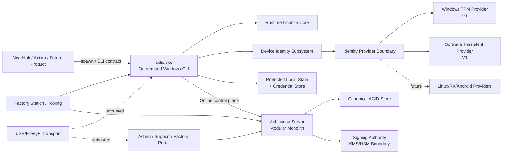
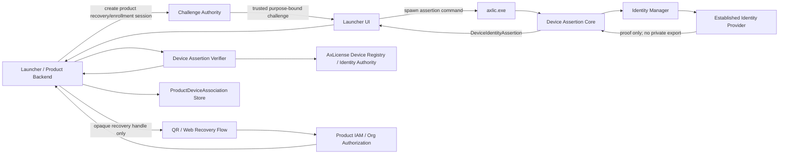
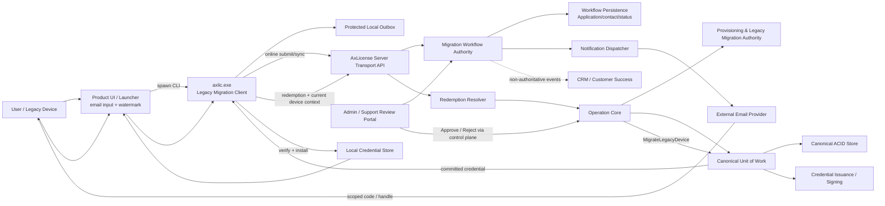
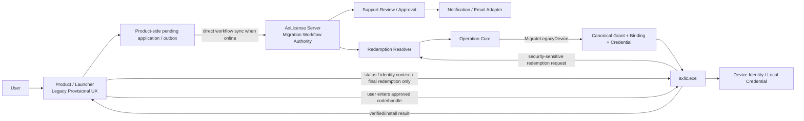
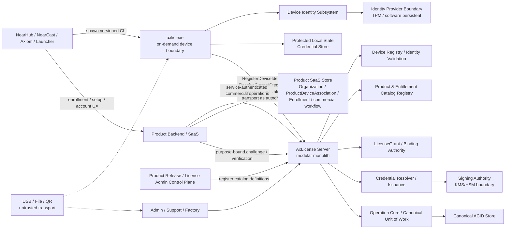

# 14 — P14 System Architecture — AxLicense V1 v0.1

> 🏗️ **Authority status: Accepted / P14 FR-019 targeted System Architecture reconciliation CLOSED — 2026-09-12.** 本页 Current Authority 冻结 AxLicense V1 在 FR-019 下的 system architecture：ordinary first-run `RegisterDeviceIdentity`、Product Backend SaaS enrollment / Organization association / commercial-decision boundary、dynamic Product/Entitlement Registry、Grant reconciliation、credential resolve/reissue、canonical/local/SaaS state ownership、trust/failure boundary，以及 P13 operations 如何映射到 server/device execution topology。FR-018 legacy provisional/application/review/redemption architecture 仅保留为 historical / compatibility context，不再驱动 NearHub V1 Current Authority。P14 不冻结具体 class/API、REST path、database engine、Windows TPM API、crypto algorithm、wire encoding 或线程实现；这些属于 P15–P18。

## 1. Stage contract

- **Role:** P14 System Architecture
- **Authority:** P02/P03 Windows-first Device Identity Assurance policy + P10 Product Object Model + P11 Interaction/Behavior + P12 Semantic Schema + P13 Operation/Mutation Model。
- **Objective:** 为 AxLicense V1 建立一个可实现、可离线运行、Windows-first、可向 Linux/RK/Android 扩展的系统边界，并确保 P13 atomicity/idempotency、ordinary first-run identity registration、Grant/Binding/Credential separation、dynamic entitlement catalog、Product SaaS 与 AxLicense authority separation、credential observation/issuance separation 以及 no-silent-downgrade 不被部署拓扑破坏。
- **Non-goals:** 不定义具体 C++/Rust/Go/TS module/class；不冻结 HTTP/gRPC/IPC protocol；不决定 PostgreSQL/SQLite 等具体 database product；不决定 CNG/NCrypt/TPM command、DPAPI/ACL/partition 等 Windows realization；不冻结 signing algorithm/HSM vendor；不做 Linux/RK/Android provider implementation。
- **Required analysis:** ownership、dependencies、public boundaries、process/deployable boundaries、trust boundary、persistence ownership、operation commit architecture、failure domains、cross-platform extension boundary。
- **Required output:** subsystem map、state ownership map、runtime topology、trust/failure boundaries、Windows-first identity architecture、P13 commit realization constraints、explicit non-ownership。
- **Quality gate:** 不产生第二套 canonical truth；device private identity material 不跨 provider boundary 泄漏；server outage 不阻止已安装 perpetual runtime；credential-required mutation 不允许 canonical Binding 先于 recoverable credential commit；existing hardware-backed identity 不允许 runtime fallback 到 lower-assurance provider。
- **Handoff:** P14 FR-019 targeted reconciliation closed 后 earliest untrusted layer = **P15 targeted Module Design reconciliation**。P15 细化 Product Backend enrollment/commercial adapter、`axlic.exe` identity/credential client、server Device Registry / Catalog Registry / Grant Authority / Credential Resolver & Issuance 等 module/interface/invariant；P17 继续暂停，直到 P15/P16 targeted reconciliation 完成。

## 2. Architectural posture

### 2.1 V1 deployment strategy

V1 采用：
- **Device side:** 一个按需执行的 Windows `axlic.exe` CLI executable；外部产品通过进程调用使用 AxLicense。V1 不要求常驻 Windows Service，不发布对外 `axlic.dll`。核心 domain/runtime/identity 逻辑作为 executable 内部模块或静态链接 Core 复用。
- **Server side:** 一个 **modular monolith AxLicense Server** + 单一 ACID canonical persistence boundary + external Signing Authority/KMS-HSM boundary。
- **Operator side:** Admin/Support/Factory Web UI 或工具只通过 AxLicense Server control plane；不得直接写 canonical store。
- **Offline flow:** request/response artifact 是不可信 transport；authority 仍来自 server canonical operation + signed credential。

### 2.2 Why modular monolith for V1

P13 要求 credential-required operations 在一个 logical outcome 中同时完成 canonical mutation、SignedLicenseCredential、capacity consumption、audit event 与 idempotency result。V1 将 domain operation coordinator 与 canonical persistence 保持在一个 server authority/process family 中，避免为了服务拆分引入 distributed transaction / dual-write truth。

未来可拆服务，但拆分前必须证明仍能维持 P13 logical atomicity；“以后可能规模变大”不是 V1 微服务化理由。

## 3. System topology



## 4. Subsystem ownership

| Subsystem | Owns | Must not own |
|---|---|---|
| `axlic.exe` CLI Boundary | Stable product-facing process/command/result contract; device-local orchestration; local identity lifecycle; provider selection execution; credential installation; runtime evaluation; online/offline exchange; diagnostics | Public DLL ABI in V1; arbitrary private-key signing primitive; commercial grant issuance policy; server canonical Device/Binding truth; signing master key |
| Internal AxLicense Core | Reusable in-process modules/static libraries linked into `axlic.exe`: runtime verification, identity orchestration, local-state access and server client logic | Independent external compatibility surface; second local authority; product-specific license semantics |
| Runtime License Core | Credential parse/verify; trusted local identity association check; right/validity evaluation; derived LicenseStatus/EntitlementSnapshot | Server mutation; UI SKU mapping; provider fallback decision; commercial entitlement creation |
| Device Identity Subsystem | Established provider/scheme continuity; first-establishment provider qualification/selection; normalized DeviceIdentityClaim/proof; identity diagnostics | License entitlement decision; silent provider downgrade; server Device ID fabrication |
| Identity Provider | Platform-specific key/material lifecycle and capability proof; private identity material containment | LicenseGrant/Binding policy; commercial activation authority; cross-provider fallback decision |
| Protected Local State / Credential Store | Device-local provider reference/identity metadata, registration association, installed signed credential, trusted-key metadata, recovery metadata | Second server canonical authority; plaintext export of protected private identity material |
| AxLicense Server Operation Core | P13 operation validation/orchestration; canonical mutation; idempotency; Device registration/catalog/grant/binding invariants; recovery/rehost/factory semantics; legacy compatibility only | Device private identity key; platform TPM/TEE implementation |
| Identity Assurance Policy | Product/operation minimum assurance; accepted schemes/capabilities; server-side validation policy | Direct platform API probing; current provider private state |
| Canonical ACID Store | P12 canonical objects; P13 operation ledger/result; signed credential record; lifecycle event; scoped authorization state | Business logic outside constraints/transactions; device private key |
| Credential Issuance / Signing Adapter | Construct protected payload from committed-intent domain state; invoke isolated signer; persist signed artifact through operation coordinator | Deciding who receives entitlement; modifying Grant/Binding independently |
| Signing Authority | Signing private key custody and cryptographic signing operation | License policy, Device registry, Binding, entitlement decisions |
| Admin/Support/Factory Portal | Human workflow/presentation; authenticated operation invocation; offline request/response handling | Direct DB writes; local DeviceIdentity creation; master signing key |

## 5. Device-side architecture — Windows V1

### 5.1 `axlic.exe` is the V1 device-side integration boundary

V1 Windows 上，`axlic.exe` 是按需执行的独立 executable，而不是常驻 daemon/service。NearHub Launcher、Axiom 或其他产品通过创建进程调用 AxLicense；产品不得直接操作 TPM、software KSP、credential files 或 AxLicense Server protocol。

这一边界的目的：
- 多产品共享同一份 AxLicense identity/license semantics；
- private identity material 不暴露给产品 shell/UI；
- provider choice、recovery、credential verify-before-replace 只实现一次；
- 产品升级不应复制或重新解释 DeviceIdentity lifecycle；
- V1 避免 Windows Service 安装、IPC daemon lifecycle 与 public DLL ABI 的额外复杂度。

### 5.2 V1 public integration surface is CLI-only

V1 **不发布 `axlic.dll` 作为稳定产品 ABI**。外部产品只依赖 `axlic.exe` 的版本化 command/result contract；具体 command vocabulary、JSON schema、exit-code mapping 由 P15/P17 冻结。

`axlic.exe` 内部可以由多个 module / static library 组成，但这些不是外部兼容性承诺。未来只有在性能、权限隔离或后台生命周期出现明确需求时，才允许在保持同一 AxLicense Core semantics 的前提下增加 DLL 或 Service Host。

### 5.3 Local runtime path is server-independent

已安装有效 credential 的正常 perpetual runtime 路径：

`Product → invoke axlic.exe → internal Runtime License Core → local identity evidence + installed signed credential → derived entitlement result`

此路径**不访问 AxLicense Server**。

产品可以在自身进程内缓存本次查询得到的 derived result，但缓存不是新的 authority；重新校验时仍以 AxLicense local state + signed credential 为准。Server/network outage 只影响新的 activation/rehost/recovery/refresh 等 control operations，不应影响现有 perpetual runtime。

## 6. Device Identity architecture

### 6.1 Three layers

Device Identity 子系统分为三个 ownership layer：
1. **Identity Policy / Selection** — 决定 minimum assurance 与 first-establishment selection 规则。
2. **Provider abstraction** — 统一 platform capability/identity/proof contract。
3. **Provider realization** — Windows TPM 或 Windows software-persistent；未来 Linux/RK/Android 以相同 boundary 接入。

### 6.2 Existing identity is provider-pinned

`axlic.exe` 执行 identity-sensitive command 时首先读取 existing local identity association。
- 若已经存在 established `scheme_id/provider`：只允许加载该 provider/current identity；**不得重新跑“best provider selection”把它自动换成别的 provider**。
- existing hardware-backed provider 暂时不可用：进入 `IDENTITY_PROVIDER_UNAVAILABLE` / controlled recovery path；不得自动生成 software identity。
- 只有“本机尚无 established identity”时才允许 provider discovery + selection。

### 6.3 First-establishment selection

Windows V1 first establishment：
1. Provider Registry probe candidate providers；
2. TPM provider 必须通过 qualification 才算 usable，presence 不等于 usable；
3. Identity Policy 选择满足 minimum assurance 的最强 provider；
4. 默认：`hardware_bound TPM → software_persistent → unsupported`；
5. provider 创建 local identity material；
6. `axlic.exe` 内部 Identity Core 形成 DeviceIdentityClaim；
7. ordinary connected first-run 由 P13 `RegisterDeviceIdentity` 建立/确认 server-side `Device + current DeviceIdentity`；factory 使用 `ProvisionDeviceIdentity`；`ActivateDevice` 可以确认既有 Device/identity 并建立 license binding。FR-018 `MigrateLegacyDevice` 仅属 historical compatibility，不再是 NearHub V1 Current Authority。

本地刚生成但尚未 server commit 的 key/material 是 **pre-registration local evidence**，不是 canonical DeviceIdentity authorization fact。

### 6.4 Provider-neutral conceptual contract

P14 只冻结 capability boundary，不冻结语言/API signature：

```plain text
IdentityProvider capabilities:
- probe / qualify
- create local identity material
- load existing identity material
- derive normalized public identity / claim
- prove possession / provider usability when required
- report assurance + persistence + exportability diagnostics
- destroy only through explicit lifecycle authority
```

Future provider 实现必须保持 P12 `scheme_id + identity_value + identity_epoch` 与 P13 operation semantics，不得增加 incompatible license semantics。

### 6.5 Local identity association

`axlic.exe` 所使用的 local state 需要一份 **non-canonical protected local identity association**，至少将：
- selected scheme/provider；
- provider-local key/material reference；
- normalized identity value/reference；
- current identity epoch；
- server-assigned `device_id`（一旦 canonical registration 完成）；
- registration/recovery metadata

绑定在同一 local trust boundary 中。

该 association 是 runtime realization，不是第二份 server Device authority。其具体 Windows protection/storage mechanism 留给 P17。

## 7. Server architecture

### 7.1 Modular monolith

AxLicense Server V1 是一个 logical deployable authority，内部至少划分以下 ownership areas，但它们**不是独立微服务 authority**：
- Operation Core / Transaction Coordinator
- License & Entitlement Domain
- Device Registry / Identity Validation
- Device Registration / Provisioning Authority
- Product & Entitlement Catalog Registry
- Identity Assurance Policy
- Credential Issuance
- Audit / Operation Ledger
- Admin/Factory Control Plane

### 7.2 Canonical ACID store

所有 P12 canonical durable state 必须位于同一个 logical transactional persistence boundary：
- Licensee / ProductDefinition / EntitlementDefinition / CatalogRevision
- LicenseGrant / EntitlementGrant
- Device / DeviceIdentity
- DeviceBinding
- SignedLicenseCredential record/artifact metadata
- ProvisioningAuthorization
- LicenseLifecycleEvent

FR-018 `LegacyMigrationAuthorization` / `LegacyMigrationApplication` 若因既有部署需要保留，只属于 historical compatibility data；不得参与新的 FR-019 catalog/grant/activation/entitlement evaluation。

此外允许 persistence support state：
- Operation ledger / idempotency record；
- pending execution/retry metadata；
- delivery status。

Support state **不得成为授权 truth**。

### 7.3 Operation Coordinator owns mutation ordering

任何 canonical mutation 必须从 Operation Core 进入。Portal、factory、device API、background worker 都不得绕过 Operation Core 直接修改 Grant/Binding/Device。

Operation Core 负责：
- canonical payload normalization/hash；
- `(operation_kind, correlation_id)` uniqueness；
- precondition + expected revision；
- per-grant/per-device conflict control；
- credential issuance orchestration；
- atomic canonical commit；
- stable committed/rejected result recovery。

## 8. Credential issuance and atomic commit architecture

P13 要求 credential-required operation 不得留下“Active Binding 已成立但 credential issuance 不可恢复”的合法终态。因此 V1 禁止简单的：

`DB commit binding → async queue → later sign credential`

作为 canonical success path。

### 8.1 Required sequence

概念顺序：
1. Operation Ledger 建立/恢复 operation identity 与 canonical payload hash；
2. 从 canonical store 读取并验证 expected current state；
3. 分配/恢复本 operation 的 stable candidate IDs/revisions；
4. 构造 candidate protected credential payload；
5. 调用 Signing Authority 获得 candidate signed artifact；
6. 回到 canonical transaction，重新验证 expected revision/conflict；
7. **单一 ACID commit**：canonical Device/Grant/Binding mutation + signed credential record/artifact + capacity consumption + lifecycle event + committed operation result；
8. commit 成功后才允许 Deliver/Observe。

### 8.2 Failure behavior

- Signer failure：没有 canonical authorization mutation。
- DB/revision conflict after signing：candidate artifact 未成为 authority；不得交付，Operation Core 重新读取/按同一 operation identity 收敛。
- response/network failure after commit：retry 从 Operation Ledger 恢复同一 committed outcome，不重新 bind/consume capacity。
- process crash before commit：pending support record 可恢复；不能把 pending 当 authorization。

这一 architecture 允许 signer/KMS 与 database 是独立 failure domain，同时保持 P13 logical atomicity。

## 9. Signing Authority trust boundary

Signing private key 必须与 AxLicense business/application process 分离。

AxLicense Server 只向 Signing Authority 提交待签的 protected payload/key reference，并接收 signature/signed artifact；Signer 不拥有 LicenseGrant、Binding、Device 或 entitlement policy。

V1 不在 P14 冻结：
- local HSM vs cloud KMS；
- exact algorithm；
- key rotation ceremony；
- provider vendor。

这些由后续 security/platform/verification authority 决定。

## 10. Control planes

### 10.1 Device control plane

Agent 通过 server device control plane 执行 online activation、provision registration、legacy migration、recovery/refresh。具体 transport/endpoint/auth scheme 在 P15/P17 冻结。

### 10.2 Operator control plane

Admin/Support Portal 调用同一 domain Operation Core，用于 issue/revise/rehost/revoke/migration authority 管理。UI 不是 authority。

### 10.3 Factory control plane

Factory station 的 factory credential 只拥有 scoped provisioning actions。推荐 station 与目标 Windows Agent 协作：Agent 在**目标 physical device**上创建 identity，station/server 只接收 claim/proof，不生成可复制 private identity material。

### 10.4 Offline exchange plane

Offline request/response file/QR/USB 被视为完全不可信 transport。
- request 不能授予 entitlement；
- portal 导入 request 后仍必须执行 P13 canonical operation；
- response 必须由目标 Agent 在本地验证后 install；
- copied/replayed artifact 由 correlation/idempotency/proof rules 收敛或拒绝。

## 11. Persistence ownership

### Server

- **Canonical:** all P12 authority + credential records + lifecycle events。
- **Support:** operation ledger, delivery state, diagnostics/metrics。

### Device

- **Protected identity state:** provider references/material as permitted by provider；private material never sent to server。
- **Installed signed credential:** current/safe previous candidate as needed for verify-before-replace。
- **Trusted verifier metadata:** accepted issuer public keys / format support / local policy cache where required。
- **Transient artifacts:** offline request/response staging、retry diagnostics。

Device local files/state 不得被 server 当作 canonical grant ownership truth；server DB 也不得让产品 runtime 必须在线查询。

## 12. Trust boundaries

1. **Product process ↔ `axlic.exe`:** Product 是 consumer，不是 license authority；CLI/process input 全部视为 caller-controlled。
2. **Agent ↔ Identity Provider:** private identity material/secure key handle 不越过 provider contract；Agent 只消费 claim/proof/capability/reference。
3. **Device ↔ Server:** network 不可信；server 必须验证 operation authority、identity evidence、correlation/idempotency。
4. **Server ↔ Signing Authority:** server application 不持有 master signing private key；signer 不做 business authorization。
5. **Portal/Factory ↔ Server:** human/tool credential scoped；UI 不直接访问 DB/KMS private key。
6. **Offline media:** USB/file/QR 一律不可信；安全来自签名、proof binding、anti-replay 与 canonical operation。
7. **Golden Image boundary:** image 内只有 Agent/software/trust roots，不包含 current DeviceIdentity/private material/Binding/credential。

## 13. Failure domains and required containment

| Failure | Required containment |
|---|---|
| Internet / AxLicense Server unavailable | 已安装 perpetual runtime 继续本地验证；新的 online mutation unavailable；offline request 可本地生成/暂存 |
| Canonical store unavailable | Server canonical mutation 不得部分提交；device local runtime unaffected |
| Signing Authority unavailable | 所有需要新 credential 的 operation 不得 canonical-success；不需要 signing 的独立 admin operation 可按其自身 contract 执行 |
| Response lost after server commit | retry 恢复同一 operation result/credential；不得第二次 bind/consume capacity |
| TPM provider temporarily unavailable on existing TPM identity | 报告 identity/provider unavailable；不得 software fallback；进入 retry/recovery |
| TPM unavailable on first establishment | 若 policy 允许且 software-persistent qualified，则选择 fallback；否则 unsupported |
| Local credential corrupt | 该 credential fail closed；若 identity continuity 成立走 credential recovery，不从残缺字段推导 entitlement |
| Protected local identity state lost | 不得静默生成新 identity 并继承旧授权；进入 controlled RecoverDevice / Rehost decision |
| Agent process unavailable | 产品不得自行旁路读取 license 文件建立另一 authority；恢复/重启 Agent。具体 availability/grace policy 后置 P16/P18 |
| Portal unavailable | 不改变 server/device authority；device local runtime unaffected |

## 14. Runtime topology and process boundaries

### Windows device

- `AxLicense Agent`: privileged/system service process，auto-start 由 platform contract 决定。
- Product/Launcher: 独立普通应用进程。
- SDK ↔ Agent: local IPC process boundary。
- Windows TPM/software provider: Agent 内 provider adapter 调用 platform security boundary；具体 provider API 与 blocking/thread behavior 留 P17。

### Server

- AxLicense Server domain/control plane：V1 一个 deployable/process family。
- Canonical store：独立 persistence failure domain。
- Signing Authority/KMS/HSM：独立 security/failure domain。
- Web frontend 可独立部署，但没有 domain authority。

### Factory

Factory tooling 是独立 client。Device private identity material 必须在目标 device/provider boundary 内生成；factory station 不成为 cloneable identity issuer。

## 15. Cross-platform extension architecture

Linux/RK/Android V1 不实现 provider，但 architecture 必须保留：
- provider registration/discovery；
- capability/assurance description；
- normalized public identity claim/proof；
- provider-pinned existing identity lifecycle；
- protected local state adapter；
- diagnostics/failure classification。

未来新增 `optee/rpmb`、Linux TPM、Android Keystore/StrongBox 等 provider 时，只替换 platform realization，不允许改变：
- Device / DeviceIdentity / identity_epoch semantics；
- LicenseGrant / Binding / Credential semantics；
- P13 operations；
- offline credential model；
- no-silent-downgrade invariant。

## 16. Explicit non-ownership / forbidden shortcuts

- Product shell/UI **不得**成为 entitlement authority。
- Factory station **不得**生成后再复制同一个 device private identity 到多台设备。
- AxLicense Server **不得**接收/持久化 device private identity key。
- Signing Authority **不得**直接读写 LicenseGrant/DeviceBinding。
- Portal/background job **不得**绕过 Operation Core 直接写 canonical state。
- Device local status/cache **不得**变成第二份 server canonical Grant/Binding truth。
- Identity Provider **不得**根据 license SKU 决定 entitlement。
- Existing hardware-backed identity provider failure **不得**触发自动 software fallback。
- V1 **不得**为了未来 Linux/RK/Android 预先实现 platform-specific provider；只冻结 contract seam。
- Credential-required canonical operation **不得**用“先 commit binding、后异步签 credential”的成功模型。

## 17. Capability-to-architecture trace

- FR-001 Signed License → Runtime License Core + Credential Issuance + Signing Authority。
- FR-002 Device Identity/Binding → Device Identity Subsystem + Provider Boundary + Device Registry。
- FR-003/004 Activation → Agent Exchange + Server Operation Core + Credential Issuance。
- FR-005 Entitlement → Runtime License Core + Product SDK。
- FR-006 Rehost → Server Operation Core + Agent recovery/delivery path。
- FR-007 Factory → Factory client + target Agent identity creation + scoped server Operation Core。
- FR-008 Right separation → License Domain + Runtime License Core。
- FR-009 Admin lifecycle → Operator Control Plane + Operation Core + Audit。
- FR-010 Rotation → Signing Authority boundary + trusted verifier metadata + credential refresh。
- FR-011 Integration API → Product SDK + local IPC。
- FR-012 Recovery → Device Identity Subsystem + Operation Core `RecoverDevice/RehostDevice` boundary。
- FR-013 Legacy Migration → Agent legacy/offline exchange + LegacyMigrationAuthorization + Operation Core。
- FR-014 Provider Discovery → Device Identity Subsystem + Provider Registry/qualification boundary。
- FR-015 Assurance/Fallback → Identity Policy + Provider selection + server-side assurance validation。
- NFR-SEC-03 No Silent Downgrade → provider-pinned local identity + explicit RecoverDevice migration path。
- NFR-OPS-02 Diagnostics → Agent diagnostics + provider capability/failure classification。

## 18. P14 acceptance review

P14 exit conditions are satisfied:
- subsystem authority and non-ownership are explicit；
- canonical server state and local support state have one owner each；
- Windows-first device process boundary is explicit；
- modular monolith + single ACID canonical boundary preserves P13 atomicity；
- signing private key and device private identity key have isolated trust boundaries；
- local runtime does not depend on server availability；
- provider-pinning/no-silent-downgrade is represented architecturally；
- Linux/RK/Android extension seam exists without V1 implementation burden；
- major failure domains have defined containment；
- no unresolved architecture contradiction requires reopening P10–P13。

**Disposition: P14 ACCEPTED / CLOSED. Earliest untrusted layer = P15 Module Design.**

## P14 targeted deployment reconciliation — CLI-only V1 (2026-09-12)

> 🧭 **Normative reconciliation.** 本节 supersede 本页任何仍把 Windows `AxLicense Agent`、local IPC 或 public `axlic.dll` 描述为 V1 mandatory boundary 的旧措辞。V1 device-side deployable 固定为 **`axlic.exe` on-demand CLI**；P14 其余 Server / Signer / canonical ACID / Device Identity Provider / atomic commit architecture 保持不变。

### CLI deployment invariant

- `axlic.exe` 是 V1 唯一正式 product-facing local integration surface；外部应用主动创建进程调用，不要求常驻 Windows Service。
- V1 不发布 `axlic.dll`。内部可以使用 static library / internal module 组织代码，但不形成 public ABI compatibility obligation。
- CLI contract 必须提供 machine-readable structured result 与稳定 error classification；human-readable presentation 不得成为调用方解析依据。具体 command/JSON/exit-code schema 由 P15/P17 定义。
- 产品不得绕过 `axlic.exe` 直接读取/修改 AxLicense protected local state、直接调用 identity private-key primitive 或自行实现第二套 credential verifier 作为 authority。

### Local concurrency invariant

取消常驻 Agent 后，不再天然存在单进程串行化。因此所有会修改 local identity association、credential store、offline import state 或 provider lifecycle 的 command 必须经过 **machine-wide single-writer coordination** 与 crash-safe local commit boundary。
- read-only query 可以并发；
- mutating command 必须序列化或以等价机制保证单写者；
- process crash 不得留下“新 credential 半写入 / identity metadata 与 provider reference 不一致”的合法终态；
- 具体 Windows named mutex/file lock/transactional file replacement 机制留给 P17。

### Private-key boundary

`axlic.exe` 只开放 AxLicense lifecycle 所需的高层 command。V1 **禁止**提供 `sign arbitrary bytes`、导出 private key 或等价通用 signing-oracle command。TPM / Software KSP private material 只能由 internal Identity Provider 为 AxLicense-defined proof/lifecycle 使用。

### Why no public DLL in V1

当前 entitlement/status 查询属于启动/控制路径，不是高频实时数据面。增加 public DLL 会同时引入 ABI、语言绑定、in-process state、版本装载与多路径一致性成本，而当前没有足够价值证明这些复杂度必要。

未来满足以下至少一种明确需求时，才重新评估 DLL/Service Host：
- CLI process-start latency 被测量为产品启动瓶颈；
- entitlement 查询成为高频 hot path；
- 需要更强的 service-account/private-key ACL 隔离；
- 需要后台 refresh/push/revocation/heartbeat；
- 多产品并发需要长期共享进程状态。

任何后续 host 只能复用同一 Internal AxLicense Core 与 P10–P14 semantics，不能创造第二套 license authority。

### Reconciliation disposition

**P14 remains ACCEPTED / CLOSED.** 该变更是 deployment-boundary simplification，不改变 P10–P13 canonical semantics，也不要求重新打开 P02–P13。下一 earliest untrusted layer 仍为 **P15 Module Design**。

## P14 Diagnostics & Safe Logging reconciliation — 2026-09-12

### Diagnostic exposure model

**State: Accepted / P14 authority reconciliation.** AxLicense V1 adopts a three-layer diagnostic model. Diagnostic capability exists to locate operational failures, but must not become a disclosure surface for identity internals, credential authority, signing material, server internals, or bypass-relevant implementation details.

1. **Product-facing CLI result** — `axlic.exe` returns only stable outcome data: success/failure, stable error code/category, retryability, safe next-action hint, and correlation reference. Product-facing output must not expose raw DeviceIdentity, key names/material, raw credential payload, activation/migration secrets, server response body, filesystem secrets, stack traces, or low-level cryptographic/provider internals.
2. **Local production diagnostic log** — bounded, rotating, structured events for field troubleshooting. Events use registered `event_id + component + result + correlation_ref + approved safe_fields`; security-sensitive modules must not emit arbitrary free-form payloads containing unclassified values.
3. **Explicit Support Bundle** — detailed diagnostics are exported only by an explicit support action such as `axlic.exe support-bundle`. The bundle is sanitized before packaging and, for production use, encrypted to an AxLicense Support public key or equivalent support-only recipient. Exact encryption algorithm/key format belongs to P17; encryption never permits inclusion of forbidden secret material.

### Minimum-disclosure policy

Normal `status` / `diagnostics` output exposes capability class rather than implementation-sensitive detail. For example, `identity_assurance=hardware_bound` and a stable AxLicense error code are sufficient for a product UI；raw TPM/KSP key identifiers, provider-local handles, PCR/detail dumps, CNG call traces, credential bytes, canonical database IDs, or internal object layout are not part of the normal external contract。

Where cross-system correlation is required, logs/support output should prefer non-authoritative opaque diagnostic references such as a deterministic short hash/fingerprint of canonical IDs. Raw `device_id`, `license_grant_id`, `binding_id`, machine serial/MAC, customer identifier, and full filesystem user path are classified as sensitive-by-default and require an explicitly registered diagnostic field policy before emission.

### Never-log / never-export secrets

No production log level, CLI result, crash report, or Support Bundle may contain:
- device private key, seed, private-key serialization, KSP/TPM secret material;
- server signing private key or signing-secret material;
- activation/admin/factory bearer secret, password, authorization header, migration-authority secret;
- raw secret-bearing offline artifact fields;
- credential signing preimage or other material that enables reconstruction/forgery of authorization authority.

Encryption of a Support Bundle is defense-in-depth and does **not** relax these prohibitions.

### Diagnostic log is not audit authority

Device diagnostics and canonical lifecycle audit are separate systems:
- **Diagnostic log:** non-authoritative; bounded/rotating; may be deleted, lost, or corrupted without changing license truth.
- **Server audit / `LicenseLifecycleEvent`:** canonical lifecycle evidence governed by P13 logical commit; it must not depend on device diagnostics for authorization history.

Loss of local diagnostic logs therefore cannot imply loss, rollback, or ambiguity of LicenseGrant/Binding/Device canonical history.

### P15 successor constraint

P15 must materialize a dedicated **Diagnostics & Safe Logging** module/policy boundary rather than allowing every domain module to decide independently what to print. It must define the stable error taxonomy, registered event schema, field classification/redaction rules, bounded retention/rotation, support-bundle assembly/sanitization, and correlation-reference contract. Exact Windows logging backend, paths/ACLs, crash-dump integration, encryption profile and key storage are deferred to P17/P18.

**Impact:** diagnostic/security boundary reconciliation only. P10–P13 remain closed; P14 remains CLOSED; successor remains **P15 Module Design**.

## P14 targeted reconciliation — Purpose-Bound Device Assertion architecture — 2026-09-12

### Stage contract

- **Role:** P14 System Architecture targeted reconciliation.
- **Authority:** FR-016/FR-017/NFR-SEC-04 + reconciled P10–P13 Device Assertion semantics.
- **Objective:** Map purpose-bound device proof onto the existing Windows `axlic.exe`, Device Identity Provider, server trust boundary and consuming-product backend without making AxLicense an account/organization ownership service.
- **Non-goals:** No exact CLI flags/JSON schema, QR UI, account database, Windows CNG calls, challenge-signing algorithm, or HTTP endpoint.
- **Required analysis:** subsystem ownership, trust boundary, challenge issuance/verification topology, product-backend boundary, failure containment.
- **Required output:** architecture below.
- **Quality gate:** `axlic.exe` cannot become arbitrary signer; QR/account systems cannot obtain device private material; product ownership remains external; existing licensing architecture remains intact.
- **Handoff:** P15 materializes module/port boundaries and the stable CLI capability family.

### Architectural ownership

AxLicense owns the **device trust primitive** only:
- current registered Device/DeviceIdentity authority;
- verification that a trusted challenge is valid for an allowed purpose/audience;
- device-local proof-of-possession through the established Identity Provider;
- server-side verification of the resulting DeviceIdentityAssertion against registered identity authority;
- minimum-disclosure assertion diagnostics.

The consuming product/backend (Launcher/NearHub management) owns:
- Account / Organization / Tenant;
- `ProductDeviceAssociation` and claim/transfer audit;
- enrollment/recovery/transfer session state;
- QR/recovery handle generation and web UX;
- human authentication, password reset, SSO recovery and organization-admin authorization;
- the final association/recovery/transfer commit.

### New architectural components / responsibilities

**Challenge Authority (server-side logical capability)**
- issues signed/trusted `DeviceAssertionChallengeEnvelope` for approved audience/purpose/session;
- enforces TTL, issuer/key policy and optional expected-device binding;
- remains separate in authority from Product ownership policy;
- challenge signing keys are logically purpose-separated from License Credential Signing Authority. A common KMS/HSM infrastructure may be reused later, but key identity/policy must remain distinct.

**Device Assertion Core (inside `axlic.exe`)**
- accepts only trusted challenge envelopes;
- validates trust/scope/time before provider proof;
- obtains current device identity context from Identity Manager;
- asks Identity Provider for the AxLicense-defined challenge proof primitive;
- composes `DeviceIdentityAssertion`;
- never accepts arbitrary caller bytes for signing and never exports provider private material.

**Device Assertion Verifier (server-side logical capability)**
- validates challenge/assertion binding, registered Device/current identity epoch/scheme, proof, expiry/replay and trusted assurance class;
- returns a minimum-disclosure verification result to the consuming backend;
- does not create Account/Organization/ProductDeviceAssociation or license mutations.

### End-to-end topology



### Recommended recovery ordering

`Product backend creates RecoverySession → Challenge Authority issues trusted challenge → Launcher invokes axlic.exe → Device Assertion verified → backend marks session device-verified → backend displays/returns opaque QR recovery handle → human authenticates/authorizes in web flow → product backend recovers account/access or performs separately authorized association action.`

Raw DeviceIdentity, provider proof internals, private-key handles and reusable assertion secrets are not placed in the QR. QR is only an opaque high-entropy pointer to product-side session state with short TTL/single-use policy.

### Trust/failure boundaries

1. **Product process → axlic.exe:** product may request the defined assertion command but cannot access a generic signing primitive.
2. **axlic.exe → Identity Provider:** provider private key/material never crosses the provider boundary；only AxLicense-defined proof result returns.
3. **Product backend → Challenge Authority:** only approved audience/purpose can receive a challenge；arbitrary external challenge text is not trusted.
4. **Assertion verifier → Product backend:** a valid assertion proves device possession for the bound context only；product backend still requires human/org authority before ownership-sensitive commit.
5. **QR/web transport:** fully untrusted；copied QR must at most expose a short-lived recovery session, never durable authority.
6. **Provider unavailable:** assertion fails as unavailable/retry/recovery；established hardware identity does not silently fall back to software identity.
7. **Server/challenge authority unavailable:** new enrollment/recovery/transfer proof cannot start, but existing perpetual license runtime remains unaffected.
8. **Assertion replay/expiry:** reject without changing Device, license or product association state.

### Existing architecture impact

- `axlic.exe` remains the only V1 public device-side integration binary；still no public `axlic.dll` and no mandatory Service/Agent.
- Device Identity Subsystem gains a **restricted proof consumer** but retains provider-pinning/no-silent-downgrade.
- AxLicense Server modular monolith gains Challenge Authority + Assertion Verifier logical modules；they are not new canonical license authorities.
- Canonical ACID license store and credential-signing atomicity are unchanged.
- Diagnostics & Safe Logging rules apply to assertion flows；raw challenge/proof/private identity internals are sensitive and not product-facing diagnostic output.

### P14 disposition

**P14 targeted reconciliation ACCEPTED / CLOSED.** Device Assertion is integrated without changing license canonical truth or product ownership authority. Earliest untrusted layer is now **P15 Module Design** and ownership remains `aegis-architecture`.

## P14 targeted reconciliation — FR-018 Legacy Provisional Activation & Human-Assisted Migration architecture — 2026-09-12

### Stage contract

- **Role:** P14 System Architecture targeted reconciliation.
- **Authority:** FR-018 + P10/P11/P12/P13 reconciled legacy provisional/application/approval/redemption/migration semantics.
- **Objective:** 为 legacy provisional application、offline outbox、backend intake/dedup、human review/approval、notification/redemption 和最终 `MigrateLegacyDevice` 指定唯一 subsystem owner、process/persistence boundary、failure containment 与 dependency direction。
- **Non-goals:** 不冻结具体 CLI flag、REST endpoint、SMTP/email vendor、CRM product、database table、worker implementation、retry interval 或 UI 页面。
- **Quality gate:** workflow/contact/mail 不得成为 License authority；device outbox 不得成为 server truth；人工 approval 必须通过 P13 operation 建立 scoped `LegacyMigrationAuthorization`；最终 entitlement 只能由 `MigrateLegacyDevice` 经 Operation Core commit；notification/CRM failure 不得改变授权结果；V1 不引入 device-side 常驻 Agent/Service。

### Architecture decision

FR-018 不建立第二套独立 licensing service。V1 继续采用现有拓扑：
- device side：**Product UI/Launcher + on-demand `axlic.exe`**；
- server side：**AxLicense Server modular monolith + one logical ACID transaction authority**；
- operator side：**Admin/Support Review Portal**；
- external integration：**Email/Notification Provider**，以及可选 CRM/Customer-Success sink；
- final license mutation：继续由既有 **Operation Core + CanonicalUnitOfWork + Credential Issuance/Signer** 完成。



### 1. Product UI / Launcher ownership

**Owns:**
- designated legacy-upgrade UX entry and visible `Unactivated / 未激活` watermark；
- contact email input/edit UI；
- invoking `axlic.exe` to create/update application intent；
- opportunistic sync trigger at startup, explicit retry, or product-observed network recovery；
- displaying application/activation status returned by AxLicense.

**Must not own:**
- durable server application identity；
- migration approval authority；
- redemption-scope validation；
- Device private identity material；
- direct canonical DB/API mutation；
- an independent “temporary license”.

The product may know that a device arrived through a designated legacy in-place upgrade path, but this signal grants only provisional UX eligibility. It never establishes historical entitlement.

### 2. `axlic.exe` Legacy Migration Client ownership

FR-018 remains inside the existing CLI-only integration model；no public DLL and no mandatory Windows service are introduced.

**Owns:**
- validating local preconditions for the legacy-application command；
- creating and preserving `LogicalApplicationId`；
- protected local `LegacyMigrationOutboxEntry` persistence；
- contact revision monotonicity while still local/pending；
- submission/sync/retry through ServerClient；
- reconciliation when response was lost but server application already exists；
- redemption submission bound to current DeviceIdentity context；
- receiving, verifying and installing committed SignedLicenseCredential；
- deriving local provisional-vs-licensed status from trusted local facts + rollout provenance.

**Must not own:**
- deciding whether an applicant is a historical customer；
- approving/rejecting migration entitlement；
- issuing `LegacyMigrationAuthorization`；
- sending SMTP mail directly；
- CRM/customer classification；
- background autonomous execution while product is not running.

### 3. Device-local Outbox boundary

`LegacyMigrationOutboxEntry` is stored in the existing protected local-state boundary, but is a **delivery-reliability artifact only**.

Architectural rules:
1. Product UI never writes the outbox file directly；it asks `axlic.exe`.
2. `LogicalApplicationId + device_id + product_id` survives process restart/reconnect.
3. Deleting/corrupting a local outbox cannot prove that no server application exists；reconnect must query/reconcile server truth.
4. Successful server acknowledgement permits local outbox removal, but does not delete server workflow truth.
5. V1 has no device-side background daemon. Retry is triggered when the consuming product invokes AxLicense again (startup/network-restored/user retry or equivalent product lifecycle point).
6. Exact retry cadence/backoff/storage realization is deferred to P16/P17/P18.

### 4. Migration Workflow Authority — server-side logical subsystem

Add one logical ownership area inside the existing AxLicense Server modular monolith：**Migration Workflow Authority**。

**Owns:**
- `LegacyMigrationApplication` durable workflow identity/status/contact history/lineage；
- `LogicalApplicationId` intake deduplication and lost-response reconciliation；
- review-queue projection and status transition orchestration；
- contact revision fencing；
- linkage to `migration_auth_id` and completion event after authoritative operations succeed；
- emitting non-authoritative notification/CRM events.

**Must not own:**
- LicenseGrant/DeviceBinding/Credential creation；
- signing keys；
- direct grant/binding writes；
- widening approval scope；
- product Account/Organization ownership.

`LegacyMigrationApplication` may share the same physical/database infrastructure as canonical state for V1, but remains a logically separate **workflow truth**. Its PII/contact fields have a more restrictive access/retention boundary than ordinary canonical license data.

### 5. Workflow persistence and transaction boundary

P13 requires `ApproveLegacyMigrationApplication` to make application `approved` and create its scoped `LegacyMigrationAuthorization` as one logical outcome. Therefore V1 architecture requires both to participate in the **same logical ACID transaction authority** coordinated by Operation Core/CanonicalUnitOfWork.

This does **not** make the application an authorization source. It only prevents impossible split states such as:
- `application=approved` but no migration authorization exists；
- active migration authorization exists while the linked application still says under review/rejected.

Raw email/contact history should not be copied into `LicenseLifecycleEvent`；canonical audit should reference opaque `application_id` / `migration_auth_id` when linkage is required.

### 6. Human Review / Approval boundary

Admin/Support Review Portal is presentation + authenticated operator interaction only.

**Review Portal may:**
- list/filter/group applications；
- surface email domain/request counts as customer-development signals；
- show safe device/product/application context；
- record support notes outside license authority；
- invoke BeginReview / Approve / Reject / Revoke operations through the AxLicense Server control plane.

**Review Portal must not:**
- write workflow or canonical database directly；
- construct arbitrary `LegacyMigrationAuthorization` records；
- mutate product/device ownership；
- approve based solely on automated “large customer” clustering.

Current P13 semantics remain **per application/device approval with capacity 1**. A UI may help an operator process many requests efficiently, but a true fleet/bulk migration authorization is a new product/semantic capability and is not introduced by P14.

### 7. Approval Authority ownership

`ApproveLegacyMigrationApplication` enters **Operation Core**, which owns the mutation transaction and delegates scope validation to the existing Provisioning & Legacy Migration Authority area.

Successful approval atomically establishes:
- application status = `approved`；
- frozen `decision_contact_revision`；
- one `LegacyMigrationAuthorization` scoped to approved application/device/product with capacity 1；
- durable operation/idempotency result；
- safe audit evidence.

Approval does not create LicenseGrant/Binding/Credential and therefore does not remove the device watermark.

### 8. Notification Dispatcher and Email Provider

Email delivery is separated from approval authority.

**Notification Dispatcher owns:**
- observing committed workflow outcomes；
- rendering approved/rejected/request-received message templates；
- retry/dedup delivery state；
- asking Redemption Resolver/representation layer for the scoped user-facing handle/code when needed；
- resend behavior that references the same underlying approval rather than creating a new approval.

**External Email Provider owns only transport.**

It must never hold license-signing keys or direct canonical mutation credentials. A provider outage may delay mail, but cannot revert approval or create a second authorization.

Inbound email replies are human-support communication only；they do not constitute an AxLicense operation until an authenticated operator acts through the Review Portal/control plane.

### 9. CRM / Customer Success integration

Email domain, request frequency and other migration-application metadata may be exported as **non-authoritative business events** for installed-base discovery.

CRM/Customer Success may use them to identify likely fleet customers and start conversations about deployment, management and product issues. CRM classifications/notes must never flow back as automatic entitlement authority. Any approval still occurs through the authenticated AxLicense Review/Approval path.

### 10. Redemption Resolver ownership

Add a logical **Redemption Resolver** at the AxLicense Server boundary.

**Owns:**
- mapping the human-visible code/opaque handle to the server-side tuple `migration_auth_id + application_id + device_id + product_id`；
- validating syntax/expiry/reference integrity；
- rejecting wrong-device/product/application attempts **before** migration capacity consumption；
- locating an already committed `MigrationCommitKey` outcome for replay/recovery；
- passing a validated migration context to Operation Core.

**Must not own:**
- independent `consumed` truth；
- Grant/Binding/Credential mutation；
- authority-scope widening；
- generic reusable license-key semantics.

The user-visible code may be re-presented or another alias may be delivered, but aliases resolve to the same underlying scoped approval and do not create more capacity.

### 11. Canonical `MigrateLegacyDevice` handoff

After redemption validation, only **Operation Core** may execute P13 `MigrateLegacyDevice`.

Required dependency direction：

`Transport/Redemption → Operation Core → Migration Authority + Device Registry + License Domain + Credential Issuance → CanonicalUnitOfWork → Store/Signer`.

No workflow, notification, CRM or portal component may call the canonical store directly.

The authoritative migration commit still consists of the standard AxLicense outcome：
- create/confirm Device + current identity；
- issue/confirm LicenseGrant；
- create unique Active DeviceBinding；
- produce recoverable SignedLicenseCredential；
- consume migration capacity；
- append lifecycle/operation evidence；
- link application to completion outcome.

After server commit, local observation remains separate：`axlic.exe` must verify/install the returned credential before Product UI removes the watermark.

### 12. Failure-domain matrix

| Failure | Authoritative effect | Recovery owner |
|---|---|---|
| Device offline after email submission | No server application yet；provisional remains | `axlic.exe` outbox + later sync trigger |
| Submit reached server but response lost | Server application may already exist | Workflow dedupe/reconcile by LogicalApplicationId |
| Email/notification provider outage | Approval/application remain committed；no license change | Notification Dispatcher retry/resend |
| CRM unavailable | No effect on migration or license authority | Business integration retry/drop policy |
| Reviewer browser/session crash | No mutation unless operation committed | Review Portal reloads durable application state |
| Approval commit succeeds, mail fails | Scoped MigrationAuthorization remains valid | Resend/retrieve same approval context |
| Wrong Device uses code | Reject before capacity consumption | Redemption Resolver |
| Migrate commit succeeds, response lost | Grant/Binding/Credential already authoritative | Operation ledger + MigrationCommitKey returns same outcome |
| Credential delivery/install fails | Server migration remains committed；device still visually provisional | `axlic.exe` recover same committed credential then install |
| Local outbox/state corruption | Cannot recreate entitlement from missing files | Server reconciliation / normal recovery |

### 13. Trust boundaries

1. **Product → `axlic.exe`:** product supplies contact/input intent and UX triggers, but cannot directly edit outbox/identity/license state.
2. **Device → Server:** application submission is authenticated/bound to current AxLicense Device context as defined by later contracts；email itself proves nothing.
3. **Portal → Operation Core:** reviewer identity/role is authenticated server-side；browser UI never holds authority by itself.
4. **Workflow → License Core:** workflow can request approval/migration operations but cannot mutate LicenseDomain directly.
5. **Notification → Customer:** email/code delivery is transport, not authorization commit.
6. **CRM boundary:** outbound business telemetry only for V1；CRM is never a license authority source.
7. **Signer boundary:** unchanged；FR-018 does not expose signer to workflow/portal/email systems.

### 14. Explicit non-ownership / rejected alternatives

- **No direct SMTP from the device.** It would couple retry, credentials, spam policy and audit to each product/device and would not give a durable server case truth.
- **No second “Legacy Licensing Service”.** Existing Operation Core remains sole canonical mutation authority.
- **No device background AxLicense daemon for V1.** Product lifecycle triggers on-demand sync；a future service requires a new architecture decision.
- **No generic migration license key.** Redemption is a scoped lookup/representation only.
- **No CRM-driven auto-approval.** Request grouping is a sales/support signal, not entitlement evidence.
- **No distributed microservice transaction for approval in V1.** Application-approved + MigrationAuthorization creation must preserve P13 atomicity；modular monolith + one logical transaction authority is retained.

### 15. P15 successor constraints

P15 must refine the architecture above into stable modules/interfaces without changing the semantics. At minimum it must materialize:
- device-side `LegacyMigrationClient` / local outbox repository + sync coordinator boundary；
- server-side Migration Application workflow module/repository；
- review/approval application-service boundary into Operation Core；
- notification dispatcher/provider port；
- redemption resolver/lookup port；
- CRM/customer-success event sink as optional non-authoritative adapter；
- safe PII/logging boundaries；
- handoff into existing `ProvisioningMigrationAuthority`, `CanonicalUnitOfWork`, `CredentialIssuance` and local `CredentialManager`.

### P14 FR-018 disposition

**P14 FR-018 TARGETED RECONCILIATION ACCEPTED / CLOSED.** FR-018 is integrated without changing the CLI-only Windows V1 deployment model, canonical License authority, Device Assertion boundary, signing model or CredentialPayload. The new workflow is owned by the AxLicense Server modular monolith；device-local durable delivery is owned by `axlic.exe`；product UI owns only UX/provisional presentation/sync triggers；email/CRM are non-authoritative external integrations. Earliest untrusted layer advances to **P15 targeted Module Design reconciliation**, owner remains `aegis-architecture`. P17 stays paused until P15/P16 reconciliation completes.

## FR-018 P14 ownership correction — Product/Launcher owns migration application interaction and sync — 2026-09-12

### Correction scope

This section **supersedes any earlier P14 wording that assigned FR-018 migration-application outbox, retry or reconnect sync to `axlic.exe`**. It is an architecture-ownership correction only；P10–P13 semantics remain unchanged.

### Final device-side ownership

**Product / Launcher owns:**
- Legacy Provisional user interaction and watermark presentation;
- email/contact entry and editing UX;
- `LogicalApplicationId` persistence as part of the product-side migration workflow client;
- local pending application/outbox needed while offline;
- retry scheduling, network recovery detection and submission/reconciliation with the AxLicense Server Migration Workflow API;
- application/case status presentation to the user;
- receiving or presenting the approved migration redemption code/handle;
- invoking `axlic.exe` only when an AxLicense security/license primitive is actually required.

**`axlic.exe` owns:**
- DeviceIdentity establishment/loading and safe device context;
- local license status / entitlement evaluation;
- ordinary activation/offline activation primitives;
- final migration redemption bound to the current Device context;
- execution of the device-side part of `MigrateLegacyDevice` / retrieval of its committed result;
- SignedLicenseCredential verification and installation;
- recovery/rehost/security-sensitive identity operations.

**`axlic.exe` explicitly does not own:**
- customer email/contact workflow;
- LegacyMigrationApplication local outbox;
- reconnect polling or workflow sync;
- support-case UX;
- email delivery;
- CRM/customer-success grouping.

### Corrected topology



### Interaction rule

After an offline user submits an application in Launcher, **Launcher does not later spawn `axlic.exe` merely to sync that application**. Launcher retries the workflow submission directly when connectivity returns. This workflow is non-authoritative, so it may use normal product-side networking and local persistence without making Product/Launcher a license authority.

The secure boundary is re-entered only at authorization-sensitive points. A typical ordering is:

`Launcher detects provisional state / obtains safe Device reference as needed → Launcher collects email → Launcher stores/submits LegacyMigrationApplication directly → server/support approves → user receives code/handle → Launcher invokes axlic.exe for final device-bound redemption → Operation Core commits MigrateLegacyDevice → axlic.exe verifies/installs credential → Launcher removes watermark.`

### Security and authority constraints

1. Direct Launcher→Migration Workflow API submission can create/update workflow only；it cannot create `LegacyMigrationAuthorization`, LicenseGrant, DeviceBinding or credential.
2. Product-side possession of a `device_id` or workflow handle is not proof of license eligibility. Final redemption is revalidated against current Device context through `axlic.exe` and server authority.
3. Product local outbox loss may lose unsent contact workflow state, but cannot create or revoke entitlement. If the server already accepted the application, server workflow identity remains durable truth.
4. Product networking credentials for workflow submission must not grant access to canonical License operations.
5. Email/CRM systems remain notification/customer-development adapters and never become approval or entitlement authorities.

### P14 disposition after correction

**P14 FR-018 TARGETED RECONCILIATION remains ACCEPTED / CLOSED.** Earliest untrusted layer remains **P15 targeted Module Design reconciliation**, but P15 must now materialize the migration application/outbox client on the Product/Launcher side rather than inside `axlic.exe`.

## P14 FR-019 targeted reconciliation — Unified Enrollment, Dynamic Entitlement & Credential Observation Architecture — 2026-09-12

### A. Current Authority scope

This section is the latest P14 Current Authority and **supersedes conflicting FR-018 architecture wording for NearHub V1** while preserving prior sections as historical context. It maps trusted P10–P13 FR-019 semantics onto subsystem/process/persistence/trust boundaries without redefining operation payloads or schema.

**Role:** P14 System Architecture.  
**Authority:** reconciled P02/P03 + trusted P10/P11/P12 + P13 FR-019 including D-076 `RegisterDeviceIdentity`.  
**Objective:** assign one owner to ordinary identity registration, Product SaaS enrollment/association, commercial-decision handoff, dynamic entitlement catalog, Grant/Binding/Credential authority, credential delivery/observation, and historical compatibility.  
**Non-goals:** no exact CLI verbs/JSON, REST path, database product, queue product, service-auth mechanism, TPM/CNG calls, KMS vendor, signature algorithm, deployment sizing or thread model.  
**Quality gate:** no second authority；Product SaaS and AxLicense commits remain independently recoverable；catalog registration cannot grant customer rights；ordinary refresh cannot mint credential generations；perpetual runtime remains locally evaluable；signer/DB failure cannot leave unrecoverable canonical license authority.  
**Handoff:** after acceptance, earliest untrusted layer becomes **P15 targeted Module Design reconciliation**.

### B. FR-019 system topology



The diagram defines ownership, not protocol shape. Logical modules inside AxLicense Server remain one V1 authority/process family and **must not be interpreted as independently authoritative microservices**.

### C. Ownership and explicit non-ownership

| Boundary | Owns | Must not own |
|---|---|---|
| Product / Launcher | User-facing setup/license state projection；invokes `axlic.exe`；starts Product Backend enrollment/claim/commercial UX | Device private identity material；direct canonical license writes；local credential parsing rules duplicated outside AxLicense |
| Product Backend / SaaS | Organization/Tenant IAM；EnrollmentSession/SetupCode；ProductDeviceAssociation；SKU/package mapping；purchase/redeem/pool/included/grandfathered commercial eligibility；workflow retry/support state | `Device`/`DeviceIdentity` canonical truth；EntitlementDefinition semantics；LicenseGrant/Binding/Credential authority；signing keys；AxLicense canonical DB |
| `axlic.exe` | Local identity establishment/pinning；possession proof；ordinary `RegisterDeviceIdentity` client orchestration；purpose-bound assertion creation；local credential resolve/import/verify/install/evaluate；offline artifact handling | Organization ownership；commercial entitlement decision；dynamic catalog mutation；arbitrary generic signing；server canonical authority |
| Device Registry / Identity Validation | `RegisterDeviceIdentity`；factory `ProvisionDeviceIdentity` validation；Device/current identity uniqueness；assurance policy validation；registered device lookup | License entitlement/package decision；ProductDeviceAssociation |
| Product & Entitlement Catalog Registry | `ProductDefinition`；`EntitlementDefinition`；immutable machine semantics；CatalogState；monotonic `CatalogRevision`；registration conflict validation | Customer Grant entitlement assignment；SKU/package policy；device runtime authorization |
| LicenseGrant / Binding Authority | `LicenseGrant`, entitlement set/constraints/validity, `authority_revision`, one-active-binding invariant, activation/rehost/recovery/admin lifecycle | Product SaaS Organization/association；catalog redefinition；local observation state |
| Credential Resolver / Issuance | Construct signed snapshots from authoritative Grant/Binding state；`ReissueCredential`；non-mutating `ResolveCurrentCredential`；delivery of current authoritative artifact | Creating commercial rights；changing Grant semantics independently；treating delivery as authority |
| Operation Core / Canonical Unit of Work | P13 idempotency, CAS/conflict validation, canonical mutation coordination, lifecycle event and credential-required atomic outcome | Product SaaS distributed transaction；Device private keys |
| Canonical ACID Store | P12 Current Authority objects, `CatalogRevision`, operation/idempotency ledger, signed credential records, lifecycle events | Organization/IAM/order/payment truth；local private identity material |
| Signing Authority | Credential signing private-key custody and cryptographic signing operation | Grant/catalog/device policy or canonical business mutation |
| Release/Admin Control Plane | Authenticated invocation of catalog/license/admin operations | Direct DB writes；client-side entitlement registration；direct signer access |

### D. Ordinary first-run identity registration architecture

Default connected first-run is now an explicit identity-only architecture path:
1. Product invokes `axlic.exe` because AxLicense-aware setup/runtime needs device identity.
2. `axlic.exe` loads existing protected local identity association first. Only if absent may Identity Policy perform provider discovery/qualification and establish a new local identity.
3. **Local private identity material must be durably protected before network registration begins.** A network failure after this point retries the same identity；it never causes a fresh key merely to retry registration.
4. `axlic.exe` proves control/possession through the provider boundary and calls AxLicense Server ordinary `RegisterDeviceIdentity`.
5. Device Registry / Identity Validation applies scheme/assurance policy and the shared `(scheme_id, identity_value)` uniqueness fence used by both ordinary registration and factory provisioning.
6. Canonical commit creates/confirms one `Device + current DeviceIdentity + lifecycle event + idempotency result`；it creates no Grant/Binding/Credential and consumes no factory capacity.
7. Returned `device_id` may be stored in protected local association as a convenience/reference. If that local reference or server response is lost, presenting the same valid current identity must resolve the same canonical Device；the local reference is not Device authority.

`product_id` supplied as registration policy context does not namespace physical Device identity. One physical device used by several products remains one AxLicense Device unless a future upstream semantic authority explicitly changes that rule.

### E. Product enrollment / Organization association boundary

Normal connected enrollment is deliberately **outside AxLicense canonical license authority**:
1. Product Backend creates/owns EnrollmentSession and SetupCode/QR lifecycle.
2. Product Backend obtains a purpose-bound AxLicense Device Assertion challenge for the approved audience/purpose/session.
3. Launcher invokes `axlic.exe`；Device Assertion Core validates the trusted challenge before asking the established provider for the restricted proof primitive.
4. AxLicense Device Assertion Verifier validates registered Device/current identity/proof/replay/assurance and returns a minimum-disclosure verified-device result.
5. Product Backend independently authenticates the human/account and checks Organization authorization.
6. Product Backend commits `ProductDeviceAssociation` in **Product SaaS Store**, not AxLicense canonical persistence.

SetupCode, EnrollmentSession and ProductDeviceAssociation therefore cannot become activation authority merely because they are successful. Conversely, AxLicense does not become the product's IAM/Organization ownership database.

### F. Product Backend → AxLicense commercial authority handoff

Purchase, license-key redemption, existing pool assignment, included-hardware rights and grandfathered eligibility remain Product Backend commercial decisions. Architecture converges all of them through the same trusted server-to-server AxLicense control boundary:
- Product Backend authenticates as a scoped service/system actor；exact mechanism is deferred to P17.
- The backend supplies only the commercial inputs/references required to invoke already-defined P13 operations. Product data is not copied wholesale into AxLicense canonical storage.
- No Product Backend process may write Canonical ACID Store directly or call Signing Authority directly.
- AxLicense Operation Core independently validates operation authority, target Grant/Device/current identity/binding policy, expected revision and idempotency before commit.

Recommended orchestration follows P13 without inventing a new compound business operation:
- no Grant yet → `IssueLicenseGrant`；
- existing Grant rights change → `ReviseLicenseGrant`；
- unbound Grant → `ActivateDevice`；
- already bound, rights changed → `ReviseLicenseGrant` creates the successor credential in the same recoverable logical commit.

If `IssueLicenseGrant` commits and later activation fails, the unbound Grant is a valid canonical state. Product Backend retries the next operation；it must not roll back the committed Grant merely to simulate an end-to-end distributed transaction.

### G. Dynamic Product / Entitlement Registry architecture

Dynamic registration is owned inside AxLicense Server by **Product & Entitlement Catalog Registry** and stored inside the same logical canonical persistence boundary as other P12 authority objects.

Authorized Product Release/Admin tooling may invoke catalog mutations through the control plane. Device clients and ordinary product applications may **not** self-register entitlement definitions.

Architecture rules:
- successful catalog mutation atomically persists the definition change + new `CatalogRevision` + operation/audit result as applicable；
- Catalog Registry validates immutable authorization-critical semantics and rejects same-ID conflicting redefinition；
- catalog mutation never touches any `LicenseGrant`, `authority_revision`, binding or credential；
- Product Backend may cache/read the registry for package configuration or admin UX, but such cache is not customer authorization truth；
- local perpetual runtime does not query Catalog Registry. Signed credential snapshot remains self-sufficient for offline evaluation；
- SKU/edition/package mapping remains Product Backend commercial configuration. Turning a newly registered capability into customer rights requires explicit Grant reconciliation.

### H. Grant reconciliation and credential-required commit architecture

`ReviseLicenseGrant` is the single canonical full-set rights mutation. Product Backend batch/rollout logic may coordinate many Grants, but each Grant has its own operation identity, expected revision and canonical commit. No cross-Grant transaction exists.

For an **unbound** Grant rights change, Operation Core commits the new Grant authority revision + event without inventing a DeviceBinding.

For a **bound** Grant rights change, the server must preserve the existing P13 requirement that changed authorization and its successor signed snapshot form one recoverable logical outcome. V1 realization remains:
1. restore/create operation identity in Operation Ledger；
2. read current Grant/Binding and verify expected `authority_revision`；
3. allocate the candidate next authority revision / credential generation deterministically for this logical operation；
4. construct candidate signed credential payload from candidate authoritative state；
5. obtain candidate signature from Signing Authority；
6. revalidate conflict/CAS before commit；
7. one ACID commit persists Grant mutation + successor credential record/artifact + lifecycle event + operation result；
8. only after commit may the artifact be delivered/observed.

Signer failure or post-sign revision conflict cannot create authorization. A signed candidate that never enters the successful canonical commit is not deliverable authority.

### I. `ResolveCurrentCredential` versus `ReissueCredential`

P13's separation is preserved architecturally:

**`ResolveCurrentCredential`** is owned by Credential Resolver as a **non-mutating read/delivery path**. Typical callers are `axlic.exe` on application start, reconnect, software update, explicit refresh, or recovery delivery. It may authenticate/validate device/current identity context, resolve current binding and return the current authoritative credential, but it:
- does not call Signer merely because the client asked to refresh；
- does not increment `authority_revision`；
- does not increment `credential_generation`；
- does not consume a license/seat/binding.

**`ReissueCredential`** is a real server mutation. It enters Operation Core + Signing Authority + canonical commit, keeps Grant authority semantics unchanged, and creates a higher credential generation only for an authorized reason such as key rotation, format migration or controlled recovery reissue. Same authority revision requires authorization-equivalent rights snapshot.

Therefore Windows V1 still does **not** require a resident Agent/Service. Products may trigger opportunistic `axlic.exe` resolve/refresh at lifecycle points；exact command vocabulary and scheduling policy belong to P15/P16.

### J. State and persistence ownership

Four durable/support worlds must remain separate:

**AxLicense canonical authority:** ProductDefinition, EntitlementDefinition, CatalogRevision, Licensee, LicenseGrant/EntitlementGrant, Device/DeviceIdentity, DeviceBinding, SignedLicenseCredential, ProvisioningAuthorization, LicenseLifecycleEvent, operation/idempotency support records.

**Product SaaS durable truth:** Organization/Tenant/IAM, ProductDeviceAssociation, commercial package/SKU mapping, purchase/order/subscription/pool/grandfathered eligibility records, enrollment workflow/support state.

**Device protected local state:** provider identity reference/material as permitted by provider, selected/pinned provider metadata, normalized identity association, optional server `device_id` reference, trusted verifier metadata, installed signed credential, safe previous candidate/recovery metadata.

**Transient/delivery state:** HTTP sessions, SetupCode presentation, CLI process lifetime, retry timers, offline file/QR transfer, delivery progress, caches.

A status such as `claimed + unlicensed` or `server licensed + device observation pending` is a projection across these worlds, not a new canonical enum/database row shared between systems.

### K. Cross-system transaction and failure boundary

There is **no distributed transaction between Product SaaS and AxLicense**. Required recovery states are first-class:

| Failure / partial state | Required containment / recovery |
|---|---|
| Local identity established；AxLicense registration unavailable | Keep same local identity；retry registration later. Do not regenerate/downgrade provider. |
| RegisterDeviceIdentity committed；response lost | Retry same logical operation or present same current identity；recover same `device_id`. |
| Product association committed；commercial/license step fails | Remain `claimed + unlicensed`；keep association；retry commercial/AxLicense workflow later. |
| Grant issued；activation fails before binding commit | Keep valid unbound Grant；retry activation；no compensating deletion required merely for transport failure. |
| AxLicense activation/revision committed；device did not receive/install credential | Remain `server licensed + local observation pending`；device later uses `ResolveCurrentCredential`, verify-before-replace and atomic install. |
| Catalog registration succeeds but rollout fails for some Grants | Catalog stays registered. Each Grant reconciliation succeeds/fails independently；no cross-Grant rollback. |
| Signer unavailable | Credential-required operation cannot canonical-success；existing local perpetual runtime remains unaffected. |
| Canonical store unavailable | No partial server mutation；Product association/local runtime remain independently intact. |
| Repeated `ResolveCurrentCredential` | Idempotent read/delivery behavior；no new generation or business consumption. |
| Organization unclaim/transfer | Changes Product SaaS association only. AxLicense license authority remains until an explicit authorized license lifecycle operation changes it. |

### L. Trust boundaries added/refined by FR-019

1. **Product process → `axlic.exe`:** caller-controlled input；no direct provider/private-key/credential-store access.
2. **`axlic.exe` → Identity Provider:** private material stays provider-local；only AxLicense-defined identity/proof outputs cross the boundary.
3. **Device → AxLicense Server:** network untrusted；registration/assertion/credential requests are validated against canonical Device/current identity and policy.
4. **Product Backend → AxLicense Server:** authenticated service boundary. Product Backend may present trusted commercial intent, but AxLicense still owns canonical validation/commit and never grants direct DB/signer access.
5. **Release/Admin tooling → Catalog Registry:** privileged control plane only；registration permission is separate from customer Grant assignment permission.
6. **Product SaaS Store ↔ AxLicense Canonical Store:** no shared writable authority and no distributed commit assumption. Correlation/references may cross APIs；truth ownership does not.
7. **AxLicense Server → Signing Authority:** signer only signs protected candidate payloads；signer does not decide rights.
8. **Offline transport:** file/USB/QR remains untrusted transport；authority derives from signed artifact + canonical operation semantics.

### M. FR-018 historical compatibility boundary

All prior P14 sections that assign Current NearHub ownership to `LegacyMigrationApplication`, `LegacyMigrationAuthorization`, migration review/approval/redemption workflow, provisional watermark/outbox or `MigrateLegacyDevice` are **superseded for FR-019 NearHub V1**.

If an already-deployed implementation or historical data requires compatibility:
- compatibility code/data may remain isolated behind an explicit legacy adapter/path；
- it may preserve/read historical audit facts；
- it must not be invoked as the default first-run/commercial licensing path for new FR-019 devices；
- historical migration records must not participate in current runtime entitlement evaluation；
- grandfathered customer eligibility is decided by Product Backend commercial policy and converges to ordinary `IssueLicenseGrant` / `ReviseLicenseGrant` / `ActivateDevice` operations.

Physical deletion or database migration of legacy data is not required by P14；isolation and non-authority are required. Cleanup/migration planning belongs to later implementation planning after P15/P16 determine concrete modules/data paths.

### N. P14 acceptance / disposition

**P14 FR-019 TARGETED SYSTEM ARCHITECTURE RECONCILIATION ACCEPTED / CLOSED.** The architecture now has one explicit owner for ordinary device registration, SaaS association, catalog definition, customer Grant authority, credential issuance/resolution, canonical persistence and signing；Product SaaS and AxLicense are intentionally separate transaction domains；dynamic catalog evolution cannot auto-grant rights；device refresh cannot auto-reissue；legacy migration is compatibility-only；CLI-only Windows V1 and perpetual offline runtime are preserved.

**Earliest untrusted downstream layer:** **P15 targeted Module Design reconciliation**. P15 must materialize the boundaries above into concrete modules/interfaces/invariants, especially:
- `axlic.exe`: CLI Router, Identity Manager/Provider Registry, Device Registration Client, Device Assertion Core, Credential Resolver Client, Credential Manager/Runtime Evaluator, Local State, Safe Diagnostics;
- Product Backend: Enrollment/Association, Commercial Entitlement Decision, AxLicense Integration Adapter and retry/orchestration support;
- AxLicense Server: Device Registry/Identity Validation, Catalog Registry, Grant/Binding Domain, Operation Core/CanonicalUnitOfWork, Credential Resolver/Issuance, Assertion Challenge/Verifier, Admin/Factory/Release control-plane adapters;
- historical legacy compatibility adapter isolated from Current Authority.

P17 remains paused until P15/P16 targeted reconciliation completes.
