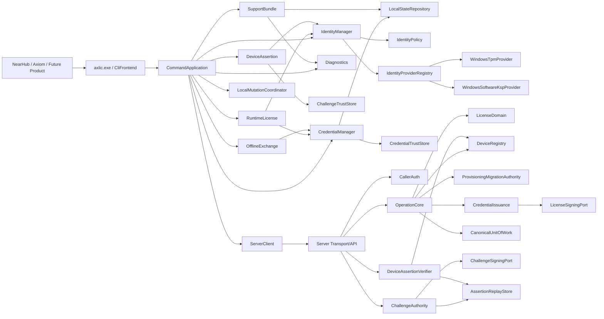
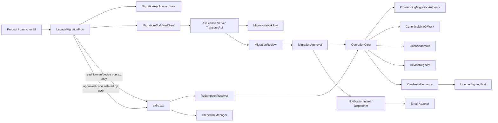
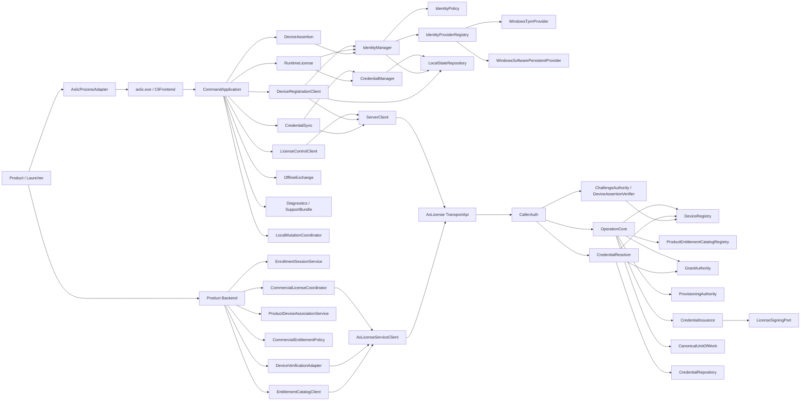

# 15 — P15 Module Design — AxLicense V1 v0.1

> 🧩 **Authority status: Accepted / P15 FR-019 targeted Module Design reconciliation CLOSED — 2026-09-12.** 本页将 trusted P10–P14 FR-019 authority（含 D-076 ordinary `RegisterDeviceIdentity` 与 P14 D-078）细化为 AxLicense V1 稳定模块、端口、依赖方向与 module invariants。Windows V1 对外仍仅发布 `axlic.exe`；不发布 public DLL，不要求常驻 Agent/Service。FR-019 Current Authority 明确 ordinary Device registration、Product Backend enrollment/commercial adapter、dynamic Product/Entitlement Catalog、Grant Authority、CredentialResolver 与 CredentialIssuance 的模块边界；FR-018 migration application/review/redemption module material 仅作为 historical / compatibility context。Device Assertion 继续复用 DeviceIdentity，但 Account/Organization/ProductDeviceAssociation 始终由消费产品后台持有。

## 1. Stage contract

- **Role:** P15 Module Design.
- **Authority:** Accepted/reconciled P02/P03 FR-019 requirement/capability baseline; trusted P10 Product Object Model, P11 Interaction/Behavior + Catalog Evolution Addendum, P12 Semantic Schema, P13 Operation/Mutation Model including D-076 ordinary `RegisterDeviceIdentity`; P14 FR-019 System Architecture D-078. FR-018-specific migration authority is historical/compatibility-only for current NearHub V1 design.
- **Objective:** 冻结 device / Product Backend integration / server module ownership、公开/内部端口、依赖方向、模块不变量和 V1 CLI capability family，使 ordinary first-run registration、SaaS enrollment/claim、commercial decision、catalog evolution、Grant reconciliation、credential resolve/reissue 与 local observation 能在 P16 中沿稳定 module boundaries 追踪。
- **Non-goals:** 不冻结具体 C++ class/function signature、HTTP route、JSON 字段编码、database engine、Windows CNG/NCrypt call、filesystem path、Named Mutex 名称、crypto algorithm、线程模型或 deployment sizing。
- **Required analysis:** module ownership/non-ownership、dependency direction、state ownership、local mutation coordination、CLI facade、ordinary DeviceRegistration client、Device Assertion proof boundary、Product Backend enrollment/commercial boundary、dynamic Catalog/Grant/Credential server boundaries、server transaction boundary、diagnostics/logging policy boundary。
- **Required output:** module map、ports/contracts、command families、dependency rules、module invariants、P16 handoff。
- **Quality / Evidence Gate:** 不得出现第二套 local/server authority；private identity material 不得跨 provider port；产品不能绕过 `axlic.exe`；server canonical mutation 只能由 Operation Core 协调；assertion 不能成为 arbitrary signing 或 ownership authority；安全日志字段必须 policy-gated。
- **Handoff:** P15 FR-019 targeted reconciliation closed 后 earliest untrusted layer = **P16 FR-019 targeted Runtime Data Flow reconciliation**，仍由 `aegis-architecture` 负责；P16 必须按本页 Current Authority 追踪 ordinary registration → enrollment/claim → commercial decision → AxLicense activation/Grant reconciliation → credential resolve/install，以及 catalog rollout、partial success、retry/recovery；FR-018 migration workflow 仅在 historical compatibility flow 中出现。

> 🧭 **Current Authority precedence:** the FR-019 reconciliation section appended below is the latest P15 authority and supersedes conflicting FR-018 module ownership/command-family wording. Earlier sections remain reusable only where they are consistent with FR-019; legacy migration-specific modules/commands are historical compatibility only.

## 2. Module design principles

1. **One public device integration surface:** V1 外部产品只依赖 `axlic.exe` 的 versioned command/result contract。
2. **Internal modules are not public ABI:** 内部可静态链接/多 library 组织，但不形成 `axlic.dll` compatibility promise。
3. **Identity material stays provider-side:** Device private key/secret 永不返回到 IdentityManager、DeviceAssertion 或产品进程。
4. **Local authorization truth is signed credential + trusted current identity context:** 产品缓存只是 derived result。
5. **Server canonical mutation has one coordinator:** 任何 Grant/Binding/Device canonical mutation必须通过 Operation Core + UnitOfWork。
6. **Assertion and licensing remain separated:** Device Assertion 复用 DeviceIdentity，但不创建/修改 LicenseGrant、DeviceBinding、ProductDeviceAssociation。
7. **Diagnostics are schema-gated:** security-sensitive module 不允许任意自由字符串携带未分类值进入 production log。
8. **Mutating local commands are single-writer:** 取消常驻 Agent 后，由专门 coordination module 恢复 machine-wide serialization 与 crash-safe local commit discipline。

## 3. V1 module topology



## 4. Device-side modules

| Module | Owns | Must not own |
|---|---|---|
| `CliFrontend` | Process entry, argument/input validation, version negotiation, stable result envelope, stdout/stderr boundary | License semantics, private keys, direct local-state mutation, server business policy |
| `CommandApplication` | Use-case orchestration; selects read-only vs mutating command path; correlation propagation | Canonical domain truth, crypto implementation, platform storage details |
| `RuntimeLicense` | Local credential verification + current identity association check + derived LicenseStatus/EntitlementSnapshot | Credential installation, provider selection, server mutation, SKU logic |
| `CredentialManager` | Load/parse/verify credential; verify-before-replace; generation/successor handling; atomic install through local-state port | Commercial entitlement issuance, identity provider selection, signing private key |
| `IdentityManager` | Established identity load/pin; first establishment; recovery coordination; normalized current identity context | Product account ownership, entitlement evaluation, arbitrary provider fallback |
| `IdentityPolicy` | Minimum assurance and first-establishment provider ranking; no-silent-downgrade policy decisions | Direct CNG/TPM calls, product ownership, license grant decisions |
| `IdentityProviderRegistry` | Provider registration/discovery/probe aggregation and provider lookup by established scheme/provider | Choosing entitlement, silently switching established providers |
| `IIdentityProvider` • Windows providers | Create/load provider-local identity; normalized public claim/reference; restricted proof-of-possession; capability diagnostics | Export private key; receive LicenseGrant; generic `sign(bytes)` public primitive |
| `DeviceAssertion` | Trusted challenge validation; current identity-context binding; request restricted provider proof; compose assertion | QR generation, account/organization verification, ownership transfer, arbitrary signing |
| `CredentialTrustStore` | Trusted license-credential verification key metadata / key-set lookup | License signing private key; Challenge Authority policy |
| `ChallengeTrustStore` | Trusted challenge issuers/keys and allowed challenge-purpose trust metadata | License credential issuance authority; account ownership |
| `LocalStateRepository` | Protected local identity association metadata, credential bytes/artifact, trust metadata, recovery metadata; snapshot/read + crash-safe replace port | Device private key bytes, server canonical Grant/Binding truth, entitlement interpretation |
| `LocalMutationCoordinator` | Machine-wide single-writer lease for mutating local commands; mutation generation/commit discipline | Domain policy, entitlement or identity semantics |
| `ServerClient` | Transport, authenticated request/response, timeout/retry mechanics, correlation preservation | Create new logical correlation on retry; interpret itself as authorization authority |
| `OfflineExchange` | Create/import/export offline activation/migration artifacts; transport wrapper validation and routing | Grant entitlement from request file; bypass CredentialManager verification |
| `Diagnostics` | Registered event catalog, safe-field policy, redaction, bounded structured event emission | Raw secret logging, free-form security-sensitive payload logging, canonical audit truth |
| `SupportBundle` | Explicit collection of approved diagnostic snapshots/logs; sanitization; package handoff to encryption/export adapter | Private keys/tokens/raw identity material; bypass field policy because bundle is encrypted |

## 5. Device-side stable ports

### 5.1 Identity provider port

The common provider port must expose capabilities equivalent to:

```plain text
probe() -> ProviderCapability
create_identity(context) -> ProviderIdentityRef + PublicIdentityClaim
load_identity(provider_ref) -> ProviderIdentityContext
prove(trusted_proof_input) -> OpaqueProof
public_claim(provider_ref) -> PublicIdentityClaim
diagnostics(provider_ref?) -> SafeProviderDiagnostics
```

`prove()` accepts only an AxLicense-internal trusted proof input; there is no public arbitrary signing port.

### 5.2 Current identity view

`IdentityManager` exposes a read-only `CurrentIdentityContext` to other modules containing only what they need, conceptually:

```plain text
registered_device_id?
identity_epoch
scheme_id
provider_id
assurance_class
provider_local_ref (opaque / internal only)
```

`RuntimeLicense` and `DeviceAssertion` consume this view; they do not independently probe/select providers.

### 5.3 Local state port

`LocalStateRepository` must support snapshot read and generation-aware replace. Exact Windows filesystem/ACL/atomic-replace realization is P17, but P15 freezes:
- read-only commands do not mutate on mere inspection;
- mutating commands acquire `LocalMutationCoordinator` first;
- candidate state is fully validated before replace;
- crash may leave old committed state or new committed state, never an intentional half-authoritative state;
- private provider key material is referenced, not serialized by this repository.

## 6. `axlic.exe` public command families

P15 freezes **capability families**, not final flag spelling/JSON encoding:

| Family | Purpose | Mutation class |
|---|---|---|
| `status` | Derived license/identity summary | Read-only |
| `entitlement` | Query stable entitlement ID | Read-only |
| `activate` | Online activation | Server canonical + local credential install |
| `offline` | Create/import activation or migration exchange artifacts | Mixed; request creation local/transient, import may install credential |
| `identity` | Status/probe/provision/recovery-oriented identity actions allowed by policy | Read-only or controlled mutation |
| `migrate` | Legacy migration | Server canonical + local install |
| `recover` | AxLicense same-device identity/credential recovery | Controlled canonical/local mutation |
| `device-assert` | Create Purpose-Bound Device Identity Assertion from trusted challenge | Transient security operation; no canonical mutation |
| `diagnostics` | Minimum-disclosure safe diagnostic summary | Read-only |
| `support-bundle` | Explicit sanitized support package | Diagnostic artifact only |

Explicitly forbidden public families include generic `sign`, `export-private-key`, direct state-file editor, direct credential payload override, or provider raw-handle dump.

## 7. Public result contract semantics

Every product-facing command returns one semantic envelope even though exact JSON is P17:

```plain text
CommandResult {
  contract_version
  ok
  code
  category
  retryable
  safe_action_hint?
  correlation_ref
  data?  // command-specific, minimum-disclosure
}
```

Rules:
- stable semantic `code` is authoritative for product behavior; human text is presentation only;
- exit code may provide coarse process outcome, but products must not parse stderr text for semantics;
- correlation reference is safe/opaque and may be used for support correlation;
- secret/canonical raw identifiers are not returned unless the specific public contract explicitly requires an opaque reference;
- no stack trace/provider raw error/server response body in product-facing result.

## 8. Server-side modules

| Module | Owns | Must not own |
|---|---|---|
| `TransportApi` | Protocol decoding, request versioning, response mapping | Domain mutation policy, direct DB writes |
| `CallerAuth` | Authenticate caller; resolve ActorRef/scopes for device/admin/support/factory/product backend | Grant/binding mutation by itself |
| `OperationCore` | P13 canonical mutation orchestration, idempotency, expected revision/conflict control, logical transaction outcome | Platform identity private material, transport-specific semantics |
| `LicenseDomain` | LicenseGrant/Entitlement/Binding invariants and mutation planning | Commit independently of OperationCore/UnitOfWork |
| `DeviceRegistry` | Device/DeviceIdentity canonical registry, identity epoch/current identity validation, identity conflict checks | Account/Organization ownership, provider private key |
| `IdentityAssurancePolicy` | Allowed schemes/assurance per product/operation; trusted assurance interpretation | Platform probing or product IAM |
| `ProvisioningMigrationAuthority` | ProvisioningAuthorization and LegacyMigrationAuthorization validation/scope/capacity planning | Direct canonical commit or credential signing |
| `CredentialIssuance` | Deterministic protected credential payload composition from candidate canonical state; call license signing port | Entitlement decision, DB commit, master private key |
| `CanonicalUnitOfWork` | One ACID commit boundary for canonical mutation + credential record + capacity + lifecycle event + operation result | Business policy outside transaction constraints |
| `LicenseSigningPort` | Isolated credential signing request/response adapter | Grant/Binding policy or DB access |
| `ChallengeAuthority` | Issue purpose/audience/session-bound trusted Device Assertion challenges; TTL and issuer policy | Product association commit, password reset, license mutation |
| `ChallengeSigningPort` | Purpose-separated challenge signing adapter/key identity | License entitlement or ownership policy |
| `DeviceAssertionVerifier` | Challenge/assertion scope, registered current identity, proof, assurance, expiry/replay verification | Create ProductDeviceAssociation; mutate license state |
| `AssertionReplayStore` | Challenge consumption/replay/security-session support state | Canonical Device/License/ownership truth |
| `LifecycleAudit` | LicenseLifecycleEvent construction/validation for canonical operations | Device diagnostic log; optional post-commit side effect in place of atomic event |
| `ServerDiagnostics` | Safe structured operational telemetry and security events | Canonical audit source-of-truth or secret logging |

## 9. Server dependency / transaction rules

1. `TransportApi → CallerAuth → OperationCore` is the only path for P13 canonical mutation commands.
2. Domain modules may **validate/plan** candidate state, but cannot commit independently.
3. `CredentialIssuance` signs the candidate protected payload before final canonical commit as frozen in P14; `CanonicalUnitOfWork` then commits canonical state + signed artifact + capacity + lifecycle event + operation result.
4. `LicenseSigningPort` cannot query/mutate canonical DB.
5. `ChallengeAuthority` / `DeviceAssertionVerifier` are security services outside the license mutation transaction path. They may read DeviceRegistry and use replay/support state, but cannot directly mutate Grant/Binding/credential state.
6. Challenge signing and license credential signing use separate logical key purposes/ports even if P17 later chooses a common KMS/HSM infrastructure.
7. Admin/Support/Factory/consumer-product tools do not bypass TransportApi/CallerAuth to write canonical state.

## 10. Product backend integration boundary

The product backend is an external consumer, not an AxLicense module. It may call AxLicense server capabilities to:
- request a Device Assertion challenge for an approved audience/purpose/session;
- verify a DeviceIdentityAssertion and receive verified opaque `device_id` + safe assurance/context;
- use normal licensing/admin capabilities according to separate scopes.

It exclusively owns:
- Account/Organization/Tenant;
- `ProductDeviceAssociation`;
- enrollment/recovery/transfer sessions and QR handle;
- human authentication / password reset / SSO;
- device management credentials;
- ownership/association transfer policy/audit.

A product backend must not use `valid DeviceIdentityAssertion == ownership authorized`. Ownership-sensitive actions require the independent human/organization authority defined in P11.

## 11. Diagnostics & Safe Logging module contract

All security-sensitive modules emit through `Diagnostics`, conceptually:

```plain text
emit(event_id, approved_fields)
```

P15 freezes:
- event IDs and field schemas are registered, versioned contracts;
- fields are classified `safe`, `sensitive-redact/hash`, or `forbidden`;
- private identity/signing material, bearer secrets, passwords, authorization headers and raw secret-bearing artifacts are `forbidden` at every production log level;
- `device_id/grant_id/binding_id`, hardware serial/MAC and customer identifiers are sensitive-by-default and should use stable diagnostic references where correlation is needed;
- SupportBundle may only consume fields/artifacts approved by this policy;
- Device diagnostic log remains non-authoritative and separate from canonical `LicenseLifecycleEvent`.

Exact Windows event/file backend, retention sizes and bundle encryption realization are P17/P18.

## 12. Key module invariants

### Device

- Product code cannot bypass `axlic.exe` to access provider private-key primitives or protected local state.
- `RuntimeLicense` never calls ServerClient on the normal perpetual local validation path.
- Only `IdentityManager` selects/loads an identity provider; other modules consume its current identity view.
- Existing hardware identity unavailable never causes automatic software identity creation.
- `CredentialManager` verifies candidate fully before replacing a valid local credential.
- Mutating local state requires `LocalMutationCoordinator`; read-only status/entitlement may run concurrently against committed snapshots.
- `DeviceAssertion` accepts trusted challenge only and cannot sign arbitrary caller data.

### Server

- Only OperationCore coordinates P13 canonical mutation.
- Same operation identity/payload replay converges; same identity/different payload conflicts.
- Signer failure cannot produce credential-required canonical success.
- Canonical commit includes operation result and lifecycle event.
- Assertion verifier cannot mutate ProductDeviceAssociation or LicenseGrant/Binding.
- Replay/security support state cannot become a second Device/ownership/license authority.

## 13. Dependency rules / forbidden edges

Forbidden examples:
- `Product → WindowsTpmProvider` or `Product → LocalStateRepository`;
- `RuntimeLicense → IdentityProviderRegistry` for provider selection;
- `IdentityProvider → LicenseDomain`;
- `Diagnostics → domain mutation`;
- `ChallengeAuthority → ProductDeviceAssociation`;
- `DeviceAssertionVerifier → LicenseDomain mutation`;
- `Portal/Factory/Product backend → Canonical DB`;
- `LicenseSigningPort → Canonical DB`;
- any public `axlic.exe sign <arbitrary data>` path.

## 14. P15 acceptance review

P15 exit conditions are satisfied:
- device/server module ownership and non-ownership are explicit;
- CLI-only V1 public boundary is preserved;
- local concurrency authority has a single owner;
- identity/provider/private-key boundary is explicit;
- credential verify/install ownership is explicit;
- Device Assertion has dedicated challenge/proof/verifier modules without importing IAM/ownership into AxLicense;
- server canonical transaction authority remains singular;
- diagnostics/safe logging has a single policy boundary;
- platform-specific mechanisms remain deferred to P17;
- no contradiction with P10–P14 authority was found.

**Disposition: P15 ACCEPTED / CLOSED — 2026-09-12.** Earliest untrusted layer = **P16 Runtime Data Flow**. P16 must now trace happy/failure/retry/crash/timeout/replay flows across these frozen module boundaries, including activation/offline/migration/recovery/rehost, local-state corruption, server disaster recovery, AxLicense self-upgrade compatibility, and Device Assertion enrollment/recovery/transfer flows.

## FR-018 P15 targeted Module Design reconciliation — 2026-09-12

### Stage contract

- **Authority:** FR-018 reconciled through P14, including D-050 Product/Launcher ownership correction.
- **Objective:** Materialize stable module/interface/invariant boundaries for product-side migration application UX/outbox/direct workflow sync, server-side application/review/approval/notification/redemption, and final handoff to existing AxLicense migration execution.
- **Non-goals:** No final HTTP route names, JSON wire encoding, UI framework, local DB engine, retry timing constants, email provider, CRM vendor, Windows filesystem path, or thread model.
- **Quality gate:** Product workflow state cannot become license authority; `axlic.exe` cannot regain ownership of application sync/outbox; human approval cannot bypass `OperationCore`; notification failure cannot roll back approval; application status cannot remove the watermark without a valid installed credential.

### 1. Targeted module topology



### 2. Product / Launcher modules

| Module | Owns | Must not own |
|---|---|---|
| `LegacyMigrationFlow` | Provisional UX orchestration; email/contact form; application status presentation; start/resume/retry/cancel interaction; invokes `axlic.exe` only for AxLicense status/device context and final approved redemption | License validity truth; DeviceIdentity material; migration authorization issuance; canonical license mutation |
| `MigrationApplicationStore` | Product-side durable pending/outbox state; `LogicalApplicationId`; contact revision; queued/sent/acknowledged transport bookkeeping; safe local retry metadata | Signed credential; private identity material; server application authority; second `consumed` or approval truth |
| `MigrationWorkflowClient` | Direct Product/Launcher → AxLicense Server workflow transport for create/update/status/retry; preserves logical application identity and contact revision; maps stable workflow result codes | Calls to license mutation endpoints on behalf of the product; inventing a new logical application on transport retry; interpreting approval as installed entitlement |

`LegacyMigrationFlow` does not need a separate stable `MigrationStatusController` module in V1. Status presentation is a responsibility inside the flow controller; extracting it later is an implementation refactor unless a second product-facing state consumer appears.

### 3. Product-side application context contract

The Launcher must be able to bind an application to the current AxLicense device without receiving raw DeviceIdentity or provider-private information. P15 freezes a minimum-disclosure conceptual view:

```plain text
LegacyMigrationApplicationContext {
  application_device_ref: OpaqueValue
  provisional_eligible: Bool
  license_state: StableLicenseState
  correlation_ref?: OpaqueValue
}
```

Rules:
1. The context is obtained through an existing/read-only `axlic.exe` capability family such as `status`/`migrate` context; exact flag spelling and wire encoding remain P17.
2. `application_device_ref` is safe for Product/Launcher persistence and workflow submission but is not a DeviceIdentity secret, provider key reference, proof, credential or authorization token.
3. Server-side `MigrationWorkflow` resolves/validates the submitted application device reference into the canonical application `device_id`; the workflow API must reject unknown/mismatched device references rather than trusting arbitrary product input.
4. After the application is queued, the Launcher does **not** call `axlic.exe` again merely to retry or synchronize it. `MigrationApplicationStore + MigrationWorkflowClient` own that loop directly.

### 4. Server workflow modules

| Module | Owns | Must not own |
|---|---|---|
| `MigrationWorkflow` | `LegacyMigrationApplication` intake, `LogicalApplicationId` dedupe, device-ref resolution, contact revision/lineage, workflow state transitions that do not issue authority, status query | LicenseGrant/Binding/Credential mutation; email delivery as authority; CRM ownership truth |
| `MigrationReview` | Support-facing review query/read model, begin-review, reject/withdraw orchestration, safe grouping signals such as request count/product/contact domain for customer discovery | Automatic license approval from grouping score; direct DB writes around workflow contracts; creating migration authority |
| `MigrationApproval` | Approve/revoke decision orchestration; verifies `decision_contact_revision`; prepares the exact application/device/product-scoped approval request and hands it to `OperationCore` | Independent commit of `LegacyMigrationAuthorization`; signing credentials; bypassing P13 idempotency/capacity rules |
| `NotificationDispatcher` | Post-commit customer/support notification intent consumption, email template/render adapter invocation, retry/dedup and delivery status | Approval truth, migration authorization truth, deciding whether a license exists |
| `RedemptionResolver` | Resolve user-visible code/handle to exact `migration_auth + application + device + product` scope; reject expired/revoked/wrong-device/wrong-product input before canonical migration execution | Independent durable `consumed` Boolean; LicenseGrant/Binding creation; credential signing |

### 5. Approval commit port

`MigrationApproval` cannot directly persist an approved application and then separately create a migration authorization. Its stable dependency is the canonical operation boundary:

```plain text
MigrationApproval
  -> OperationCore.approve_legacy_migration_application(...)
      -> validate application + decision_contact_revision
      -> create LegacyMigrationAuthorization
      -> transition application to approved
      -> persist operation/idempotency outcome
      -> append required audit/lifecycle evidence
      -> commit as one logical UnitOfWork
```

If approval commit fails, neither the application may appear authoritatively approved nor an active migration authorization be exposed. If the response is lost after commit, retry must recover the same approval outcome.

### 6. Notification port and failure isolation

Approval generates a durable notification intent/outbox entry that can be delivered asynchronously after authority commit. The exact queue/database realization is deferred, but P15 freezes:
- email send is **after** approval authority commit;
- email-provider outage does not roll back approval;
- retry sends the same logical notification/redemption context rather than issuing another migration authorization;
- notification delivery status is support/workflow metadata only;
- raw contact email stays in workflow/notification storage and follows diagnostics redaction policy;
- CRM/customer-success export, if added, consumes a read projection and cannot call `MigrationApproval` automatically in V1.

### 7. `axlic.exe` FR-018 boundary — no application module

FR-018 does **not** add `MigrationApplicationOutbox`, `MigrationWorkflowClient`, email, reconnect polling or support-case modules to `axlic.exe`.

Final redemption reuses existing device-side modules:

```plain text
CliFrontend
  -> CommandApplication
      -> IdentityManager.current_context
      -> ServerClient.redeem/migrate
      -> CredentialManager.verify_and_install
      -> LocalMutationCoordinator for local install
```

The `migrate` capability family may expose a final device-bound redemption action and a read-only application-context/status action. It does not expose workflow create/update/status synchronization.

### 8. Watermark / provisional UI authority rule

Launcher may display application states from `MigrationWorkflowClient`, but application state is not the authority for removing the unactivated watermark.

```plain text
application = approved
    != licensed

email delivered
    != licensed

migration server commit
    != device observed credential

axlic.exe status verifies valid installed credential
    = licensed / watermark may be removed
```

Therefore `LegacyMigrationFlow` must use the current AxLicense license-status result for the final transition out of provisional UX. A cached `approved` or `completed` application record alone cannot suppress the watermark.

### 9. Retry, corruption and reconciliation invariants

1. Product-side retry preserves `LogicalApplicationId`; transport retry never creates a new logical application.
2. Deleting/corrupting the local product outbox does not delete or revoke an already-created server application. Reconciliation uses the stored logical/server application reference where available; otherwise support/server resolution is required rather than assuming no application exists.
3. Contact edits increment revision. A stale retry cannot overwrite a newer server contact revision.
4. `MigrationWorkflow` dedupe remains authoritative after server receipt; local outbox is delivery support state only.
5. Wrong-device redemption fails before migration capacity consumption.
6. A migration already committed is recovered as the same Grant/Binding/Credential outcome even if Launcher retries the code with a new UI session.
7. A valid credential later lost/corrupt routes to normal AxLicense recovery, not back to application creation/provisional privilege.
8. Product logs may contain opaque application/correlation refs, but raw email is sensitive-by-default and raw DeviceIdentity/provider values remain prohibited.

### 10. Dependency direction

```plain text
Product UI
  -> LegacyMigrationFlow
      -> MigrationApplicationStore
      -> MigrationWorkflowClient -> Server MigrationWorkflow
      -> axlic.exe public contract

MigrationReview -> MigrationWorkflow
MigrationApproval -> MigrationWorkflow + OperationCore
NotificationDispatcher -> notification intent/read-only workflow context + EmailAdapter
RedemptionResolver -> ProvisioningMigrationAuthority + OperationCore
OperationCore -> LicenseDomain + DeviceRegistry + CredentialIssuance + CanonicalUnitOfWork
```

Forbidden dependencies:
- `MigrationWorkflowClient -> axlic.exe` for background application sync;
- `MigrationWorkflow -> LicenseDomain` direct mutation;
- `NotificationDispatcher -> OperationCore` to create/reissue approval because email failed;
- `MigrationReview -> ProvisioningMigrationAuthority` direct approval mutation;
- `Launcher -> canonical license mutation API` for final migration;
- `axlic.exe -> Product MigrationApplicationStore`.

### 11. P15 FR-018 disposition

**P15 FR-018 TARGETED RECONCILIATION ACCEPTED / CLOSED.** The corrected P14 ownership is materialized without creating a second licensing stack: Product/Launcher owns application interaction/outbox/direct workflow sync; AxLicense Server owns durable workflow/review/approval/notification/redemption modules; `axlic.exe` remains the device identity/license security boundary and is only re-entered for read-only AxLicense context/status and final device-bound redemption/credential installation.

**Earliest untrusted layer advances to P16 targeted Runtime Data Flow reconciliation.** P16 must explicitly trace online application submission, offline product-side outbox/reconnect, contact revision update, support review, approval + lost response, notification failure/resend, wrong-device redemption, successful migration with response loss, credential install failure/recovery, and final watermark removal based on verified local license state.

## P15 FR-019 targeted reconciliation — Module Design Current Authority — 2026-09-12

### A. Scope and precedence

This section is the latest P15 Current Authority. It refines P14 D-078 into logical modules, ports, dependency directions and invariants without changing P13 operation semantics or P14 subsystem ownership. It supersedes conflicting FR-018 module/command wording for NearHub V1; FR-018 migration modules may exist only behind an explicit compatibility boundary.

### B. FR-019 logical module topology



The boxes above are logical modules, not mandatory independent processes or microservices. Server modules remain inside the P14 modular monolith unless a later authority explicitly changes the deployment boundary.

### C. Device-side Current Authority modules

| Module | Owns | Must not own |
|---|---|---|
| `CliFrontend` | Process entry, contract/version negotiation, stable result envelope, stdout/stderr boundary | License semantics, direct local-state mutation, provider/private-key access |
| `CommandApplication` | Use-case orchestration, command classification, correlation propagation, acquisition of local mutation lease when required | Independent domain truth, direct provider fallback, server canonical commit |
| `IdentityManager` | Established identity load/pin, first establishment, normalized current identity context, provider continuity/recovery orchestration | Device server registration commit, Product ownership, entitlement decision |
| `IdentityPolicy` | First-establishment provider ranking/minimum assurance and no-silent-downgrade decision | TPM/CNG implementation, commercial policy |
| `IdentityProviderRegistry` • `IIdentityProvider` | Provider discovery/lookup; provider-local key lifecycle; restricted possession proof; public identity claim; safe capability diagnostics | Private-key export, generic public `sign(bytes)`, LicenseGrant/Binding semantics |
| `DeviceRegistrationClient` | Ordinary first-run `RegisterDeviceIdentity` client orchestration: ensure stable local identity, request restricted possession proof, preserve correlation, call server, persist returned opaque `device_id` association | Creating LicenseGrant/Binding/Credential; Organization claim; regenerating identity after transport failure; factory ProvisioningAuthorization policy |
| `DeviceAssertion` | Validate trusted purpose-bound challenge, bind current identity/session context, request restricted provider proof, compose assertion | Organization/account verification, ProductDeviceAssociation commit, generic signing |
| `CredentialSync` | Device-facing `ResolveCurrentCredential` orchestration; fetch current authoritative artifact and pass candidate to CredentialManager | Calling signer, requesting arbitrary `ReissueCredential`, changing authority revision/generation, entitlement decisions |
| `CredentialManager` | Credential parse/verify, identity/binding association validation, anti-rollback, verify-before-replace and atomic local install | Remote Grant mutation, commercial policy, server signing |
| `RuntimeLicense` | Offline local entitlement/status evaluation from installed credential + trusted current identity context | Network dependency for normal perpetual runtime, credential installation, SKU/package mapping |
| `LicenseControlClient` | Online activation/recovery and other device-authorized control-operation transport orchestration according to P13 | Inventing commercial authority, direct catalog mutation, direct DB/signing access |
| `ServerClient` | Authenticated transport, timeout/retry mechanics, version/correlation preservation | Changing logical correlation on transport retry or interpreting network success as authority by itself |
| `LocalStateRepository` | Protected local association metadata, credential artifact, trust metadata and crash-safe snapshot/replace port | Device private-key bytes, server canonical truth, entitlement interpretation |
| `LocalMutationCoordinator` | Machine-wide single-writer lease/generation discipline for local mutations | Identity/license policy |
| `OfflineExchange` | Offline activation request/response artifact creation/import/export and transport wrapper validation | Grant authority from file presence; bypassing CredentialManager on import |
| `Diagnostics` / `SupportBundle` | Registered safe event schema, redaction, bounded diagnostic snapshots and explicit sanitized bundle generation | Private keys/tokens/raw identity proof, canonical audit authority, unrestricted free-form sensitive logging |

### D. Consuming Product / Product Backend modules

Product modules are outside the AxLicense package/repository boundary unless a consuming product chooses to implement adapters in a shared SDK. Their ownership is nevertheless frozen because P16 needs stable cross-system actors.

| Module | Owns | Must not own |
|---|---|---|
| `AxlicProcessAdapter` | Product-side spawn/invoke/timeout/result-envelope handling for `axlic.exe`; converts stable semantic codes into product UX states | Parsing credential bytes, TPM/provider access, duplicating AxLicense entitlement semantics |
| `EnrollmentSessionService` | EnrollmentSession, SetupCode/QR lifecycle, expiry/single-use/retry state | License activation authority; Device canonical identity |
| `DeviceVerificationAdapter` | Request purpose-bound challenge and submit DeviceIdentityAssertion to AxLicense verifier; retain minimum-disclosure verified-device result for the product session | Device private proof internals, ProductDeviceAssociation commit without human/org authorization, LicenseGrant mutation |
| `ProductDeviceAssociationService` | Organization/Tenant authorization checks and final association/recovery/transfer commit + product audit | Changing AxLicense Device/Binding/License truth |
| `CommercialEntitlementPolicy` | SKU/package/purchase/redeem/pool/included/grandfathered eligibility → desired stable entitlement set/constraints | Redefining EntitlementDefinition machine semantics; treating SKU labels as AxLicense authority |
| `EntitlementCatalogClient` | Read/sync known Product/Entitlement definitions for package authoring, validation and UI; runtime Product Backend access is read-only with respect to catalog authority | Customer entitlement grant, local runtime authorization; using CatalogRevision as customer license revision |
| `CommercialLicenseCoordinator` | Translate trusted commercial outcome into ordinary AxLicense `IssueLicenseGrant` / `ReviseLicenseGrant` / `ActivateDevice` sequence; stable correlation, retry/recovery of partial success | Distributed transaction with ProductDeviceAssociation; direct canonical DB/signing access |
| `AxLicenseServiceClient` | Scoped server-to-server client for assertion verification, catalog/read/control operations and commercial licensing calls | Owning AxLicense canonical state or deciding success from transport alone |

**External release/admin catalog adapter — `ProductReleaseCatalogPublisher`:** an authorized Product Release/Admin pipeline may submit Product/Entitlement definition registration and lifecycle changes through the AxLicense control plane. It is not part of ordinary Product Backend runtime, cannot mutate customer Grants, and cannot write canonical storage directly.

### E. AxLicense Server Current Authority modules

| Module | Owns | Must not own |
|---|---|---|
| `TransportApi` | Protocol decode/versioning/result mapping and routing to authenticated application ports | Direct domain mutation or database writes |
| `CallerAuth` | Authenticate device/admin/support/factory/product-backend/release actors and resolve scoped `ActorRef`/permissions | Grant/binding/catalog mutation by itself |
| `OperationCore` | Only coordinator for P13 canonical mutations; idempotency, CAS/conflict orchestration, lifecycle result assembly | Platform private identity material or transport-specific semantics |
| `DeviceRegistry` | `Device` / `DeviceIdentity` lookup, uniqueness/current-epoch validation, ordinary `RegisterDeviceIdentity` and factory registration mutation planning | Organization ownership, ProductDeviceAssociation, entitlement/package decision |
| `IdentityAssurancePolicy` | Allowed identity schemes/assurance by operation/product policy and proof-validation requirements | Client-side provider probing or private-key custody |
| `ProductEntitlementCatalogRegistry` | `ProductDefinition`, `EntitlementDefinition`, immutable machine semantics, CatalogState, CatalogRevision, registration/revision conflict planning | Mutating customer Grant, SKU/package policy, device runtime evaluation |
| `GrantAuthority` | LicenseGrant entitlement/constraint/validity/state and DeviceBinding invariants; plan Issue/Revise/Activate/Rehost/Recovery/Admin mutations against catalog definitions | Catalog definition mutation, Product SaaS commercial policy, independent commit outside OperationCore |
| `CredentialResolver` | Non-mutating `ResolveCurrentCredential`; validate current device/binding context and return current authoritative credential record/artifact | Signing, incrementing generation/revision, creating rights/binding |
| `CredentialIssuance` | Deterministically compose candidate signed snapshot from already-authorized candidate Grant/Binding state; invoke `LicenseSigningPort`; support `ReissueCredential` and credential-required mutations | Choosing entitlements, changing Grant semantics, final commit, signing-key custody |
| `CredentialRepository` | Credential record/artifact lookup required by resolver and canonical commit persistence adapter | Determining which credential should exist independently of canonical Grant/Binding authority |
| `ProvisioningAuthority` | Factory `ProvisioningAuthorization`, scoped identity provision/pre-activation validation and capacity planning | Ordinary self-registration policy; FR-018 migration approval as Current Authority |
| `ChallengeAuthority` | Issue trusted purpose/audience/session-bound challenge with TTL/replay contract | License mutation, Product IAM/Organization ownership |
| `DeviceAssertionVerifier` | Verify assertion against registered current DeviceIdentity, purpose/session/expiry/replay/assurance; return minimum-disclosure result | ProductDeviceAssociation or LicenseGrant mutation |
| `CanonicalUnitOfWork` | Single logical ACID persistence of canonical mutation set + signed artifact when required + lifecycle event + operation result/idempotency record | Business/domain policy decisions |
| `LicenseSigningPort` | Isolated signing request/response boundary to external Signing Authority/KMS/HSM | Canonical DB access, entitlement/binding decisions |

### F. Stable module ports / contracts

P15 freezes semantic ports, not language signatures or wire format.

**Device registration port** must provide behavior equivalent to:

```plain text
ensure_local_identity(policy_context)
  -> CurrentIdentityContext

register_current_identity(product_policy_context, correlation_id)
  -> {device_id, identity_epoch, registration_status}
```

`register_current_identity` must reuse the already-established local identity and may persist the returned opaque `device_id` only after a valid server result. Transport failure never authorizes identity regeneration.

**Credential sync port** must provide behavior equivalent to:

```plain text
resolve_current_credential(current_identity_context)
  -> up_to_date | candidate_credential

install_verified_candidate(candidate)
  -> installed | already_current | rejected_stale | rejected_invalid
```

A normal resolve path cannot request signing/reissuance. `CredentialSync` and `CredentialManager` together enforce that device-facing refresh is observation/delivery, not authority mutation.

**Product commercial handoff port** must accept a stable commercial outcome expressed in AxLicense identities rather than SKU labels, conceptually:

```plain text
CommercialLicenseIntent {
  licensee_ref
  device_ref?
  desired_entitlements[]
  source_ref        // opaque purchase/pool/included/grandfathered reference
  correlation_id
}
```

The adapter may choose the already-defined P13 operation sequence based on current AxLicense state, but it cannot introduce a new authorization operation or directly persist Grant/Binding state.

**Catalog port** separates definition from customer authority:

```plain text
register_product_definition(...)
register_entitlement_definition(...)
revise_catalog_entry(...)
read_catalog(...)
```

Catalog mutation advances CatalogRevision only. No catalog port is allowed to mutate LicenseGrant.

**Credential server ports** remain intentionally split:

```plain text
CredentialResolver.resolve_current(...)
CredentialIssuance.prepare_and_sign(candidate_authority_state, issuance_reason)
```

The resolver is read-only and has no dependency on `LicenseSigningPort`; issuance is reachable only from an authorized mutation path coordinated by `OperationCore`.

### G. FR-019 public `axlic.exe` capability families

P15 freezes capability families, not final flag spelling/JSON encoding.

| Family | Purpose | Mutation class |
|---|---|---|
| `status` | Derived identity/license summary | Read-only |
| `entitlement` | Query stable entitlement ID and bounded value when applicable | Read-only |
| `identity` | Inspect/ensure current local identity and policy-safe recovery actions | Read-only or controlled local mutation |
| `device-register` | Ordinary connected `RegisterDeviceIdentity` using established local identity | Server canonical Device/DeviceIdentity mutation + local association observation |
| `device-assert` | Create purpose-bound DeviceIdentityAssertion from a trusted challenge | Transient security operation |
| `activate` | Online device activation against already-authorized commercial Grant/activation authority | Server canonical mutation + local credential install |
| `refresh` | `ResolveCurrentCredential` and verify/install if a newer authoritative artifact exists | Server read/delivery + optional local credential mutation; never remote reissue by itself |
| `offline` | Create/import ordinary offline activation artifacts | Transient export or local verified credential install |
| `recover` | Controlled same-device identity/credential recovery according to P13 authority | Controlled server/local mutation |
| `diagnostics` | Minimum-disclosure structured diagnostics | Read-only |
| `support-bundle` | Explicit sanitized diagnostic package | Diagnostic artifact only |
| `migrate` | Historical compatibility only for retained FR-018 deployments; not part of new NearHub V1 normal path | Compatibility-only |

There is no public generic `reissue`, `sign`, `export-private-key`, catalog-admin, Grant editor, raw provider-handle dump or direct state-file editor command family in V1.

### H. Dependency and invariant rules

1. Product code depends only on `AxlicProcessAdapter`/stable CLI result semantics for device-local licensing; it must not link internal AxLicense modules or parse credential/provider storage directly.
2. `DeviceRegistrationClient` depends on `IdentityManager + ServerClient + LocalStateRepository`, never on `GrantAuthority`/commercial policy. Successful registration proves device identity continuity, not ownership or entitlement.
3. `IdentityManager` is the only module allowed to select an initial provider or enforce provider pinning. `RuntimeLicense`, `DeviceAssertion`, `DeviceRegistrationClient` and `CredentialSync` consume its read-only current identity context and cannot independently probe/fallback.
4. `CredentialSync` may call only the non-mutating current-credential resolve path for ordinary refresh. It cannot call signer or create `ReissueCredential`; recovery-specific reissue must be reached through an explicitly authorized recovery path.
5. `CredentialManager` is the only local module allowed to replace the installed credential and must enforce signature/schema/device/binding/anti-rollback checks before atomic replace.
6. Product Backend owns EnrollmentSession/SetupCode/ProductDeviceAssociation and commercial workflow state. None of those records may be written into AxLicense canonical storage as a second ownership truth.
7. `CommercialEntitlementPolicy` may map package/business facts to stable entitlement IDs, but `ProductEntitlementCatalogRegistry` owns machine semantics. A package rename/change cannot redefine an existing entitlement ID.
8. `CommercialLicenseCoordinator` may recover cross-system partial success but may not open a distributed transaction across Product SaaS and AxLicense. Reconciliation is explicit and idempotent.
9. `OperationCore` is the only server module that coordinates canonical mutations. Domain modules plan/validate; `CanonicalUnitOfWork` commits; no domain module commits independently.
10. `ProductEntitlementCatalogRegistry` and `GrantAuthority` have a one-way semantic dependency: Grant validation reads catalog definitions, but catalog registration never mutates Grants.
11. `CredentialResolver` is read-only and has no dependency on `LicenseSigningPort`. Repeated resolve must not increase `credential_generation` or `authority_revision`.
12. `CredentialIssuance` receives candidate authority state; it cannot select/add/remove entitlements. A signed candidate becomes deliverable only after the surrounding OperationCore/UnitOfWork canonical commit succeeds.
13. `DeviceAssertionVerifier` can read DeviceRegistry/current identity and replay state but cannot mutate ProductDeviceAssociation, LicenseGrant, DeviceBinding or credential authority.
14. `ProvisioningAuthority` remains factory-specific. Ordinary self-registration must not require or consume ProvisioningAuthorization capacity.
15. FR-018 legacy modules, application review/outbox/redemption adapters and legacy mutation commands must be isolated behind a compatibility boundary and cannot be called by the FR-019 normal first-run/commercial path.
16. Diagnostics and SupportBundle may observe approved safe projections only; they cannot become a bypass around credential/identity secrecy or canonical audit boundaries.

### I. P16 flow anchors frozen by P15

P16 must trace at least these module-to-module flows using the owners above:
- fresh Windows first-run identity establishment + `DeviceRegistrationClient` retry/response-loss recovery;
- Product Backend EnrollmentSession/SetupCode + DeviceAssertion + Organization claim + ProductDeviceAssociation commit;
- managed-but-unlicensed → commercial decision → `CommercialLicenseCoordinator` → Issue/Revise/Activate;
- catalog registration and later partial Grant rollout without cross-Grant rollback;
- already-bound Grant entitlement revision → successor credential canonical commit → device `refresh` resolve/install;
- repeated `refresh` no-op without generation churn;
- activation/license commit response loss → `server licensed + observation pending` recovery;
- provider unavailable/no-silent-downgrade, local install crash safety and anti-rollback;
- true offline activation;
- factory identity provision + optional pre-activation;
- same-device recovery/rehost;
- historical FR-018 compatibility only as a segregated flow if retained.

### J. P15 disposition

**P15 FR-019 TARGETED MODULE DESIGN RECONCILIATION ACCEPTED / CLOSED.** Current module authority now materializes P14 D-078 without reopening P10–P14. The stable boundaries are: CLI-only device integration; dedicated ordinary Device registration client; Product-owned enrollment/association/commercial modules; server Device Registry, Catalog Registry, Grant Authority, read-only CredentialResolver and mutation-only CredentialIssuance separation; one OperationCore/CanonicalUnitOfWork mutation path; and historical legacy compatibility isolation.

**Earliest untrusted downstream layer:** **P16 FR-019 Runtime Data Flow**. P16 must re-trace temporal happy/failure/retry/recovery behavior against these module boundaries before prior FR-018 runtime material can be treated as current.
