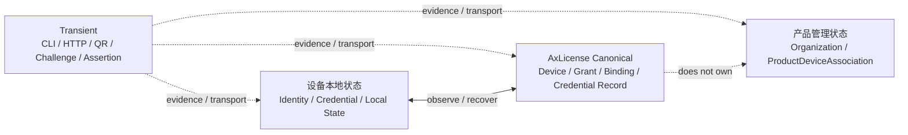
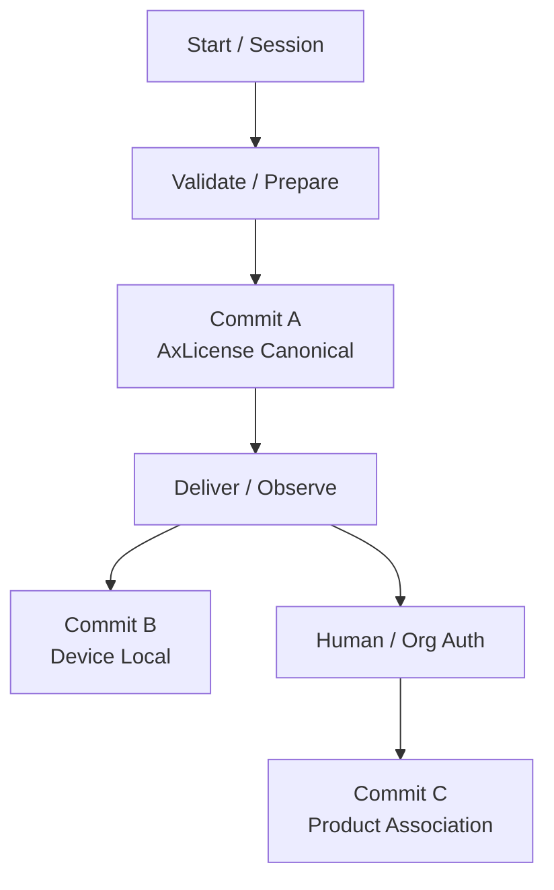
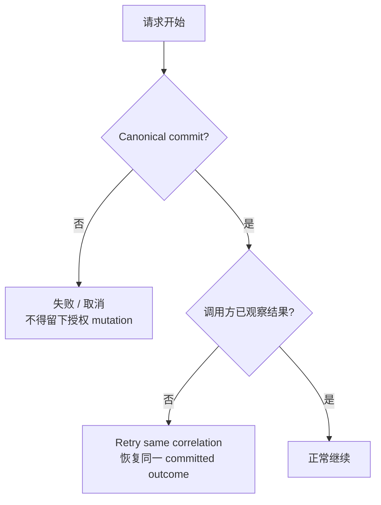

# 16.1 — Runtime Flow Atlas — 总览、状态面与读图约定

> 🗺️ **Status: P16 explanatory child / derived from Current Authority.** 本页解释如何阅读后续流程图。它不新增产品需求，不改变 P10–P16 已冻结语义。

## 1. 为什么要单独建立 Flow Atlas

P16 主文档负责冻结时间语义；本组子文档负责把这些语义转成工程、产品、测试都能直接阅读的图示。核心目标是让每个流程都能回答四个问题：**谁拥有状态、何时 commit、失败后哪份状态仍然有效、为什么不能走更“简单”的捷径。**

## 2. 四个状态面

### 中文解释

- **设备本地状态**：设备当前真正持有的 provider reference、DeviceIdentity 本地关联、已安装 signed credential。它决定离线时能观察到什么，但不是服务器商业授权的第二份真相。
- **AxLicense canonical**：服务器上的 Device、DeviceIdentity、LicenseGrant、DeviceBinding、SignedLicenseCredential record、operation ledger 和 lifecycle event，是授权/设备身份的 canonical authority。
- **产品管理状态**：Launcher/NearHub 自己的 Organization、账号、ProductDeviceAssociation、管理 token。它不属于 AxLicense license model。
- **Transient**：二维码、Challenge、Assertion、HTTP 响应、CLI process 都只是证据/运输层，不能因为“存在”就成为 authority。

### 为什么这样做

如果把四个状态面混在一起，最容易产生三类严重 bug：网络超时被误判为“没激活”、二维码被误判为“拥有设备”、本地 credential 被误判为“服务器当前状态”。分层让 retry、离线运行、灾备和 ownership recovery 都有唯一解释。

### 主要风险

- Product 直接读取/改写 AxLicense 本地文件，制造第二套语义。
- Product backend 把 DeviceAssertion 当 ownership authority。
- 服务器已 commit，但设备没收到 response，UI 却显示“失败并重新创建授权”。

## 3. 三个 durable commit

### 意义

- **Canonical commit** 决定授权事实是否已经成立。
- **Device local commit** 决定设备是否已经安全观察并持久化新 credential/identity association。
- **Product association commit** 决定设备属于哪个 Organization/Account。

三者可以发生在不同时间，失败恢复必须分别处理。

## 4. 通用读图规则

每个后续流程固定包含：

1. **流程图**：参与者和顺序；
2. **中文解释**：用户/工程实际经历什么；
3. **意义**：为什么不采用更省事但危险的设计；
4. **风险与控制**：失败点、误用点、应保持的 invariant。

## 5. 通用失败语义

**核心意义：** response 丢失不是 rollback；retry 也不是新业务请求。
