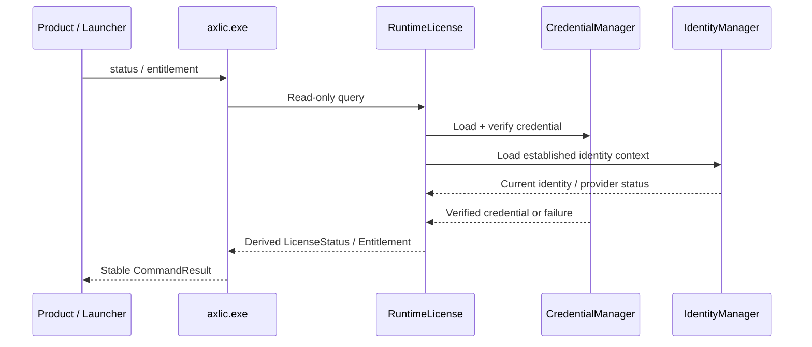
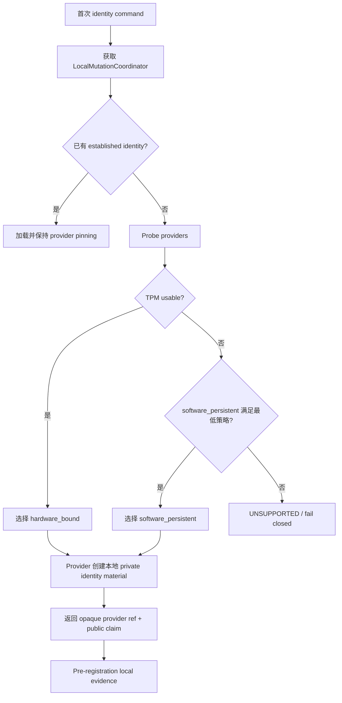
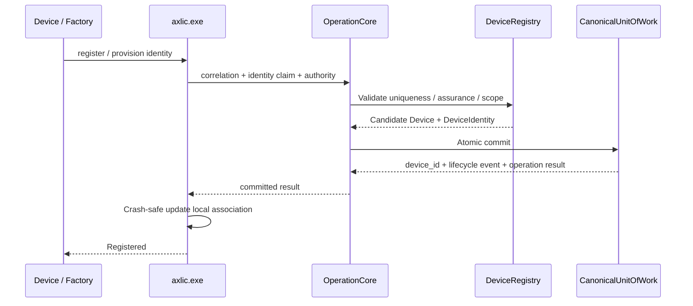

# 16.2 — Runtime Flow Atlas — 本地运行、DeviceIdentity 与设备注册

> 🪪 覆盖 `RUN-01`、`ID-01`、`ID-02`。这些流程决定“设备是谁”和“离线时如何判断授权”，是后续所有 activation/recovery/assertion 的基础。

## RUN-01 — 本地 license/status/entitlement 查询

### 中文解释

正常启动时 Product 不需要访问 AxLicense Server。`axlic.exe` 读取本机已安装 credential，并确认它确实属于当前 DeviceIdentity，再计算某个 entitlement 是否有效。

### 为什么这样做

永久 runtime 不能依赖云服务存活；否则服务器故障、客户网络隔离都会让已购买设备变砖。把 runtime verification 设计成纯本地路径，同时用 signed credential 保持真实性。

### 风险与控制

- **风险：credential 被篡改。** → signature/format/unknown key 一律 fail closed。
- **风险：TPM 暂时不可用被当成新设备。** → 返回 provider unavailable，不重新选 software provider。
- **风险：产品缓存结果过久。** → cache 只是 derived state，不是 authority。

## ID-01 — 首次本地 DeviceIdentity 建立

### 中文解释

第一次没有身份时才做 provider discovery。优先 TPM；TPM 真正不可用时才允许在政策满足的前提下使用 software-persistent。private key 永远留在 provider/KSP 内部。

### 为什么这样做

设备身份要尽量抗克隆，同时避免“理论上有 TPM 但实际上不能用”导致生产失败。首次选择和后续加载分开，才能保证已经建立的 hardware identity 不会因为临时故障自动降级。

### 风险与控制

- Golden Image 带了 private identity → 多台设备克隆成同一 Device。**必须禁止。**
- Probe 有副作用 → 可能创建垃圾 key。Probe 必须概念上 non-mutating。
- 已有 hardware identity 后再次跑 provider selection → silent downgrade。必须 provider-pinned。

## ID-02 — Device 注册到 AxLicense Server

### 中文解释

本地生成 key 并不等于服务器已经承认这台设备。只有服务器 canonical commit 成功后，才产生 `Device + DeviceIdentity` 真相，随后设备把 server-assigned `device_id` 安全写回本地关联。

### 为什么这样做

把“本地存在一把 key”和“系统承认某台 physical Device”分开，可以避免断电、重复请求、克隆或恶意 keypair 自行变成合法设备。

### 风险与控制

- Server commit 后 response 丢失 → retry 必须用同一 correlation 找回同一 Device，而不是创建第二个。
- Local write 崩溃 → canonical Device 仍存在；重试恢复并写回本地 association。
- 相同 identity claim 已属于另一 non-retired Device → fail closed。
