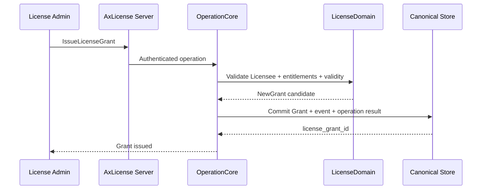
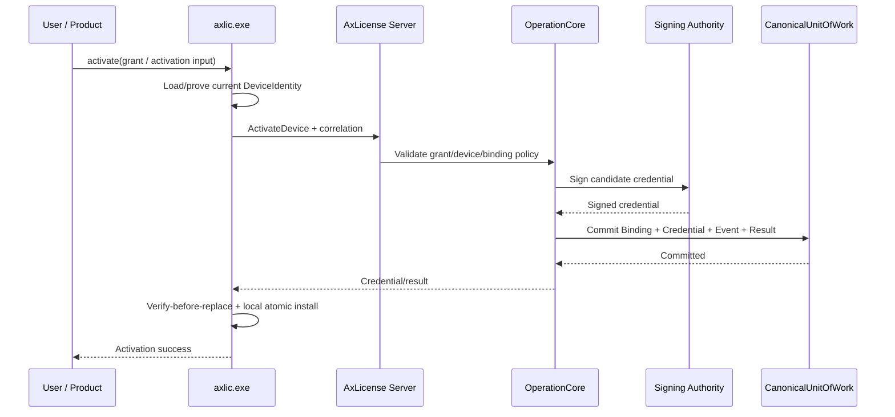

# 16.3 — Runtime Flow Atlas — LicenseGrant、在线激活与离线激活

> 🔐 覆盖 `LIC-01`、`ACT-01`、`ACT-02`。重点是区分“有一份商业 LicenseGrant”和“某台设备已经被激活”。

## LIC-01 — LicenseGrant 签发

### 中文解释

这个流程只创建“某个 Licensee 拥有哪些 entitlement”的商业/策略 authority。此时没有 DeviceBinding，也没有设备 credential。

### 为什么这样做

如果“签发 License”就等同于“某设备已经激活”，后台就无法安全支持库存、预售、离线 activation、rehost 或尚未选择目标设备的场景。

### 风险与控制

- 把 Grant existence 当设备 runtime authority → 产品越权。
- 重复提交 → 必须由 correlation 幂等返回同一个 Grant。
- SKU 名称进入授权判断 → 应只使用稳定 entitlement IDs。

## ACT-01 — 在线激活

### 中文解释

服务器先验证 grant、DeviceIdentity 和 one-active-binding，再生成 credential，并把 `Binding + Credential + Event + operation result` 当成一个可恢复的 canonical outcome。设备收到后仍要自己验签并原子安装。

### 为什么这样做

避免最危险的半状态：**服务器说已绑定，但没有可恢复的 credential**；也避免设备因为收到损坏/伪造 response 覆盖原来的有效授权。

### 风险与控制

- Signing 成功、DB commit 失败 → signature 本身不成为 authority，丢弃即可。
- DB commit 成功、response 丢失 → retry same correlation 找回同一结果。
- grant 已绑定另一 Device → 必须 `REHOST_REQUIRED`，不能偷偷抢绑定。
- 本地安装崩溃 → old 或 new committed local state，不能 half-write。

## ACT-02 — 离线激活

```mermaid
flowchart LR
    A["离线目标设备"] --> B["axlic.exe 创建 OfflineActivationRequest"]
    B --> C["USB / File / QR 等运输"]
    C --> D["联网工作站 / Portal"]
    D --> E["AxLicense Server<br>CompleteOfflineActivation"]
    E --> F["Canonical commit<br>Binding + Signed Credential"]
    F --> G["导出 Response / Credential"]
    G --> H["运输回目标设备"]
    H --> I["本地完整验签"]
    I --> J["Atomic install"]
```

### 中文解释

离线设备只创建 request；request 不授权。真正的 canonical activation 仍发生在联网 AxLicense Server。服务器返回 signed credential，目标设备再验签导入。

### 为什么这样做

这样 online/offline 共用一套授权语义，USB、二维码、文件复制只是运输手段，不会因为某个 request 被复制就复制出 license。

### 风险与控制

- request 被复制/重复提交 → exact same request 幂等恢复同一 outcome。
- request 被修改 → replay/idempotency validation 拒绝。
- server 已 commit，但用户没把 response 带回设备 → server authority 已成立；不能假装 cancel。
- response 重复导入 → 同一 credential 应是 idempotent no-op/success。
