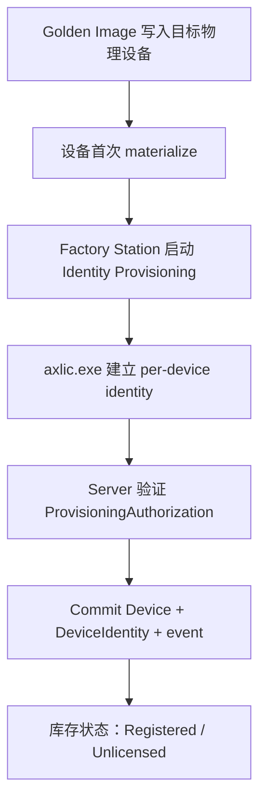
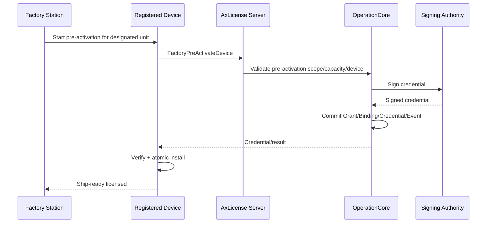
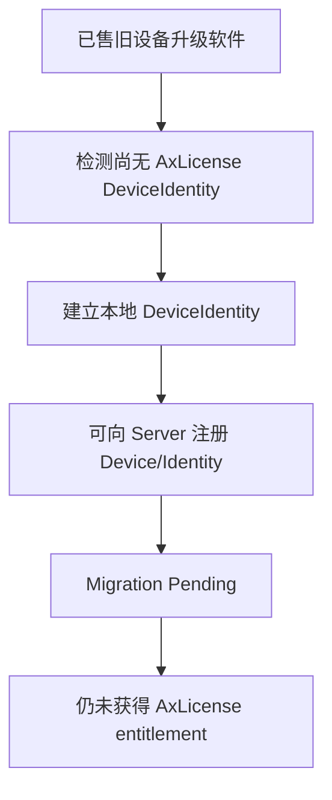
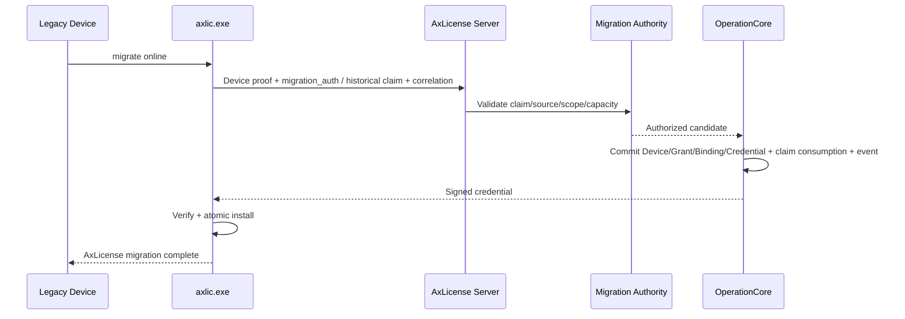
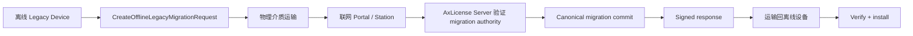
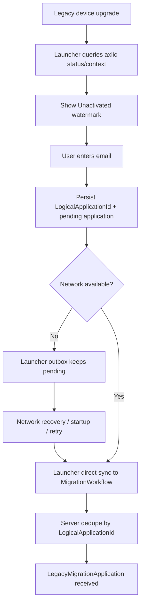
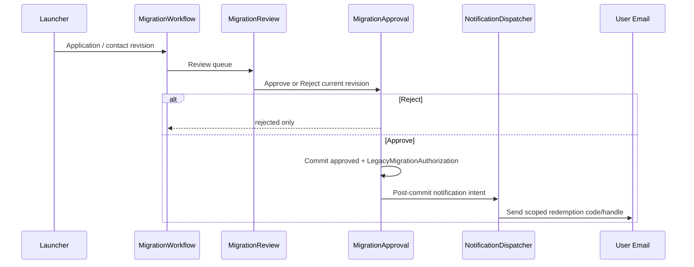
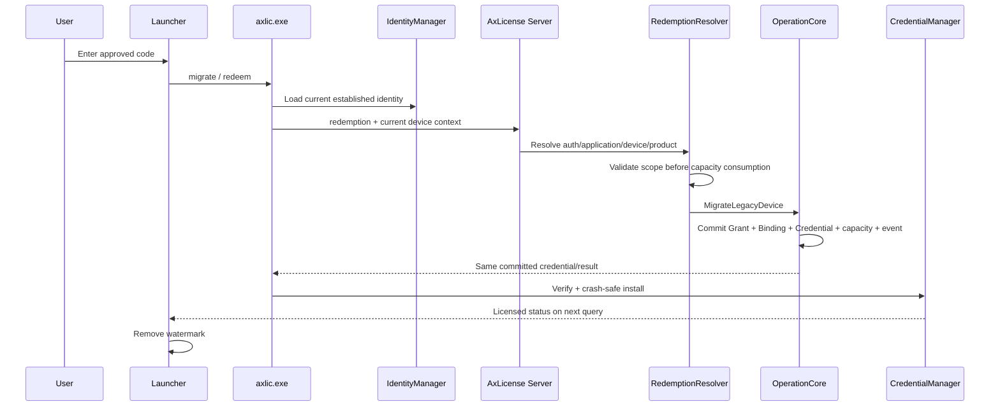

# 16.4 — Runtime Flow Atlas — 工厂 Provisioning 与 Legacy Migration

> 🏭 覆盖 `FAC-01`、`FAC-02`、`MIG-01`～`MIG-06`。核心原则：**建立 DeviceIdentity、提交历史迁移申请、人工批准、以及真正消费 License 是不同 authority fact。** FR-018 下，Product/Launcher 持有 application UX/outbox/direct sync；`axlic.exe` 只在最终 device-bound redemption/credential install 时进入。

## FAC-01 — Factory identity-only provisioning

### 中文解释

工厂先复制统一镜像，再在每台实际硬件上建立独立 DeviceIdentity。成功后只产生 Device/Identity，不创建 LicenseGrant、Binding 或 SignedLicenseCredential。

### 为什么这样做

库存设备、不同 SKU、不同客户可能在出货前都还不需要 consume license。把 identity 和 license 消费解耦可以避免“生产一台就占一个授权”，也防止 Golden Image 携带可克隆身份。

### 风险与控制

- Golden Image 预置 private key/current DeviceIdentity → 批量克隆身份，必须禁止。
- Factory authorization scope 被滥用为 license authority → identity_provision scope 不能隐式拥有 pre-activation 权限。
- 批次中断 → 已 commit 的设备保持有效，未 commit 的单机重试；不能整批 rollback。

## FAC-02 — Optional factory pre-activation

### 中文解释

只有明确要求“出厂即 licensed”的设备才继续执行 pre-activation。它使用独立的 factory-pre-activation authority，并产生与普通 activation 相同的授权结果。

### 为什么这样做

让同一产线既能生产“身份已注册但未授权”的库存设备，也能生产“开箱即可离线运行”的指定设备，而不混淆两个阶段。

### 风险与控制

- identity provisioning 成功但 pre-activation 失败 → Device 仍保持 registered/unlicensed，不能回滚身份。
- retry 重复 consume capacity → correlation/idempotency 必须恢复同一 outcome。
- 工厂拿到 master signing key → 明确禁止；只能经 Server/Signing Authority。

## MIG-01 — Legacy identity bootstrap

### 中文解释

老设备升级后可以先补上 DeviceIdentity，使其进入 AxLicense 世界，但这一动作本身不证明它历史上购买过什么授权。

### 为什么这样做

历史设备数量大、来源复杂；如果“升级软件生成 key”就自动获得 license，会让任何旧镜像/克隆设备都能自我授权。必须把 identity bootstrap 与 historical entitlement claim 分开。

### 风险与控制

- 旧 license 文件、MAC、镜像、一个新 keypair 被当 historical authority → 不允许。
- 升级后立刻强制新 license 导致老客户停机 → rollout policy 可允许 migration pending 期间继续旧体系，但不能把它解释为新 AxLicense entitlement。

## MIG-02 — Online legacy migration

### 中文解释

Server 同时验证“这台设备是谁”和“它确实有资格继承历史商业授权”。只有两者都成立才 commit 新的 AxLicense grant/binding/credential。

### 为什么这样做

设备身份与购买权利是两份独立证据；把它们组合验证，才能防止历史授权被一份镜像、多台设备或重复 claim 消耗。

### 风险与控制

- 同一 historical claim 被第二台 Device 抢占 → conflict/fail closed。
- response 丢失 → 同一 correlation 找回同一 committed outcome，不再 consume claim。

## MIG-03 — Offline legacy migration

### 中文解释

只是把 online migration 的 transport 改成 request/response 文件；historical claim、Device proof、canonical commit 语义完全相同。

### 为什么这样做

Air-gapped 客户也必须能迁移，但不能因为离线就降低 authority 要求或建立第二套 license 体系。

### 风险与控制

- request 被复制 → 不应重复 consume claim。
- response 被复制到另一设备 → device binding verification 拒绝。
- server 已 commit 但 response 未返回 → migration authority 已消费；必须恢复结果而不是重新迁移。

## MIG-04 — Legacy provisional application / Launcher outbox

### 中文解释

申请可靠投递属于产品交互，不属于 AxLicense device security core。Launcher 自己保存 pending/outbox，并在网络恢复后直接请求 Server；不需要再次调用 `axlic.exe` 做 sync。

### 风险与控制

- Server 已收到但 response 丢失 → 同一个 LogicalApplicationId 找回原申请。
- 连点 Submit → 同一 active lineage 收敛成一个申请。
- Launcher 本地 pending 丢失 → 只能丢失尚未送达的 workflow request；不能创建或撤销 License。
- Server application 一旦接受 → 由 Server workflow durable state 持有，不依赖 Launcher outbox。

## MIG-05 — Human review / approval / notification

### 中文解释

审批成功意味着“允许这台设备迁移”，但还没有真正 License。邮件只是把已经存在的批准结果传达给客户。

### 风险与控制

- Approve response 丢失 → 重载原 approval；不能再创建一份 authorization。
- Email provider 失败 → 只 retry notification。
- 换邮箱与审批并发 → 使用 contact revision/precondition；stale decision 必须重新读取。
- Reject 不终止 provisional rollout policy，也不产生 License。

## MIG-06 — Device-bound redemption / final migration

### 中文解释

只有最终 redemption 才进入 `axlic.exe` 的安全边界。`axlic.exe` 重新读取当前 DeviceIdentity，而不是相信 Launcher 保存的普通 device reference。Server 先检查 device/product/application scope，再允许消耗 migration capacity。

### 风险与控制

- 错设备/错产品输入有效码 → 在 consume 前 fail closed。
- Server migration 已 commit 但 response 丢失 → retry 恢复同一个 Grant/Binding/Credential。
- Server 已 commit、device 尚未 install → 本地仍显示未激活；恢复同一个 credential 后 verify/install。
- 下载损坏或 verify 失败 → 不覆盖原 local committed state，水印保留。
- 只有 `axlic.exe status = licensed` 才允许 Launcher 去掉水印。

## FR-018 Runtime acceptance

FR-018 的 targeted runtime path 已完成 acceptance：**Application → Approval → Redemption → Canonical Migration → Local Credential Observation** 五个时间边界不再混淆。此 acceptance 不自动关闭 P16 overall；其他 product-flow candidate gaps 仍由父文档 §39 继续评审。
