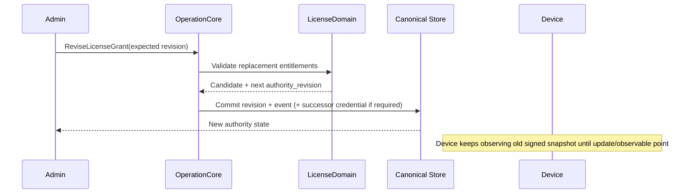
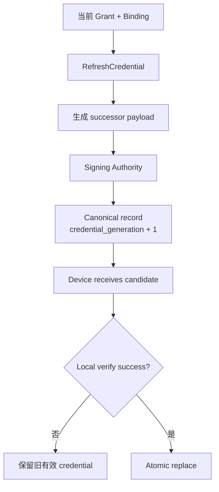
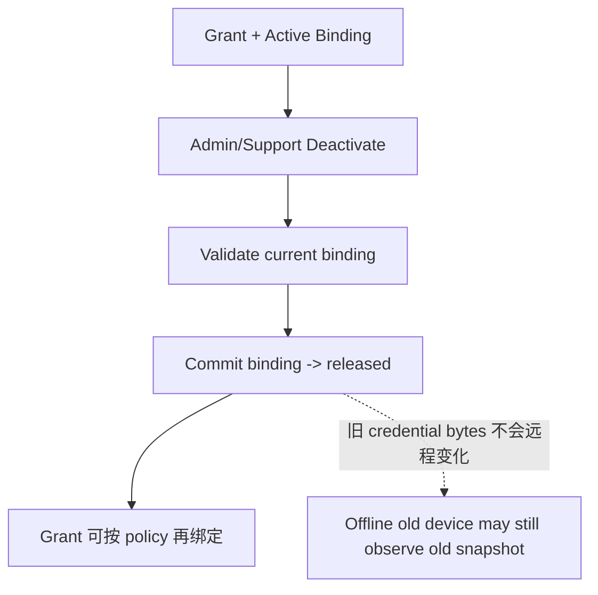
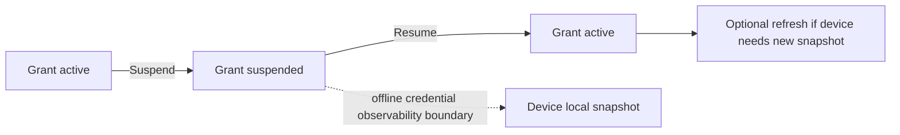
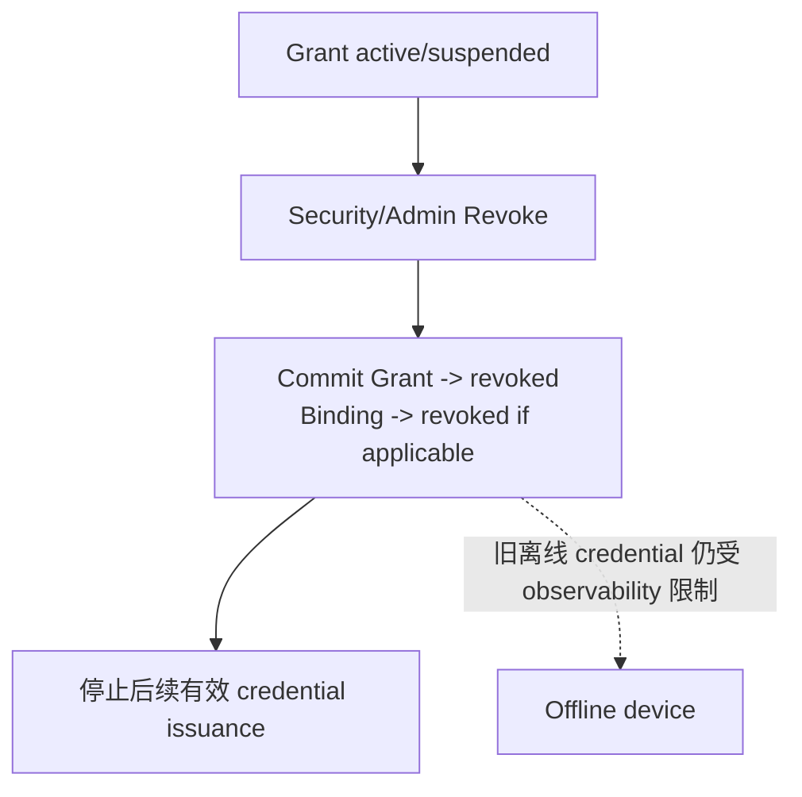

# 16.5 — Runtime Flow Atlas — Entitlement 变更、Credential 演进与 Admin Lifecycle

> ⚙️ 覆盖 `ADM-01`～`ADM-05`。本页强调：服务器 authority 改变与离线设备何时观察到变化是两件事。

## ADM-01 — Entitlement / validity revision

### 中文解释

管理员修改 rights/validity 时，服务器 canonical authority 先变化。若已有 Active binding 并需要更新离线 snapshot，则生成 successor credential；设备未收到前仍只能看到旧签名内容。

### 为什么这样做

不能让云端数据库某字段变化“魔法般”改变永久离线设备。显式 revision + signed successor 才能让线上 authority 和离线可观测事实同时可解释。

### 风险与控制

- 两个管理员同时修改 → `expected_authority_revision` 防止 silent last-write-wins。
- 服务器改了权利但没生成可恢复 credential → credential-required outcome 必须保持原子语义。
- 产品误以为后台 revision 已即时生效到离线机 → UI/支持文档必须承认 observability boundary。

## ADM-02 — Credential refresh / signing-key or format migration

### 中文解释

Credential 可以因为 signing-key rotation、format migration 或单纯 refresh 而换代，但这并不一定改变 LicenseGrant 的商业语义。

### 为什么这样做

把 `authority_revision` 与 `credential_generation` 分开，可以更新密码学/格式而不伪装成“客户授权内容变更”。

### 风险与控制

- 新 credential 验证失败却覆盖旧 credential → 必须 verify-before-replace。
- retry 每次都生成一份新 credential → same logical operation 必须恢复同一 outcome。
- 新 signing key 尚未分发 verifier metadata 就开始签发 → 客户端会全部 fail closed；rotation 要先建立 trust compatibility path。

## ADM-03 — Deactivate / release binding

### 中文解释

Deactivate 是关闭当前 binding，而不是删除历史 LicenseGrant。之后可按 policy 再 activation/rehost，但会形成新的 binding epoch/successor credential。

### 为什么这样做

授权本身与某次设备占用必须分离，才能支持换机、返修、重新部署，并保持完整审计历史。

### 风险与控制

- 把 released binding 原地改回 active → 会破坏历史边界；应创建 successor binding 语义。
- 宣称旧离线机即时失效 → 不符合签名离线模型。

## ADM-04 — Suspend / Resume

### 中文解释

Suspend 是服务器侧临时停止授权 authority；Resume 恢复。是否需要给已绑定设备刷新 credential 取决于后续平台/策略定义。

### 为什么这样做

它适合“暂时冻结”而不是永久撤销，同时保留 audit 和可恢复性。

### 风险与控制

- Suspend 被当成离线即时 kill switch → 不成立。
- Resume 偷偷改变 entitlement → 若商业 rights 变化，应走 ReviseLicenseGrant，而不是利用 resume 绕过 revision。

## ADM-05 — Revoke

### 中文解释

Revoke 是永久/强语义撤销，服务器不再承认该 Grant 的后续有效授权。

### 为什么这样做

与 deactivate/suspend 分开，才能让支持人员知道“可重新绑定”“临时冻结”“永久撤销”是三类完全不同的业务含义。

### 风险与控制

- 把 revoke 当 delete，丢失 audit/history → 必须保留 lifecycle evidence。
- 离线旧设备无法即时得知 revoke → 只能在 observable point 收敛，除非未来引入额外在线心跳能力。
