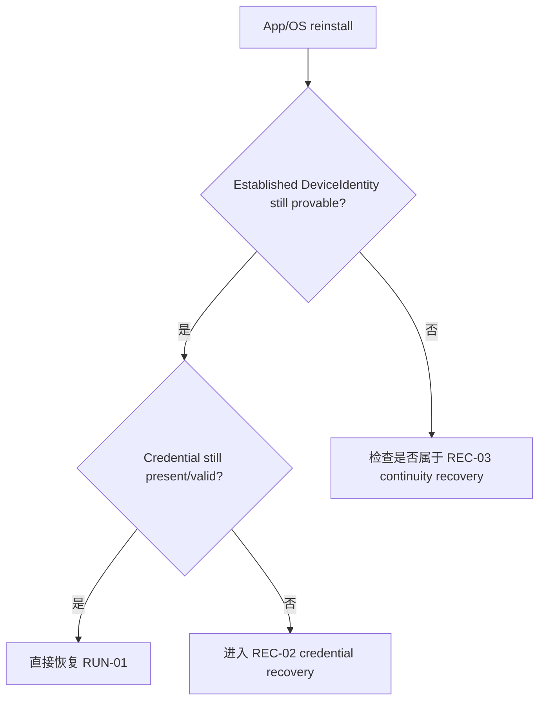
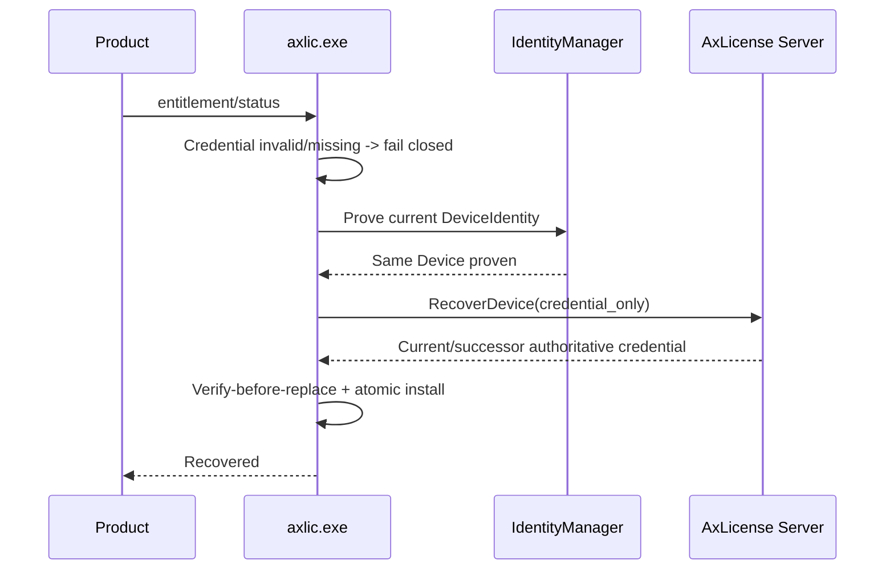
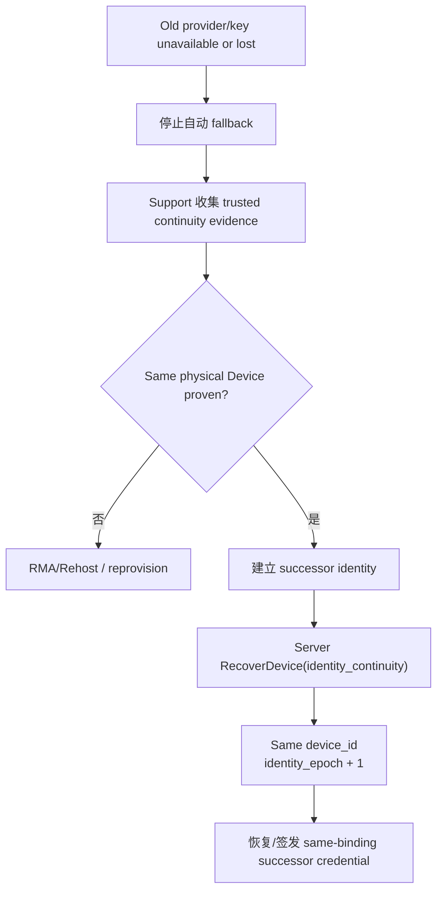
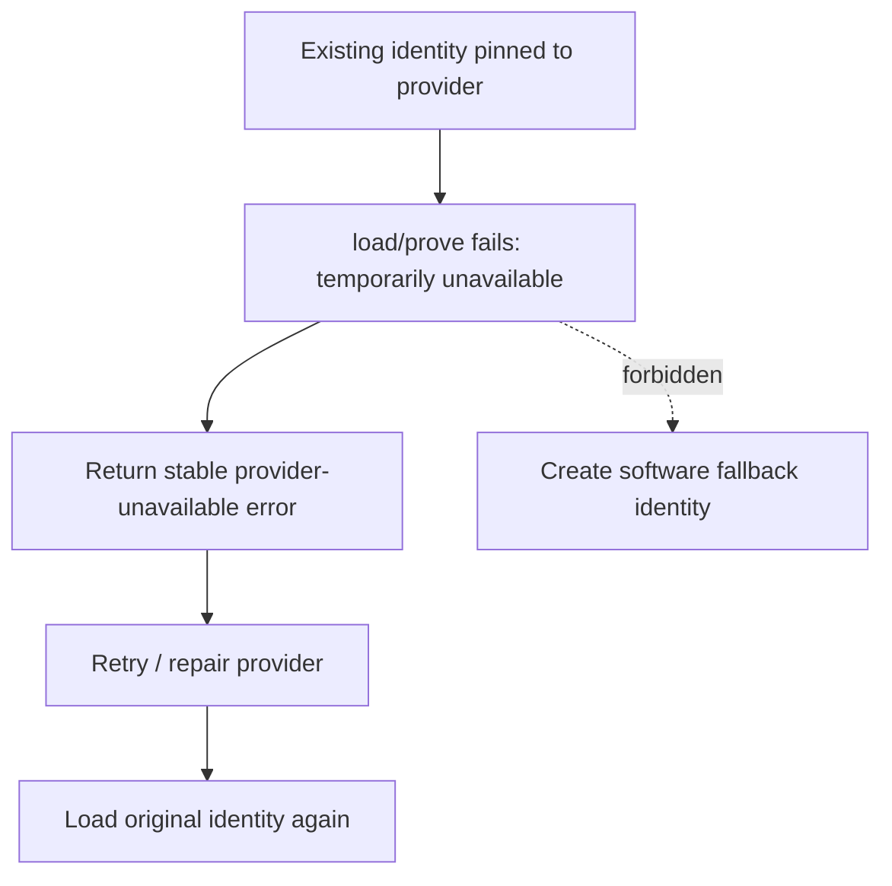
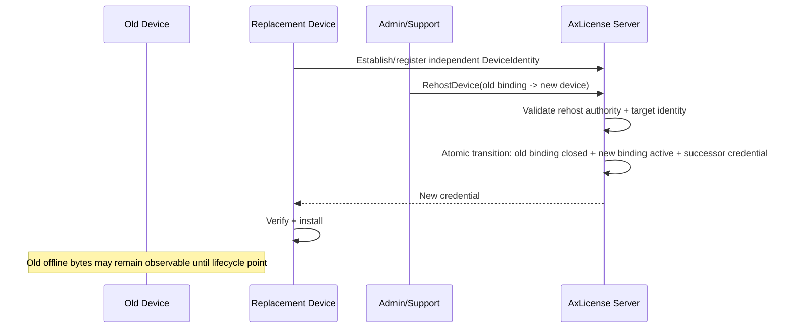

# 16.6 — Runtime Flow Atlas — Recovery、Identity Continuity 与 RMA/Rehost

> 覆盖 `REC-01`～`REC-04`、`RMA-01`。判断核心不是“文件还在不在”，而是：**能否证明仍是同一 physical Device。**

## REC-01 — App / OS reinstall，identity continuity 仍成立

### 中文解释

重装软件或支持的系统 reset 不应自然制造一台“新设备”。只要原 DeviceIdentity continuity 仍成立，就继续使用同一个 `device_id` 和 binding。

### 为什么这样做

物理设备是 license unit，而不是 OS installation。否则每次重装系统都会多占一个 license，给客户和 support 制造大量人工问题。

### 风险与控制

- “找不到本地文件”就直接创建新 Device → 禁止，先检查 provider continuity。
- 复制旧应用目录到另一台 PC → 不能等价于 continuity，必须能证明当前 provider identity。

## REC-02 — Credential corruption / loss

### 中文解释

credential 文件坏掉时不从残缺字段猜 entitlement。只要 DeviceIdentity 仍完整，就向 canonical server 恢复当前 authoritative credential 或 same-binding successor。

### 为什么这样做

credential 是可以恢复的 signed snapshot；DeviceIdentity 才是判断“是不是原机器”的核心。本地文件损坏不应该自动消耗新 license。

### 风险与控制

- 从损坏 credential 读取 grant/device id 并信任 → 不允许，损坏数据只能做非 authority 诊断提示。
- identity 也丢了却继续 credential_only → 应转 REC-03。

## REC-03 — Identity material 丢失，但 continuity 可证明

### 中文解释

原 TPM/KSP key 真丢了时，不能凭一个新 key 自称“我是原设备”。必须先通过受信 continuity evidence 证明物理设备没换，再在同一个 `device_id` 下建立新的 identity epoch。

### 为什么这样做

既能允许真实设备维修/reset 后恢复，又阻止攻击者拿着旧 license 文件和新 key 冒充原机器。

### 风险与控制

- Support 人工“看起来像同一台”就批准 → continuity evidence 的具体可信标准必须在 P17/P20 明确。
- identity epoch 变化却新建 binding/license → recovery 不应重复 consume license。

## REC-04 — TPM/KSP temporarily unavailable

### 中文解释

驱动问题、TPM 服务暂时不可用和“身份确实丢失/不匹配”不是一回事。前者只应重试或修复环境。

### 为什么这样做

如果一遇到 TPM 故障就自动生成 software identity，同一台机器会产生第二个 Device 身份，且安全等级被静默降级。

### 风险与控制

- silent fallback → 明确禁止。
- UI 把 unavailable 显示为 license revoked → 应使用独立稳定错误分类。

## RMA-01 — Physical replacement / Rehost

### 中文解释

真正换主板/整机时，新硬件先有自己的独立 Device identity；然后 support 把同一 LicenseGrant 的 active binding 从旧 Device 切到新 Device。

### 为什么这样做

Recovery 表示“还是原物理设备”，Rehost 表示“物理设备已经换了”。把两者混淆会让换机绕过 license unit 规则，也会让审计失真。

### 风险与控制

- 新设备被吸收到旧 `device_id` → 破坏 physical-device identity。
- old/new 两边短暂都是 canonical active → transition 必须原子保持 one-active-binding。
- **产品层风险：** AxLicense rehost 不会自动迁移 Launcher 的 Organization/room association；这是 P16 已暴露的产品策略缺口。
