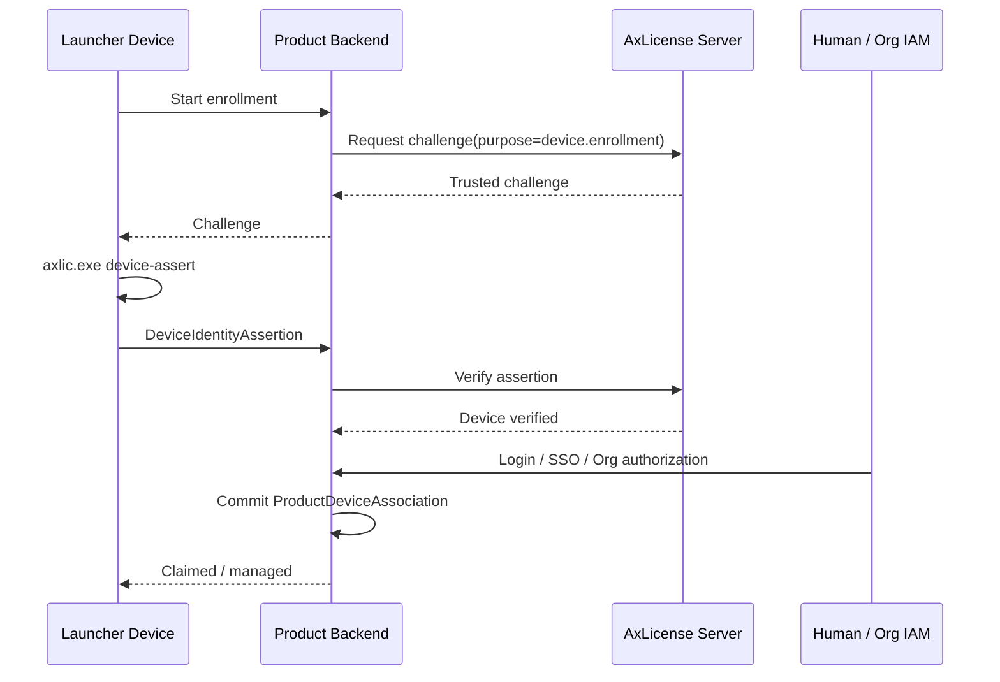
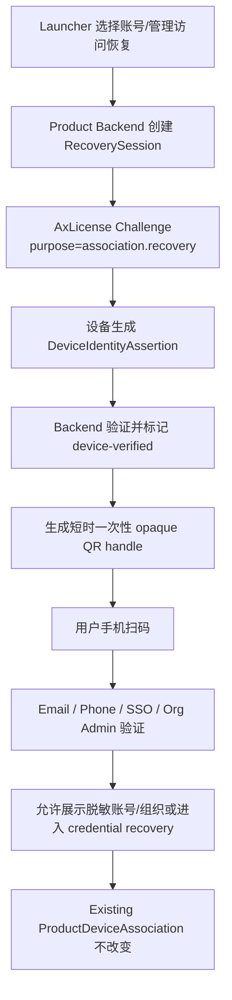
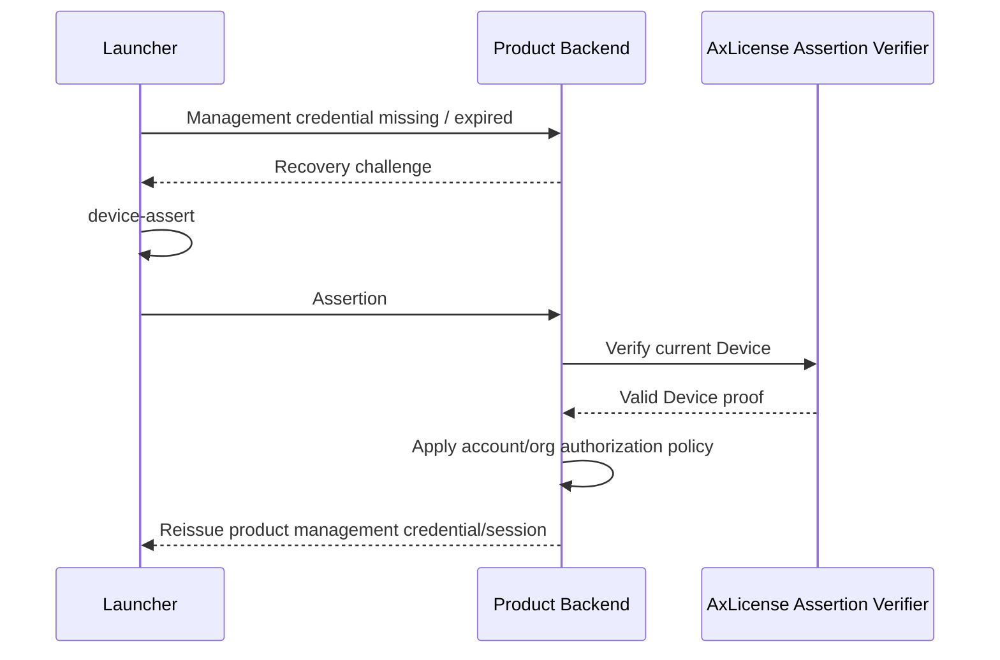
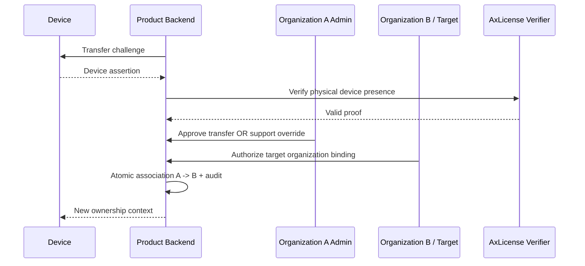
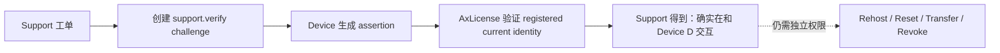
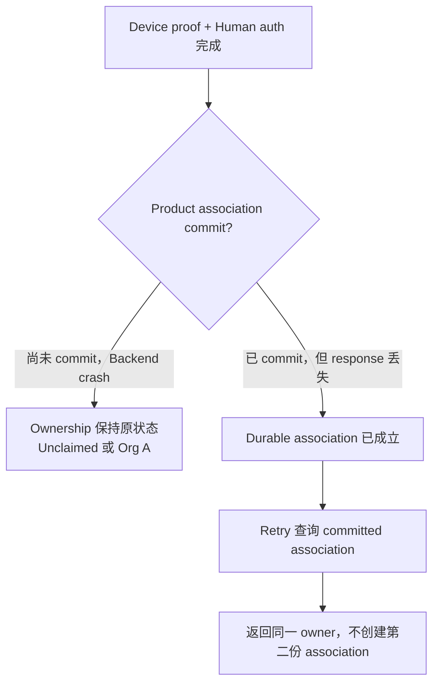

# 16.7 — Runtime Flow Atlas — Product Claim、二维码找回、Ownership 与 Support Verification

> 👥 覆盖 `OWN-01`～`OWN-05` 与 `X-11`。本页最重要的边界：**DeviceIdentityAssertion 证明“正在交互的是哪台设备”，不证明扫码的人拥有这台设备。**

## OWN-01 — First product enrollment / claim

### 中文解释

设备先证明“我是已登记的 Device D”，人再证明“我有权代表 Organization O”。只有两个条件都成立，Product Backend 才提交 Device→Organization/Account 的归属关系。

### 为什么这样做

工厂、库存、经销商阶段就可以注册 Device，但当时并不知道最终客户是谁；同时也防止“拿到会议室设备的人”仅凭物理接触就夺取 ownership。

### 风险与控制

- Device assertion 成功就直接 claim → 错误；还缺 human/org authority。
- 用户登录成功但设备没做 proof → 可能把别人的设备 claim 进自己的组织。
- Enterprise 默认应 Device→Organization/Tenant，具体个人 ownership 由产品策略决定。

## OWN-02 — 忘记账号/组织访问：二维码恢复

### 中文解释

二维码只是恢复 session 的入口；设备先在后台完成 device proof，再把一个短期 opaque handle 显示成 QR。扫码的人仍必须完成独立账号/组织验证。

### 为什么这样做

这样即使 QR 被拍照、转发或设备放在公共会议室，也不会因为“看到二维码”就泄露账号或改绑设备。

### 风险与控制

- QR 内嵌 raw device_id、DeviceIdentity、用户名、token → 不应这样做。
- QR 长期有效 → 应短 TTL、single-use、高熵 handle。
- 用户 B 登录后尝试接管原属于 A 的设备 → ordinary recovery 不允许 ownership mutation，应进入 OWN-04。
- **Availability 边界：** 当前设计需要 Product Backend + AxLicense Challenge/Verifier 在线；完全离线 kiosk recovery 尚不是已冻结能力。

## OWN-03 — Launcher 管理 credential/session 丢失

### 中文解释

后台 Device→Organization association 仍是对的，只是 Launcher 本地管理 token 丢了，所以重新证明设备并补发管理 credential。

### 为什么这样做

这和 AxLicense 的 `RecoverDevice` 完全不同。前者恢复产品管理通道，后者恢复 DeviceIdentity/license continuity；混在一起会导致授权边界混乱。

### 风险与控制

- 重发管理 token 时顺便改 ownership → 不允许。
- 把 AxLicense license credential 当 product management token → 两套 credential authority 必须分开。

## OWN-04 — Organization / ownership transfer

### 中文解释

转让是独立的高权限流程。Device proof 只能说明“目标设备当前在参与”；还必须有旧组织放行/支持覆盖和新组织接收授权。

### 为什么这样做

“忘记密码”和“换主人”风险等级完全不同。分开可以防止扫码、临时物理访问或普通账号恢复被利用来偷设备。

### 风险与控制

- 只有 physical possession → 不够。
- Association A→B 自动把 LicenseGrant commercial ownership 一起转 → 当前 V1 **没有**这种自动耦合；这是单独商业政策候选。
- 两个组织同时成为 authoritative owner → product association commit 必须保持唯一 ownership 语义。

## OWN-05 — Support device verification

### 中文解释

用于远程支持时证明客户正在操作哪台设备，减少报错设备、串设备和伪造工单。

### 为什么这样做

高风险操作前先把“设备身份”确定下来，但又不把 device proof 升格为 admin authority。

### 风险与控制

- Support 看到 valid assertion 就直接执行 rehost/revoke → 仍必须通过各操作自己的 admin/support authorization。

## X-11 — Product Backend 在 association commit 前后崩溃

### 中文解释

Enrollment/Transfer 的网页 session 状态不是 ownership authority。真正归属只看 Product Backend durable association store 是否 commit。

### 为什么这样做

防止浏览器超时、扫码中断或 backend crash 造成“一半绑定”“重复绑定”或用户看到失败后再把同一设备 claim 一次。

### 风险与控制

- transient session 标记 complete，但 DB 未 commit → ownership 不成立。
- DB 已 commit、response 丢失后新建另一 session 重新绑定 → retry 应先恢复已有 durable outcome。
