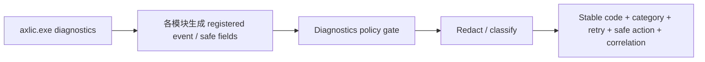
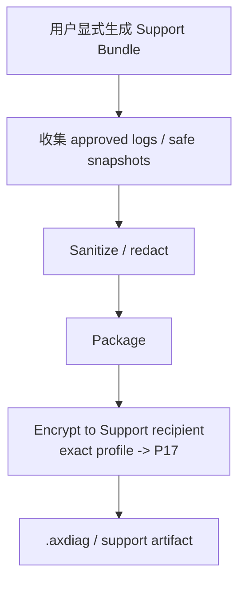
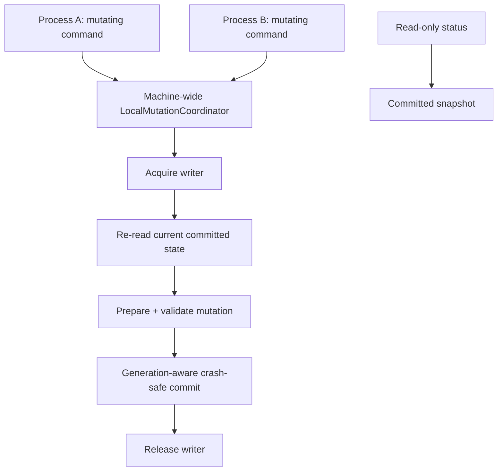
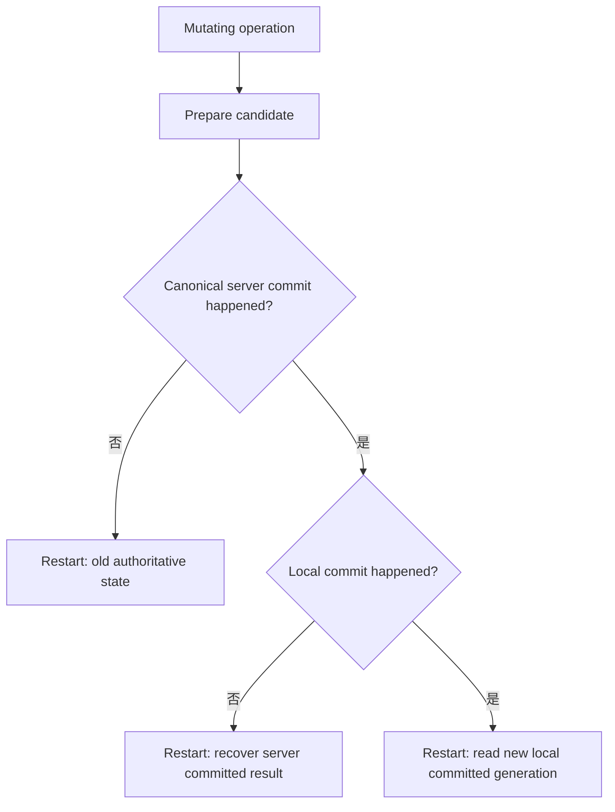
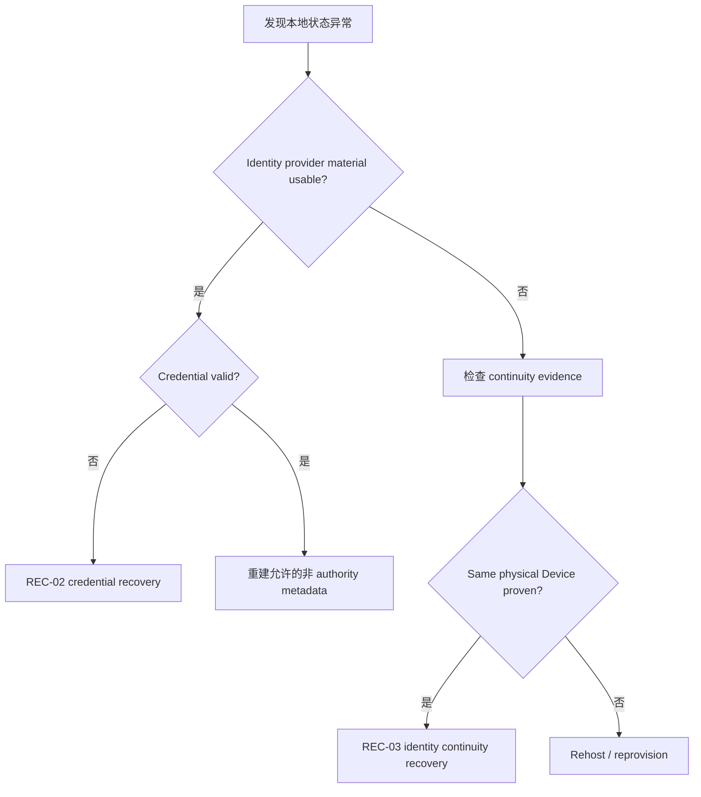
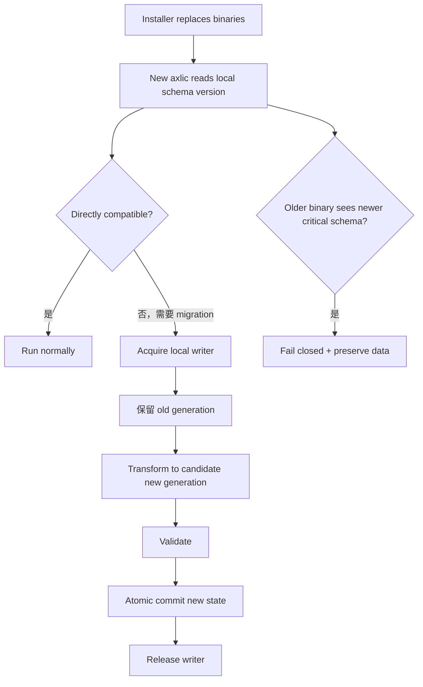

# 16.8 — Runtime Flow Atlas — Diagnostics、本地并发、Crash、State Corruption 与 Self-Upgrade

> 🧯 覆盖 `OPS-01`、`OPS-02`、`X-01`～`X-04`。这些流程决定没有常驻 Agent 的 `axlic.exe` 如何在多进程、断电和升级中仍保持 local state 可恢复。

## OPS-01 — Minimum-disclosure diagnostics

### 中文解释

诊断输出只暴露解决问题所需的稳定分类和安全字段，不把原始密钥、DeviceIdentity value、token、server response、stack trace 直接吐给产品或客户。

### 为什么这样做

现场支持需要可观测性，但 license/identity 系统本身持有高敏感数据；“为了排障全打日志”会把安全边界直接破坏。

### 风险与控制

- security-sensitive 模块自由拼字符串日志 → 应使用 registered schema/field policy。
- correlation ref 可用于跨端排查，但应 opaque/minimum-disclosure。

## OPS-02 — Support Bundle

### 中文解释

Support Bundle 是主动生成的排障包，先 sanitization，再加密输出；加密不是允许塞入 secrets 的借口。

### 为什么这样做

让深度支持有更多上下文，同时把日常日志保持最小；也防止 bundle 被第三方读取后直接获得授权秘密。

### 风险与控制

- bundle 因为“反正会加密”而包含 private key/token → 永远禁止。
- bundle 损坏/丢失不能影响 license state，因为它不是 authority。

## X-01 — 多个 axlic.exe 并发启动

### 中文解释

因为 V1 没有常驻 Service，多个应用可能同时 spawn `axlic.exe`。读操作可并行；会改本地 identity/credential/state 的命令必须全机 single-writer。

### 为什么这样做

否则两个进程可能同时安装不同 credential、建立 identity、写 association metadata，导致 local truth 不可恢复。

### 风险与控制

- 进程在拿锁前读了旧状态，拿锁后直接写 → 必须 **acquire 后重新读取**。
- 长网络请求一直占 writer → P17/P18 优化 lock scope，但 commit 前必须 revalidate。
- reader 看到半写文件 → local storage 必须 old/new snapshot 二选一。

## X-02 — 进程 crash / 断电

### 中文解释

断电后先判断 server canonical 是否已经 commit，再判断设备本地有没有观察并落盘。不能仅凭“命令返回没成功”推断授权不存在。

### 为什么这样做

电源故障不可避免，尤其 kiosk/appliance。只有明确 canonical/local 两个 commit 点，才能避免重复 activation、重复 rehost 或半写 credential。

### 风险与控制

- canonical 已 commit，本地没装 → retry same correlation/recovery，而不是发一个新 activation。
- local candidate 写了一半 → storage realization 必须让 restart 看到 old 或 new committed generation。

## X-03 — Local-state corruption / partial loss

### 中文解释

不同文件丢失代表不同风险：credential 丢了可以在 identity intact 时恢复；identity association 丢了要先找 provider/continuity；provider key 也丢了则不能只靠旧 license 文件自救。

### 为什么这样做

把“本地文件”当成一坨整体会让 repair path 要么过度严格，要么安全性太低。分类恢复能减少误占 license，又保持 anti-clone。

### 风险与控制

- 看到 metadata 缺失就宣布新设备 → 可能造成重复 Device。
- 看到旧 credential 就重建 identity → 可能把复制文件的另一台机器授权。

## X-04 — axlic.exe 自升级 / rollback / local schema migration

### 中文解释

程序文件与 identity/license state 分开升级。需要 schema migration 时，以本地事务式方式生成新 generation；旧程序若看不懂新 authorization-critical schema，不能“猜着读”或破坏数据。

### 为什么这样做

AxLicense 生命周期会远长于某个 Launcher 版本，升级/降级必须保护身份和 credential continuity。

### 风险与控制

- installer 清理旧版本时顺手删 provider key/state → 禁止。
- migration 中途断电 → old generation 应可恢复。
- downgrade 静默忽略新字段 → 可能错误授权，必须 fail closed。
