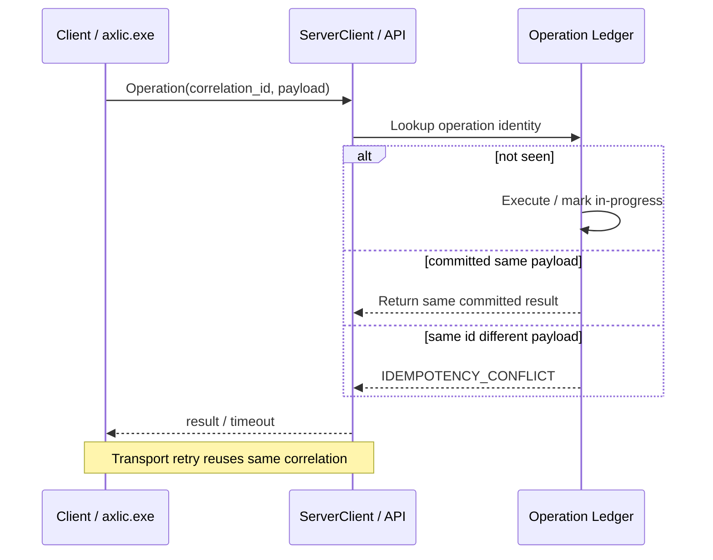
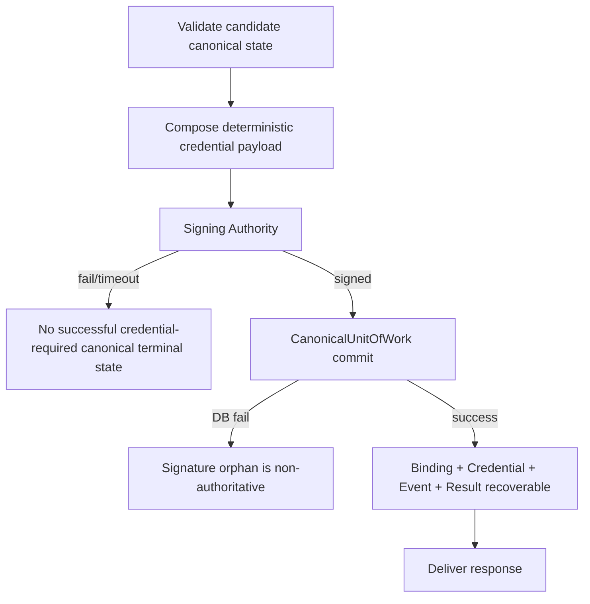
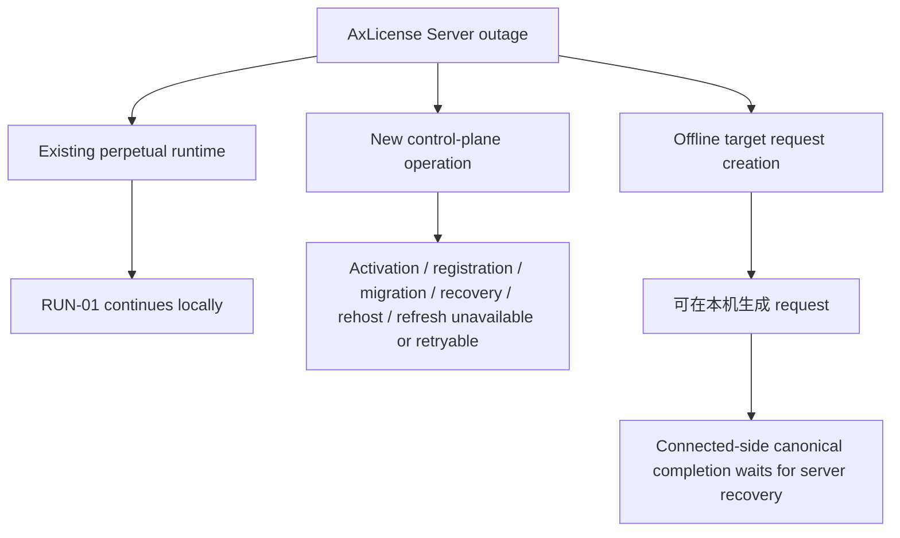
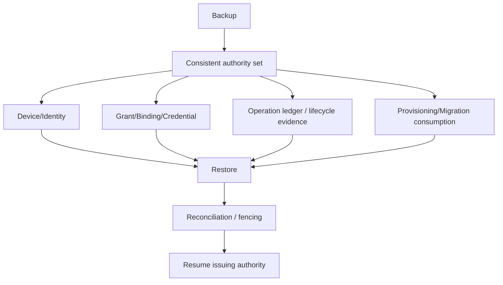
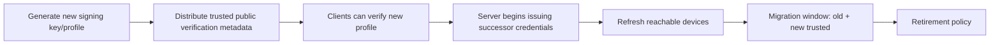
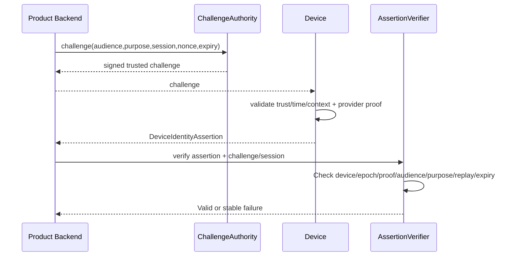

# 16.9 — Runtime Flow Atlas — Server Timeout、Signing/DB Failure、Outage、DR 与 Assertion Replay

> 🛡️ 覆盖 `X-05`～`X-10`，并从系统视角补充 signing-key rollout。这里的目标是保证 server failure 不会制造第二份 authority，也不会破坏永久离线 runtime。

## X-05 — Server timeout / duplicate delivery / backpressure

### 中文解释

网络超时只说明调用方没有看到结果，不说明服务器没执行。每个逻辑操作有稳定 correlation；transport retry 复用它。

### 为什么这样做

这是防止重复 activation、重复 consume migration/factory capacity、重复 rehost 的核心机制。

### 风险与控制

- 一 timeout 就生成新 correlation → 可能真的执行两次。
- load shedding 在 commit 前必须返回稳定 retry classification，不得留下 partial mutation。

## X-06 — Signing failure / DB transaction failure

### 中文解释

Credential-producing operation 必须在签名和 canonical commit 之间保持可恢复一致性。一个孤立 signature 不等于授权；一个 Active binding 也不能没有可恢复 credential。

### 为什么这样做

防止最危险的 server split-brain：数据库说设备已占 license，但系统再也找不到对应 credential，或者拿到一份未 commit 的 signature 就被当成授权。

### 风险与控制

- signer timeout 后其实签名成功 → 只有 canonical operation commit/ledger 能决定 authority。
- DB commit 后 response 失败 → same correlation 恢复 committed result。

## X-07 — AxLicense Server outage

### 中文解释

服务器挂掉不影响已经安装有效 perpetual credential 的本地运行，但新的授权控制操作不能被客户端自行批准。

### 为什么这样做

“云端控制面可用性”和“客户已购买设备能否开机”必须解耦。

### 风险与控制

- Server outage 时本地临时发一份 license → 形成第二 authority，禁止。
- QR 账号恢复当前也依赖 Product Backend + Challenge/Verifier；完全断网找回不是既有能力。

## X-08 — Canonical backup / disaster recovery

### 中文解释

灾备不能只恢复一份旧 DB snapshot 就继续签发。Restore 后必须证明不会把之后已经发生的 activation/rehost/revoke/migration“倒回去”。

### 为什么这样做

已经发到客户设备的 signed credential 和已经消费的 migration claim 是外部不可逆证据；如果数据库回到过去，Server 可能向相互矛盾的设备再次发授权。

### 风险与控制

- stale backup resurrect old active binding → authority regression。
- operation ledger/audit 与主数据时间点不一致 → retry/idempotency 失效。
- DB 恢复了但 KMS/signing key 没恢复 → 只能维持可验证旧状态，不能伪造新签发能力。
- 具体 backup cadence/fencing/reconciliation 机制留 P17/P20。

## X-09 — Credential / signing-key rotation rollout

### 中文解释

先让客户端认识新的 verification key/profile，再用它签发新 credential。可达设备逐步 refresh，离线设备继续依据仍受信任的旧 credential 运行到政策允许的边界。

### 为什么这样做

如果先换签名 key 再更新 verifier，所有旧客户端会立即把合法新 credential 判 invalid。

### 风险与控制

- key compromise 的 emergency handling 是高影响安全策略，P16 不假装能对永久离线设备瞬时 revoke。
- rotation 与 entitlement change 不应混淆；通常只增加 credential_generation。

## X-10 — Device Assertion replay / context failure

### 中文解释

Assertion 只对一个精确 challenge 上下文有效：audience、purpose、session、nonce、expiry、Device/identity epoch 都不能被换掉。

### 为什么这样做

同一把设备私钥不应该变成通用 `sign(anything)` oracle；purpose binding 让 proof 只能服务于被批准的 enrollment/recovery/support 场景。

### 风险与控制

- 截获旧 assertion 重放 → replay/expiry reject。
- `association.recovery` proof 被改成 `ownership.transfer` 使用 → purpose mismatch reject。
- retired identity epoch → reject/route identity recovery，不能自动映射到 current epoch。
- current provider unavailable → proof fail closed/retry，不能 fallback 到新 software identity。
