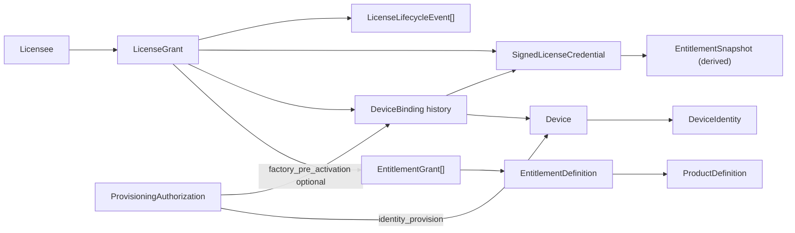
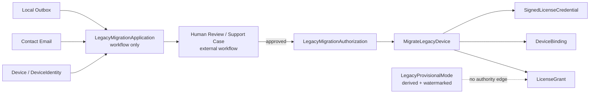

# 10 — P10 Product Object Model — AxLicense V1 v0.1

> 🧱 **Authority status: Accepted / P10 FR-019 targeted reconciliation 2026-09-12.** 本页定义 AxLicense V1 的 durable product world：哪些对象拥有稳定身份与生命周期，哪些只是 value/session/derived state。FR-019 将 NearHub 的默认产品路径统一为 local DeviceIdentity establishment → product-owned SaaS enrollment → backend commercial entitlement decision → ordinary AxLicense Grant/Binding/Credential；此前 FR-013/FR-018 的 legacy-specific client migration objects/workflows 对 NearHub V1 已 supersede。SaaS Account/Organization/ProductDeviceAssociation 继续属于产品后台，不进入 AxLicense canonical license model。Entitlement V1 保持 additive presence grant，同时冻结 future-compatible bounded constraint extension boundary。它不定义数据库、REST API、进程边界、密码算法或平台实现。

## 1. Stage contract

- **Role:** P10 Product Object Model
- **Authority:** P00–P01 accepted baseline + P02/P03 reconciled AxLicense V1 requirements / capability traceability (2026-09-12)
- **Objective:** 建立可支撑 signed license、device identity establishment、device binding、product-owned SaaS enrollment boundary、backend-driven license acquisition/assignment、online/offline activation、cross-product entitlement、rehost、factory identity provisioning / optional pre-activation 与 recovery 的稳定对象模型。
- **Non-goals:** 不冻结 schema 字段、wire format、API、crypto profile、secure-store realization、server/module architecture。
- **Quality gate:** durable truth 必须与 transient/session/derived state 分离；rehost、offline runtime、factory cloning 与 entitlement 生命周期不得依赖模糊对象语义。
- **Handoff:** P11 只能基于本页对象身份和生命周期定义 activation/rehost/provisioning 的交互行为。

## 2. Core modeling decision

AxLicense 必须区分四层：

1. **Commercial / policy authority** — 谁拥有什么授权权利。
2. **Physical device identity authority** — 世界上存在的某台 physical Device 及其 current DeviceIdentity；该层可以在没有任何 LicenseGrant/Binding/Credential 时独立存在。
3. **Device binding authority** — 当前哪台 physical device 承载某个 LicenseGrant。
4. **Portable signed credential** — 设备离线时可独立验证的 immutable license artifact。

因此，`Device/DeviceIdentity`、`LicenseGrant`、`DeviceBinding` 与 `SignedLicenseCredential` 是不同 authority layer。**Identity establishment 不授予 entitlement，也不自动消费 LicenseGrant。** RMA/rehost 不修改既有 signed credential；它关闭旧 binding，并为新 binding 签发 successor credential。

## 3. Object taxonomy

| Object | Classification | Stable identity | Durable truth owned | Lifecycle summary |
|---|---|---|---|---|
| Licensee | Entity | `licensee_id` | 某个组织/商业主体作为授权归属方的最小身份 | Active → Inactive/Retired |
| ProductDefinition | Entity | `product_id` | 稳定产品命名空间，例如 `nearhub`、`axiom` | Active → Deprecated → Retired |
| EntitlementDefinition | Entity | `entitlement_id` | 稳定 feature/right 标识与所属产品命名空间 | Active → Deprecated → Retired |
| LicenseGrant | Aggregate root / Entity | `license_grant_id` | Licensee 被授予的一组 entitlement/right 及其商业/生命周期 authority | Issued → Active → Suspended/Revoked/Retired |
| EntitlementGrant | Value object inside LicenseGrant | 由 grant + entitlement identity 决定 | 某 entitlement 的授予及 runtime/maintenance/cloud right 语义 | 随 LicenseGrant authority 演进；不单独拥有 rehost identity |
| Device | Aggregate root / Entity | `device_id` | 一台 physical device 的稳定授权身份记录 | Registered → Active → Replaced/Retired/Compromised |
| DeviceIdentity | Value object / external-proof reference | 绑定于 Device | 用于证明“这仍是同一台设备”的 identity material/reference | 可因 provider 升级而更新，但不得把镜像安装实例当成设备本身 |
| DeviceBinding | Entity inside LicenseGrant aggregate | `binding_id` | 某个 LicenseGrant 在一个时间段内绑定到哪台 Device | Pending/Active → Released/Replaced/Revoked |
| SignedLicenseCredential | Immutable credential entity | `credential_id` | 由某一 Grant + Binding + entitlement snapshot 生成、可离线验证的 signed artifact | Issued；字节内容 immutable；可被 successor/supersession 或 server-side revocation state 取代 |
| ProvisioningAuthorization | Entity | `provisioning_auth_id` | 工厂/production station 被允许在何种 product/batch/time/capacity scope 内执行 `identity_provision` 和/或 `factory_pre_activation`；拥有 identity-provision scope 不等于拥有 license-consumption scope | Issued → Active → Expired/Revoked/Exhausted |
| LegacyMigrationAuthorization | Historical / superseded for NearHub V1 | `migration_auth_id`（historical only） | 旧 FR-013/FR-018 的 legacy-specific migration authority。FR-019 后不再作为 NearHub V1 Current Authority；历史客户权益由 backend commercial policy 基于可信 sales/customer/support evidence 转换为 ordinary LicenseGrant/EntitlementGrant。 | No new NearHub V1 lifecycle instances；仅保留历史审计/兼容引用（如已有实现需要） |
| LicenseLifecycleEvent | Append-only entity / audit record | `event_id` | issue / bind / activate / provision / deactivate / rehost / revoke 的不可变历史事实 | Append-only |

## 4. Value objects

以下属于稳定语义，但不应拥有独立业务生命周期：

- **RightKind** — `runtime` / `maintenance_update` / `cloud_service`。
- **EntitlementConstraint** — `EntitlementGrant` 的可选 bounded-capability 约束概念，用于未来表达数量/并发/上限类能力（例如 concurrent sources）。V1 默认仍以 entry presence 表达授权；constraint 只能收窄已授予 capability 的 extent，不能把缺失 entitlement 变成授权。具体 closed constraint kinds、字段、默认值与兼容规则留 P12；V1 不引入任意 JSON/expression policy engine。
- **ValidityWindow** — perpetual 或 bounded validity 的概念值。
- **ProductRef / EntitlementRef / DeviceRef / LicenseeRef** — 稳定 identity reference。
- **BindingPolicy** — V1 默认 per physical device；具体 schema 延后 P12。
- **SigningKeyRef** — signed credential 使用的 signing authority/key identifier；**只引用公开 metadata，不包含 private key**。
- **FormatVersionRef** — credential semantic/wire version 的引用。

## 5. Session / transient objects — not durable authorization truth

以下对象允许存在，但不得被误建模成最终授权事实：

| Transient/session object | Purpose | Why not canonical authorization truth |
|---|---|---|
| ActivationSession | 在线首次激活的 request/retry/result 生命周期 | 成功后真正 durable truth 是 Grant/Binding/Credential |
| OfflineActivationRequest | air-gap request file/message | 它只是申请材料，不能授予 runtime right |
| OfflineActivationExchange | request → external transfer → response/import | 交互成功后由 SignedLicenseCredential 承担离线 authority |
| RehostSession | 内部 support/admin 发起 RMA 迁移 | canonical result 是旧 Binding closed + 新 Binding active + successor credential |
| IdentityProvisioningSession | Golden Image materialize 后为目标 physical device 建立/登记独立 DeviceIdentity | 成功后的 durable truth 只有 Device/DeviceIdentity；不产生 LicenseGrant/Binding/Credential |
| FactoryPreActivationSession | 对明确要求出厂即 licensed 的设备，在 identity provisioning 后执行受控 pre-activation | 成功后的 durable truth 是 Grant/Binding/Credential；session/progress 本身不授权 |
| LegacyMigrationSession | Historical / superseded NearHub legacy-specific session | FR-019 后不再属于 NearHub V1 默认或必需 session；历史客户权益走普通 backend entitlement assignment + activation。已有历史实现仅作兼容/审计处理。 |
| DeviceIdentityClaim | 设备提交 fingerprint/key evidence | 原始 hardware attributes/claim 是证据，不是授权主体本身 |

## 6. Derived state — never independent authority

- **LicenseStatus** — 由当前 credential、device identity、local policy/clock 与已知 server state 推导。
- **EntitlementSnapshot** — 产品消费的本地只读视图，例如 `hasEntitlement("nearhub.byod")`。
- **ActivationStatus / IdentityProvisioningProgress / FactoryPreActivationProgress** — interaction/session 的投影视图。
- **RemainingFactoryCapacity** — 分别由 ProvisioningAuthorization action scope + 已发生 event 推导；identity-provision capacity 与 license/pre-activation capacity 不得混成同一隐式计数。
- **LegacyMigrationProgress / RemainingLegacyMigrationCapacity** — historical projections only；FR-019 后不属于 NearHub V1 Current Authority。
- **CurrentBinding** — LicenseGrant bindings 的当前 active projection，而不是第二份 truth。
- **UI SKU label / Standard / Pro / Ultra** — commercial presentation，不是客户端授权 authority。

## 7. External resources / explicitly non-owned objects

- **Master signing private key / HSM/KMS key material** — security infrastructure resource，不是可序列化 product object。
- **TEE / Android Keystore / TPM / OS secure storage** — DeviceIdentity/SecureStore 的 platform realization，留给 P17/P14。
- **Payment / invoice / CRM customer record** — V1 non-goal；Licensee 只保留授权所需最小 identity/reference。
- **Named end user / login account** — V1 不进入 license semantics。
- **Raw hardware inventory** — 除非证明 DeviceIdentity 所必需，否则不进入 canonical license model。

## 8. Aggregate boundaries

### A. LicenseGrant aggregate

`LicenseGrant` 是授权业务 authority 的核心 aggregate root。

- owns entitlement grants / right policy；
- owns DeviceBinding history；
- V1 invariant：**同一个 LicenseGrant 同时最多一个 Active DeviceBinding**；
- rehost 必须先使旧 binding 不再 Active，再建立新 binding；
- `license_grant_id` 在 rehost 前后保持稳定。

### B. Device aggregate

`Device` 独立于 LicenseGrant 存在，**registered Device 可以长期没有任何 Active DeviceBinding 或 SignedLicenseCredential**。

- 一台 physical device 有稳定 `device_id`；
- Golden Image 是 identity-free template；clone/materialize 后才允许为目标 physical device 建立 current DeviceIdentity；
- factory image reinstall/OS reinstall 不应天然创建新 physical device；
- device identity provider 可以演进；若 identity material 丢失但仍可凭受信 continuity evidence 证明同一 physical Device，可建立 successor identity epoch；
- 若无法证明 continuity，不得把新 identity 自动吸收到旧 Device；physical replacement 必须走 rehost；
- Device 被 replacement/retirement 后仍保留历史 identity 与 audit linkage。

### C. Product / Entitlement catalog

`ProductDefinition` 与 `EntitlementDefinition` 是稳定命名 authority。

- display name、SKU 包名可以变化；`product_id`/`entitlement_id` 不应随销售命名变化；
- V1 entitlement 是 additive grant；客户端不解释 SKU；
- 一个 LicenseGrant 可以包含跨一个或多个 product namespace 的 entitlement，允许 NearHub bundle 同时携带 `nearhub.*` 与 `axiom.*` rights。

### D. SignedLicenseCredential

Signed credential 不拥有商业 entitlement 真相，而是某一时点 authority 的**签名快照**。

- immutable；
- 必须绑定 `license_grant_id` 与具体 `binding_id/device_id`；
- 可以被新 credential supersede；
- server 端 revoke/suspend 不会魔法般修改已经离线的旧字节；完全离线设备只能依据它当前可观测的信息判断。

## 9. Relationship model



## 10. Identity rules

- `license_grant_id` 标识授权本身，**rehost 不改变它**。
- `device_id` 标识 physical device，不等价于 OS installation id、MAC address 或某个文件系统 UUID。
- `binding_id` 标识一次授权分配 epoch；每次 rehost 产生新的 binding。
- `credential_id` 标识一次 signed issuance；credential immutable，因此 renewal/rehost/entitlement refresh 产生 successor credential。
- `product_id` 与 `entitlement_id` 是稳定机器标识；销售名称和 UI label 可变。
- `event_id` 只标识历史事件，不作为当前授权 state 的替代来源。

## 11. Lifecycle invariants

1. **Grant ≠ Binding ≠ Credential.** 三者不可合并成一个“license row”。
2. **Per physical device** 的 V1 policy 通过 Active DeviceBinding 约束表达，而不是依赖文件安装目录。
3. **Rehost preserves grant identity.** 旧 binding 结束，新 binding 建立，旧 credential 不被原地修改。
4. **Credential is immutable.** entitlement 更新、maintenance 更新、rehost、key/format migration 都通过 successor credential 表达。
5. **Offline observability is explicit.** Server-side revoke 是 durable server truth，但永久离线 credential 在下一个 observable lifecycle point 前不能获知远端变化。
6. **Runtime / maintenance / cloud rights are distinct.** maintenance/cloud 变化不得隐式删除 perpetual local runtime right。
7. **Golden Image is identity-free.** 镜像可复制软件，但不得携带 current DeviceIdentity、device-private identity material、DeviceBinding 或 SignedLicenseCredential；per-device identity authority 必须在目标 physical device materialize 后建立。
8. **Identity establishment ≠ license consumption.** `Device/DeviceIdentity` 的存在不产生 entitlement；只有显式 Activation / Factory Pre-Activation / Legacy Migration 等授权 mutation 才能建立 Binding/Credential。
9. **Legacy migration is authority-gated.** legacy image、旧 license 文件或新生成 keypair 都不是 historical entitlement authority；迁移必须依赖 `LegacyMigrationAuthorization`/可信 evidence。
10. **Recovery ≠ Rehost.** 同一 physical Device 的 continuity 可被证明时可更新 identity epoch/恢复 credential；physical replacement 或 continuity 无法证明时不得伪装 recovery。
11. **Private signing authority is never a product object payload.** License model最多引用 SigningKeyRef。
12. **Commercial SKU is not canonical entitlement identity.** SKU → entitlement mapping 可以变化而不迫使客户端升级。
13. **Audit events do not become authorization source-of-truth.** 当前授权由 Grant/Binding/Credential 状态决定，events 用于追溯和证明。

## 12. Capability trace update

- FR-001 Signed License → `SignedLicenseCredential` + `SigningKeyRef` / `FormatVersionRef`。
- FR-002 Device Identity & Binding / Image Isolation → `Device` + `DeviceIdentity`；identity authority 可独立于 `DeviceBinding` 存在，Golden Image 不携带 current identity/binding/credential。
- FR-003/004 Activation → session objects commit into Grant/Binding/Credential，不创造另一套 online/offline license type。
- FR-005 Entitlement → `EntitlementDefinition` + `EntitlementGrant` + derived `EntitlementSnapshot`。
- FR-006 Rehost → preserves `LicenseGrant`; replaces `DeviceBinding`; issues successor `SignedLicenseCredential`。
- FR-007 Factory Identity Provisioning + Optional Pre-Activation → `ProvisioningAuthorization` + `IdentityProvisioningSession` → Device/DeviceIdentity；若 scope 明确允许，再由 `FactoryPreActivationSession` → Grant/Binding/Credential。
- FR-008 Right Separation → `RightKind` / independent entitlement validity semantics。
- FR-009 Audit → append-only `LicenseLifecycleEvent`。
- FR-010 Rotation → immutable credential + `SigningKeyRef` + `FormatVersionRef`。
- FR-011 Product Integration → products consume derived `LicenseStatus` / `EntitlementSnapshot` only。
- FR-012 Recovery → identity is Device-level, not install-instance-level。

## 13. P10 exit review

P10 exit criterion 已满足：

- durable entities/value objects/aggregates/sessions/external resources/derived state 已分类；
- stable identity 与 lifecycle rules 已明确；
- rehost、offline runtime、factory provisioning 不再依赖“一个 license 对象包办一切”的模糊模型；
- 未提前冻结 P11–P17 所属 interaction/schema/operation/architecture/platform 实现。

**Disposition: P10 ACCEPTED / READY FOR P11 Interaction & Behavior.**

## P10 targeted reconciliation — Device Assertion / Product Device Association — 2026-09-12

### Stage contract

- **Role:** P10 Product Object Model targeted reconciliation.
- **Authority:** Accepted FR-016 Purpose-Bound Device Identity Assertion, FR-017 Device Enrollment / Association Recovery Integration, NFR-SEC-04; existing P10 Device/DeviceIdentity authority.
- **Objective:** Freeze the object boundary between AxLicense physical-device identity and product-owned Account/Organization association without turning AxLicense into an IAM/ownership system.
- **Non-goals:** No QR/web UX, challenge wire schema, assertion crypto, CLI syntax, account schema, tenant/IAM implementation, or transfer UI.
- **Required analysis:** durable ownership, evidence vs authority, product association boundary, claim/recovery/transfer separation.
- **Required output:** object classification and invariants below.
- **Quality gate:** Device proof cannot become human/organization ownership authority; account/organization objects cannot become AxLicense license truth.
- **Handoff:** P11 defines claim/recovery/transfer behavior using this boundary.

### Object-boundary decision

AxLicense continues to own only the stable physical-device trust facts:

- `Device` — registered physical device, stable `device_id`;
- `DeviceIdentity` — current/successor identity epoch used for proof-of-possession;
- existing licensing objects (`LicenseGrant`, `DeviceBinding`, `SignedLicenseCredential`, etc.).

The following are **external product-owned durable objects** and are explicitly outside the AxLicense canonical license model:

- `Account` / human login principal;
- `Organization` / `Tenant`;
- `ProductDeviceAssociation` — product-side association between an AxLicense `device_id` and an account/organization ownership/management subject;
- product-side management credential/session and role membership;
- ownership-transfer history required by the product backend.

A product backend may persist the opaque AxLicense `device_id` as a foreign reference, but AxLicense does not store product usernames, passwords, tenant membership, organization administrator roles, or account recovery secrets.

### New evidence/session concepts

The following are **transient/non-canonical AxLicense evidence**, not durable authorization truth:

- `DeviceAssertionChallenge` — trusted, short-lived, purpose/audience-bound challenge;
- `DeviceIdentityAssertion` — short-lived proof that the current registered DeviceIdentity answered that challenge;
- `DeviceAssertionVerificationResult` — derived/read-only verification outcome;
- product-side `EnrollmentSession`, `AssociationRecoverySession`, QR/recovery handle — owned by the consuming product and not AxLicense objects.

`DeviceIdentityAssertion` proves **device possession/continuity for the challenged purpose**. It does not prove that the human user owns the device, belongs to an organization, may transfer ownership, or may reset another person's credentials.

### Claim / recovery / transfer object invariants

1. **Registration is not ownership.** A valid AxLicense Device may remain indefinitely registered while externally `unclaimed` / unassociated.
2. **Association commit is product-owned.** The product backend creates or changes `ProductDeviceAssociation` only after its own human/organization authorization checks plus a valid Device Identity Assertion when policy requires device presence.
3. **Enterprise default is Organization/Tenant association.** For kiosk/room appliances, the preferred durable relationship is `Device → Organization/Tenant`; `claimed_by_user` / administrators are product-side actors, not AxLicense ownership.
4. **Account recovery does not mutate Device.** Recovering username/password/SSO or reissuing a product management credential leaves AxLicense Device/DeviceIdentity and the existing ProductDeviceAssociation unchanged unless an explicit transfer operation is separately authorized.
5. **Ownership transfer is distinct from recovery.** `Organization A → Organization B` requires product-side transfer authority (e.g. current org admin or support-controlled override). Physical access or a valid DeviceIdentityAssertion alone is insufficient.
6. **License binding is independent.** Product ownership/management association must not silently create, move, revoke, or rehost `LicenseGrant`/`DeviceBinding`; license lifecycle remains governed by existing AxLicense operations.

### P10 disposition

**P10 targeted reconciliation ACCEPTED.** Existing licensing object model remains valid. No Account/Organization/ProductDeviceAssociation object is added to AxLicense canonical state. The only AxLicense model extension is a transient, purpose-bound device assertion evidence family. Earliest untrusted layer advances to **P11 targeted behavior reconciliation**.

## 15. FR-018 targeted reconciliation — Legacy Provisional Activation & Human-Assisted Migration [SUPERSEDED FOR NEARHUB V1]

> Historical authority retained for audit/context only. FR-019 supersedes this section as NearHub V1 Current Authority; no new NearHub design may depend on `legacy_upgrade_candidate`, provisional watermark migration control, migration application/outbox, human migration approval, `LegacyMigrationAuthorization`, or device-side migration redemption unless another accepted product requirement independently re-authorizes them.

### Stage boundary

本节只冻结 P10 对象分类与 authority ownership，不定义 start/retry/cancel、字段 schema、命令名、watermark UI 或平台存储实现。

### 15.1 新增/调整对象分类

| Concept | P10 classification | Stable identity | Durable truth / meaning | Authorization meaning |
|---|---|---|---|---|
| `LegacyMigrationApplication` | Entity / workflow aggregate | `application_id`（exact schema deferred） | 记录某台已建立 AxLicense DeviceIdentity 的设备提交了一次历史迁移申请，以及与该申请相关的 contact/workflow context | **No entitlement authority.** 申请存在、邮件存在、case 已创建都不授予 License |
| `LegacyMigrationAuthorization` | Existing durable authority entity — **refined for FR-018** | `migration_auth_id` | 人工审核后允许某个 migration application/device/product 进入正式 `MigrateLegacyDevice` 的唯一 durable approval authority | Yes — but only as migration approval; successful redemption still produces normal Grant/Binding/Credential outcome |
| `LegacyUpgradeCandidateMarker` | Local/product provenance marker or audit evidence; **not canonical license authority** | No independent business identity required | 表示软件是从指定 legacy upgrade entry path 进入，用于允许产品进入 migration UX / provisional rollout policy | None. 可被技术上伪造是 FR-018 已接受的商业风险，因此它绝不能 mint entitlement |
| `LegacyMigrationOutboxEntry` | Local durable delivery/session object | Uses the stable application/request identity | 无网时保存尚未送达 backend 的 migration application，并在后续网络恢复时继续投递同一逻辑申请 | None. Outbox persistence/retry 不是 approval |
| `MigrationApprovalCode/Response` | Redeemable transport/credential representation of an approved migration authority; exact representation deferred | No new commercial identity | 把已经存在的 approved migration authority 安全带回目标 Device；可表现为输入码或 offline response artifact | 不能成为 reusable generic license key；最终 authority outcome 仍是正常 AxLicense LicenseGrant/Binding/SignedLicenseCredential |
| `LegacyProvisionalMode` | Derived product runtime state / rollout policy | None | `legacy upgrade candidate + no valid AxLicense credential + rollout policy permits provisional usage` 的产品侧投影，UI 必须显示 Unactivated/未激活水印 | **Explicitly not an entitlement and not a temporary SignedLicenseCredential** |
| Email / support case / customer-development grouping | External workflow resources / derived business intelligence | Owned by product backend / support / CRM as appropriate | 用于联系客户、去重 case、识别 fleet/enterprise patterns 与收集使用场景 | None. Email ownership、domain、request count、CRM status 均不能独立批准 migration |

### 15.2 Why `LegacyProvisionalMode` is not a License object

FR-018 明确允许历史升级设备在正式激活前继续使用，但这种继续使用来自**产品 rollout accommodation**，而不是 AxLicense entitlement authority。

因此禁止建立类似以下对象：

- `TemporaryLicenseGrant`；
- `ProvisionalSignedLicense`；
- `WatermarkEntitlement`；
- `LegacyAutoLicense`。

原因：一旦 provisional usage 被建模成 LicenseGrant/SignedLicenseCredential，就会把“无法证明历史设备但暂时允许继续用”的商业风险提升成正式授权 authority，并且新设备可以尝试通过伪造 legacy path 获得真正可移植/可恢复的授权。

正确边界是：

```plain text
legacy upgrade provenance
        +
no valid AxLicense credential
        +
product rollout policy
        ↓
LegacyProvisionalMode (derived, watermarked)

human review
        ↓
LegacyMigrationAuthorization
        ↓
MigrateLegacyDevice
        ↓
LicenseGrant + DeviceBinding + SignedLicenseCredential
```

### 15.3 `LegacyMigrationApplication` ownership

`LegacyMigrationApplication` 是 durable workflow truth，但不是 license aggregate 的一部分。

It may reference:

- current AxLicense `Device` / DeviceIdentity context；
- target `ProductDefinition`；
- user-supplied contact channel（例如 email）；
- stable logical request/application identity；
- support/customer workflow linkage。

Exact fields、PII retention、status enum 与 wire format 留 P12/P17。

**Critical boundary:** contact email does not create or prove `Licensee`, Account, Organization/Tenant, ProductDeviceAssociation or historical ownership. It is a contact/workflow attribute only.

### 15.4 Human approval reuses `LegacyMigrationAuthorization`

FR-018 不需要再引入第二种“support-approved license”对象。

人工审核结果应继续汇入现有 `LegacyMigrationAuthorization`：

```plain text
LegacyMigrationApplication
        ↓ human review
approved? ── no → no license authority
        |
       yes
        ↓
LegacyMigrationAuthorization
        ↓
MigrateLegacyDevice
        ↓
normal AxLicense authority
```

For FR-018 the authorization must semantically be scoped to the approved migration context, especially the target Device/request/product. Exact schema is P12；single-use/replay/idempotency behavior is P11/P13。

### 15.5 Local outbox is durable but non-canonical

`LegacyMigrationOutboxEntry` intentionally survives reboot/network loss, but **durable local persistence does not make it canonical authorization truth**.

Required P10 meaning:

- it preserves one logical application identity across retries;
- duplicate sends may create at most one logical backend application/case;
- deleting/corrupting the outbox may lose an unsent support request, but must not fabricate or revoke a LicenseGrant；
- a queued request never changes `DeviceBinding` or entitlement state。

### 15.6 Device / License model remains unchanged

Existing core authority objects remain valid without structural replacement:

- `Device` remains physical-device identity；
- `DeviceIdentity` remains the device proof anchor；
- `LicenseGrant` remains commercial entitlement authority；
- `DeviceBinding` remains per-device assignment authority；
- `SignedLicenseCredential` remains the offline-verifiable immutable authorization snapshot；
- `LegacyMigrationAuthorization` remains the migration gate。

FR-018 therefore adds a **workflow layer in front of** existing migration authorization rather than a second license system.

### 15.7 Origin / provenance rule

The system may retain onboarding/upgrade provenance for audit and routing, but provenance has no entitlement meaning.

Normative distinctions:

- `factory/new-install path` → normal provisioning/activation rules；
- `designated legacy-upgrade path` → may create `legacy_upgrade_candidate` provenance and permit product provisional policy；
- `unknown to AxLicense` → **does not imply legacy**；
- copied old software/image/version markers → may support routing diagnostics but do not create `LegacyMigrationAuthorization`。

### 15.8 Aggregate / ownership relationship



The dashed relationship is intentional: provisional mode has **no authority edge** to LicenseGrant.

### 15.9 P10 invariants added for FR-018

1. **No-record ≠ legacy.** Absence of Device/License history never creates legacy eligibility.
2. **Candidate ≠ entitlement.** `legacy_upgrade_candidate` only permits migration/provisional UX.
3. **Provisional ≠ license.** Watermarked provisional usage must not be represented by Grant/Binding/Credential.
4. **Application ≠ approval.** `LegacyMigrationApplication`, email delivery, CRM case or fleet heuristic never authorizes migration.
5. **Human approval converges into one existing authority:** `LegacyMigrationAuthorization`.
6. **Approval response is scoped, not generic.** A user-facing code/artifact is only a representation/redemption path for approved migration context.
7. **Outbox retry preserves one application identity.** Offline persistence cannot multiply logical applications or grants.
8. **Post-migration specialness ends.** Once `MigrateLegacyDevice` commits, later update/reinstall/recovery follows ordinary AxLicense Device/License semantics; historical application is audit/workflow history only.
9. **Email is not ownership identity.** Contact email must never silently become Licensee, Account, Organization or ProductDeviceAssociation.
10. **Fresh/factory devices do not gain provisional rights merely by lacking a credential.** Entry into provisional mode requires the designated legacy-upgrade provenance/policy path.

### 15.10 Historical disposition

**SUPERSEDED BY FR-019 / NOT CURRENT NEARHUB V1 AUTHORITY.**

This section records the previously accepted FR-018 model for audit/history only. Its `LegacyMigrationApplication`, `LegacyMigrationAuthorization`, provisional migration state and migration-specific P11 handoff are superseded by §16. No new NearHub V1 downstream design may route from this historical disposition.

## 16. FR-019 Targeted Reconciliation — Unified First-Run Enrollment & Cross-Product Entitlement

### 16.1 Stage contract

- **Authority:** accepted FR-019 + P03 unified first-run capability trace; existing Device/DeviceIdentity, Grant/Binding/Credential, product-association boundary and DeviceIdentityAssertion authority remain current unless explicitly changed below.
- **Objective:** reconcile the durable product world after software distribution ceases to be a license boundary, without turning AxLicense into SaaS IAM, billing, CRM, SKU packaging or a generic policy engine.
- **Non-goals:** no setup-code UX, purchase UI, billing schema, SaaS tenant schema, REST/CLI contract, exact entitlement wire fields, crypto realization or module/process architecture.

### 16.2 No new AxLicense ownership/enrollment aggregate

FR-019 does **not** add `Account`, `Organization`, `Room`, `ProductDeviceAssociation`, `EnrollmentSession`, `SetupCode`, purchase/order/subscription or license-pool records to AxLicense canonical state.

- `ProductDeviceAssociation` remains product-backend durable truth: `AxLicense device_id ↔ Organization/Tenant/Room context`.
- `EnrollmentSession` / `SetupCode` remain product-owned transient session/locator objects and never carry entitlement.
- `DeviceIdentityAssertion` remains transient evidence proving device possession/continuity for a challenged purpose; it is not human/organization ownership authority.
- Payment/order/CRM/subscription/license-pool records remain external commercial resources. They may justify a backend commercial decision, but only an AxLicense `LicenseGrant` / `EntitlementGrant` becomes canonical license authority.
- A product Organization may map to or reference an AxLicense `Licensee`, but `Licensee` is the minimal commercial authorization subject; it is not a copy of the SaaS IAM/tenant model.

Therefore the default NearHub product journey composes multiple independent authority facts rather than one distributed aggregate:

```plain text
Device / DeviceIdentity
        +
ProductDeviceAssociation   (product backend)
        +
LicenseGrant / EntitlementGrant
        +
DeviceBinding
        +
SignedLicenseCredential
```

### 16.3 Legacy-specific object supersession

For NearHub V1, the following previous objects/concepts are no longer Current Authority requirements:

- `LegacyMigrationApplication`;
- `LegacyMigrationAuthorization`;
- `LegacyMigrationSession`;
- `legacy_upgrade_candidate`;
- legacy provisional/watermark migration-control state;
- migration application email/outbox/review/redemption state;
- `RemainingLegacyMigrationCapacity` and equivalent projections.

Already-sold devices and newly shipped devices both establish ordinary DeviceIdentity and then use ordinary product enrollment + backend entitlement assignment. If an historical customer should receive grandfathered/included rights, trusted sales/customer/support evidence is evaluated outside the device and converted into ordinary `LicenseGrant` / `EntitlementGrant` authority. No separate client provenance object is required.

This supersession does **not** remove ordinary `Rehost`, same-device recovery, true air-gap Offline Activation, or optional Factory Pre-Activation.

### 16.4 Cross-product entitlement is a first-class V1 object-model capability

`ProductDefinition` / `EntitlementDefinition` are stable machine-semantic namespaces, not commercial package names. AxLicense may authorize product capabilities across NearHub, NearCast, Launcher-hosted capabilities, Axiom/Arc and future consumers without creating separate incompatible license systems.

Examples are illustrative, not a frozen catalog:

```plain text
nearcast.protocol.miracast
nearcast.multiscreen
nearcast.concurrent_sources
nearhub.signage.advanced
nearhub.signage.cloud_schedule
axiom.whiteboard
```

A single `LicenseGrant` may contain `EntitlementGrant[]` from multiple product namespaces. `Standard`, `Pro`, `Ultra`, bundles, promotional packages and future commercial names remain external packaging and may change without changing `entitlement_id`.

### 16.5 Future-compatible bounded entitlement boundary

P10 preserves the existing rule that an `EntitlementGrant` entry represents a granted capability. It additionally recognizes optional `EntitlementConstraint` as a value concept that can bound the extent of that granted capability.

Examples of future bounded semantics include `max concurrent sources`, `max display count`, `max signage zones` or similar integer limits. This does not authorize a generic typed-value or expression system.

P10 invariants:

1. **Presence remains authority.** Missing `EntitlementGrant` means no grant; an optional constraint cannot create authority by itself.
2. **Constraint narrows, never invents.** A bounded value refines the extent of an already granted entitlement.
3. **Definition owns meaning.** The stable `EntitlementDefinition` determines whether a constraint is meaningful; clients must not reinterpret the same `entitlement_id` as unrelated boolean/quantity semantics.
4. **No SKU parsing.** Product code evaluates stable entitlement semantics, never `Pro/Ultra` labels.
5. **No generic policy engine in V1.** Arbitrary JSON, formulas, scripts and expression evaluation are outside the model. Exact closed constraint kinds and compatibility/default rules belong to P12.
6. **Minimal V1 behavior is allowed.** Initial V1 products may use only presence-based entitlements while the schema remains evolvable for bounded entitlements.

### 16.6 Current aggregate boundaries after FR-019

- **Device aggregate:** physical-device identity and continuity only; can exist indefinitely while unclaimed and unlicensed.
- **LicenseGrant aggregate:** commercial entitlement authority + binding history; remains independent of product enrollment state.
- **Product/Entitlement catalog:** stable capability semantics across product namespaces; commercial packaging is external.
- **SignedLicenseCredential:** immutable device-bound signed snapshot of current grant/binding entitlement authority for offline verification.
- **ProvisioningAuthorization:** retained only for the optional factory identity/pre-activation path; factory provisioning is no longer the default NearHub onboarding requirement.
- **ProductDeviceAssociation:** external product-owned durable truth, not an AxLicense aggregate.

### 16.7 P10 invariants after reconciliation

1. Software possession/install provenance is not an AxLicense product object and grants no entitlement.
2. DeviceIdentity establishment, SaaS association, commercial entitlement and device credential installation are independent facts.
3. A registered Device may be unclaimed/unlicensed; a claimed device may remain unlicensed; AxLicense must not collapse these product states into one canonical status.
4. Product association must not silently issue/move/rehost a license. Backend orchestration must explicitly create/select/modify ordinary license authority.
5. Legacy/new/factory provenance does not change ordinary Device/Grant/Binding/Credential semantics after identity establishment.
6. One shared entitlement model serves NearHub/NearCast/Launcher/Axiom and future products; product-specific license formats are forbidden by model intent.
7. Presence-based entitlement semantics remain valid while bounded constraints are an explicit future-compatible extension, not a V1 generic rule engine.

### 16.8 P10 disposition / handoff

**P10 FR-019 TARGETED RECONCILIATION ACCEPTED.**

No new SaaS/IAM/billing aggregate is added to AxLicense. Legacy-specific NearHub migration objects are removed from Current Authority. Existing Device/DeviceIdentity + LicenseGrant/EntitlementGrant + DeviceBinding + SignedLicenseCredential remain the canonical AxLicense product world, with `EntitlementConstraint` reserved as a narrow future-compatible value concept.

**Earliest untrusted downstream layer:** **P11 Interaction / Behavior targeted reconciliation.** P11 must reconcile the unified flow `first-run identity → product enrollment → claimed-but-unlicensed → backend purchase/redeem/assign/included decision → ordinary activation → device credential observation`, including failure/retry boundaries between product association and license activation, while preserving true offline/factory/rehost/recovery paths.

**Next Primary Owner:** `aegis-modeling` / P11 Interaction & Behavior.
