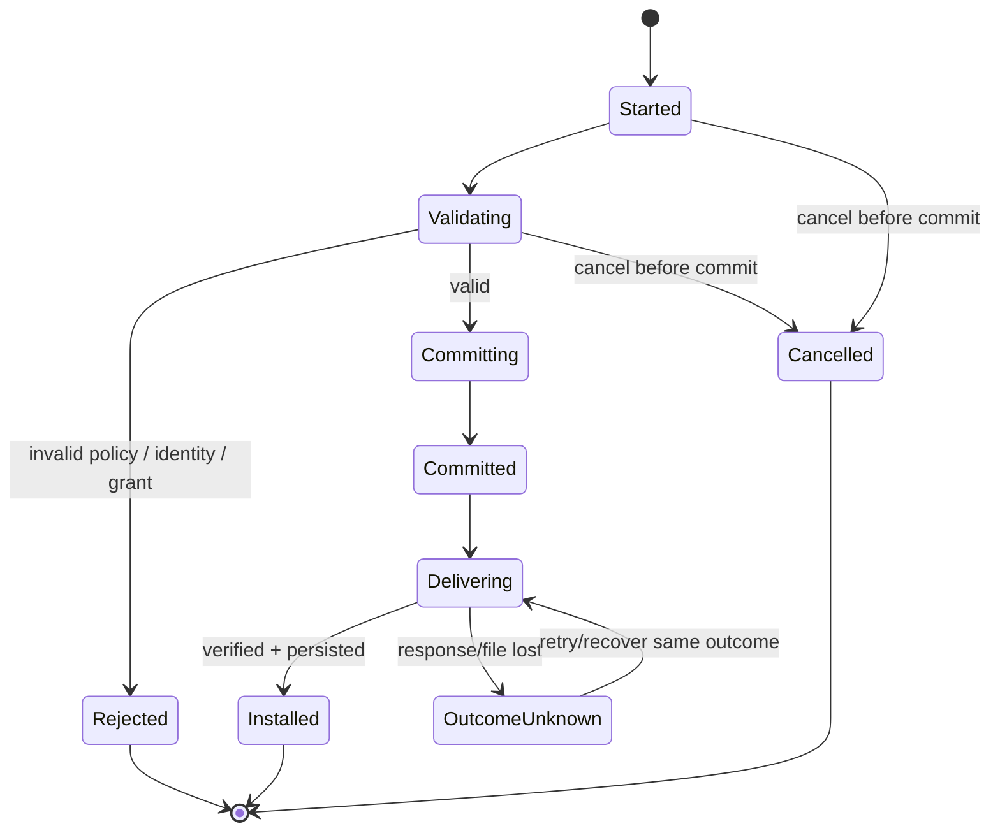
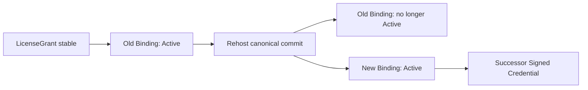
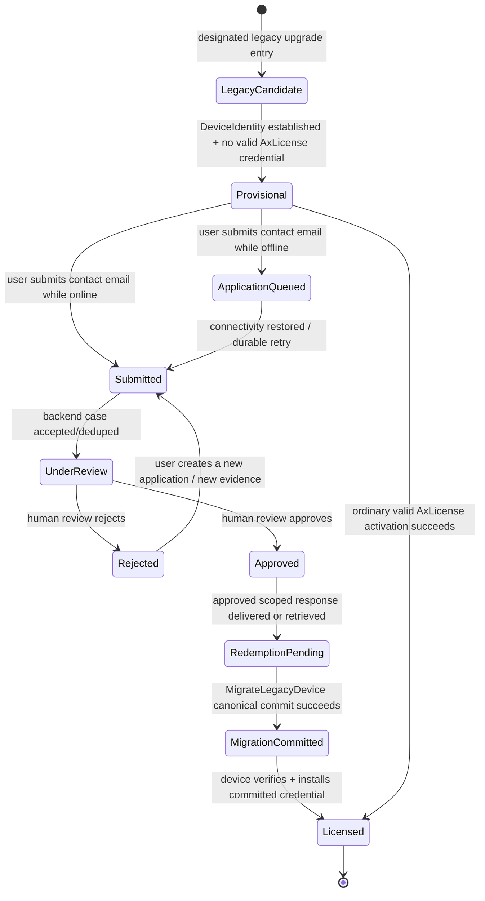
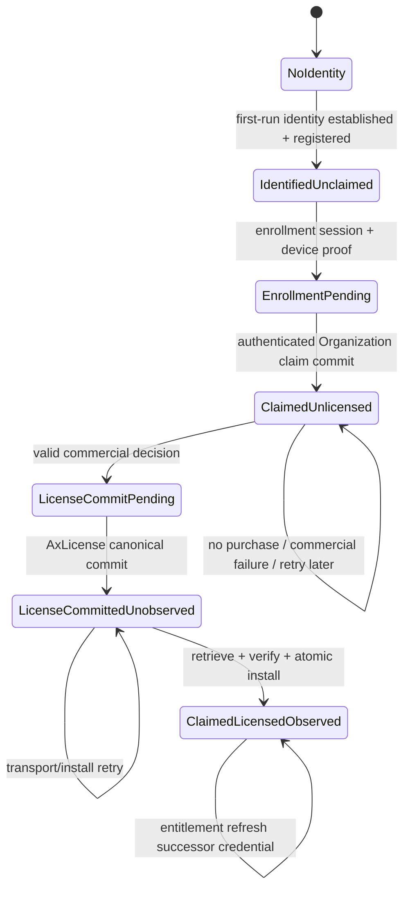

# 11 — P11 Interaction & Behavior — AxLicense V1 v0.1

> 🔁 **Authority status: Accepted / P11 FR-019 targeted reconciliation 2026-09-12.** 本页冻结 AxLicense V1 的 interaction/behavior 语义：session 如何开始、何时产生 durable commit、取消/重试如何处理，以及 server authority、product association 与 device-local observation 尚未同时收敛时如何恢复。FR-019 将 NearHub 默认行为统一为 first-run DeviceIdentity establishment → product-owned SaaS enrollment/Organization claim → managed-but-unlicensed → backend commercial entitlement decision → ordinary AxLicense activation/entitlement refresh → credential retrieve/verify/install → licensed feature observation。此前 FR-018 legacy provisional/application/review/redemption 行为对 NearHub V1 已 supersede，仅保留为 historical context。它不定义 wire schema、REST API、数据库事务实现、进程边界、crypto algorithm 或平台 secure-store realization。

## 1. Stage contract

- **Role:** P11 Interaction / Behavior
- **Authority:** P02/P03 reconciled requirement/capability baseline + P10 reconciled Product Object Model (2026-09-12)
- **Objective:** 使 first-run identity establishment、product-owned SaaS enrollment/claim、backend-driven license acquisition/assignment、online/offline activation、entitlement refresh、rehost、factory identity provisioning / optional pre-activation 与 recovery 在成功、失败、取消、重试及跨系统部分成功时都有唯一且可验证的行为含义。
- **Non-goals:** 不冻结字段级 schema、endpoint、database/API implementation、crypto profile、TEE/TPM/Keystore 选择、daemon/IPC topology。
- **Quality gate:** 每个主要交互必须明确 start / transient / commit / cancel / retry；任何 network/file/transport failure 都不能隐式制造第二份授权或第二个 Active DeviceBinding。
- **Handoff:** P12 只能把本页已冻结的 durable/transient distinction 与 behavior outcome 编码成 canonical schema，不得重新定义交互语义。

## 2. Cross-flow behavior invariants

1. **Session is not authority.** `ActivationSession` / `OfflineActivationExchange` / `RehostSession` / `IdentityProvisioningSession` / `FactoryPreActivationSession` 以及 product-owned `EnrollmentSession` / SetupCode 的存在、完成百分比或 UI 状态都不能授予 entitlement。
2. **Identity, product association, commercial authority, and device observation are distinct commits/facts.** DeviceIdentity establishment/registration 只建立/确认 `Device + current DeviceIdentity`；ProductDeviceAssociation commit 只改变产品后台的 Organization/management ownership；只有 AxLicense authorization commit 才能建立/改变 LicenseGrant/EntitlementGrant、DeviceBinding 与 SignedLicenseCredential authority；设备最终启用功能还必须观察并验证已安装 credential。
3. **Commit precedes observation.** Server-side canonical commit 与目标设备“已经收到并安装 credential”是两个不同事实；响应丢失不得回滚已经提交的授权，也不得让 retry 创建第二次授权。
4. **Retry is idempotent by interaction identity.** 同一逻辑请求的 retry 必须收敛到同一 durable outcome；不得重复占用 grant、重复创建 active binding 或重复消耗 factory capacity。P13 再定义具体 idempotency operation contract。
5. **Cancel only cancels uncommitted work.** commit 之前取消不得留下授权 mutation；commit 之后“取消”不能假装回到过去，必须通过明确的 successor lifecycle action（deactivate/rehost/revoke 等）改变 durable truth。
6. **Credential installation is verify-before-replace.** 新 credential 在完整验证成功前不得覆盖当前仍有效的本地 credential；导入失败保持原有有效状态不变。
7. **One active binding remains invariant.** V1 同一 `LicenseGrant` 同时最多一个 Active `DeviceBinding`；任何 rehost/activation retry 都不得短暂产生两个 canonical Active binding。
8. **Offline observability remains physical reality.** Server-side revoke/rehost/suspension 不会修改已离线保存的 credential bytes；永久离线设备只能在下一次可观察 server state / imported successor state 时获知变化。
9. **Committed lifecycle changes are auditable.** 成功的 issue/bind/activate/entitlement-authority change/identity-provision/factory-pre-activate/rehost/revoke/recovery-issuance 必须形成 `LicenseLifecycleEvent`；transient retry/error diagnostics 不成为 authorization source-of-truth。
10. **Software installation and identity bootstrap never self-authorize.** 新设备、已售设备或任意重新分发的软件安装都可以建立 DeviceIdentity，但仅安装软件、首次运行、生成 private key、注册 Device 或完成 SaaS claim 均不得自行创建商业 entitlement；License authority 必须来自受信 backend commercial decision 并最终进入普通 AxLicense Grant/Binding/Credential 语义。
11. **Recovery and rehost are mutually exclusive by continuity.** 能证明同一 physical Device continuity 时走 recovery；physical replacement 或无法证明 continuity 时必须走 rehost/重新授权，不能把新设备吸收到旧 identity 下。

## 3. Generic interaction phases

以下阶段是概念行为，不是 P12 wire enum：

`Start → Validate/Prepare → Commit or Reject → Deliver/Observe → Complete`

其中：

- **Start:** 建立 session/correlation identity 并收集所需输入，不产生授权权利。
- **Validate/Prepare:** 验证 device identity claim、grant/policy、scope、authorization 与请求一致性；失败为 non-mutating rejection。
- **Commit:** 原子地建立该流程所需 durable authorization outcome；从此结果不能靠 session cancel 撤销。
- **Deliver/Observe:** 将已提交 credential/result 交付给目标设备或离线介质。这里失败时，canonical outcome 仍可能已经成立。
- **Complete:** 调用方已能证明自己观察/安装了 committed result；Complete 是 session outcome，不是新的授权 mutation。

## 4. Online Activation behavior

### Start

设备持有可验证的 `DeviceIdentityClaim`，并提供能够定位/授权某个 `LicenseGrant` 的 activation input。Start 本身不建立 `DeviceBinding`。

### Transient / validation

系统验证：

- grant 存在且允许 activation；
- device identity claim 可接受；
- 当前 binding policy 允许绑定该 Device；
- 若 grant 已绑定同一 Device，则进入 idempotent recovery/return-current-result 路径，而不是创建第二 binding；
- 若 grant 已绑定另一 Device 且未经过 rehost authority，则拒绝。

### Commit

Online activation 的 canonical commit 必须同时产生一个可恢复的授权结果：

- 建立或确认目标 `Device`；
- 建立唯一 Active `DeviceBinding`；
- 产生与该 grant/binding/device 对应的 `SignedLicenseCredential`；
- 记录 lifecycle event。

不得出现“binding 已 Active 但系统无法确定对应 credential issuance”的合法终态。

### Deliver / local install

设备接收 candidate credential，先验证 signature/format/device binding/rights validity，再安全替换本地 credential。设备成功安装后 session 才能对本地调用方报告 fully observed success。

### Cancel

- Commit 前：取消 → 无 durable authorization mutation。
- Commit 后、响应尚未到设备：不能以 cancel 回滚；设备应 retry/recover 已提交结果。

### Retry

同一 activation retry 必须：

- 已未提交 → 可重新验证并尝试 commit；
- 已提交但响应丢失 → 返回/恢复同一 committed binding 的有效 credential outcome；
- 不得创建新的 active binding 或额外占用授权。

## 5. Offline Activation behavior

### Start / request export

设备生成 `OfflineActivationRequest`，包含足以绑定请求与 DeviceIdentityClaim、grant intent 和 anti-replay correlation 的信息。**导出 request 不授予任何 entitlement，也不创建 DeviceBinding。**

### External transfer

USB、文件复制、二维码或其他介质只是 transport；丢失、复制或重复传输 request 不改变 canonical state。

### Server-side validation and commit

联网侧处理 request 时执行与 online activation 等价的 policy/device/grant validation。成功 commit 产生：

- 唯一 Active `DeviceBinding`；
- 对应 `SignedLicenseCredential`；
- lifecycle event。

Online/offline 不产生两种不同 license semantics。

### Response export / import

response/license artifact 可以被重复复制。目标设备只有在本地完整验证通过后才安装；**同一 credential 重复 import 必须是 idempotent no-op/success**，不能产生新的授权事实。

### Cancel

- Request 生成或传输阶段取消：无 durable mutation。
- Server 已 commit 但 response 尚未回到设备：授权已经成立；“不再导入”不是 revoke。需要显式 deactivate/rehost/revoke 才改变 durable truth。

### Retry / replay

- 同一 request 重复提交必须收敛到原 committed outcome或安全返回其 successor/current credential；不得重复创建 binding。
- 被修改、过期、与设备身份不匹配或违反 replay policy 的 request/response 必须被拒绝且不改变 durable authorization state。

## 6. Rehost / RMA behavior

### Start

只有 V1 已授权的 internal admin/support authority 可以启动 `RehostSession`。输入必须定位现有 `LicenseGrant`、当前 binding 与目标 replacement Device/DeviceIdentityClaim。

### Validation

必须确认：

- grant 处于允许 rehost 的状态；
- old binding 是当前 authoritative binding；
- target device identity 可接受；
- target device 不会导致违反 per-physical-device / one-active-binding policy。

### Commit

Rehost 是**单一 canonical transition**：

1. old `DeviceBinding` 不再 Active（Replaced/Released 等具体 schema 由 P12 定义）；
2. new `DeviceBinding` 成为唯一 Active binding；
3. 为新 binding 签发 successor `SignedLicenseCredential`；
4. `license_grant_id` 保持不变；
5. append lifecycle event。

语义上不得存在可观察的“两边同时 canonical Active”终态。

### Deliver

新设备安装 successor credential 后获得本地授权。旧设备若永久离线，可能继续依据旧 credential 工作到下一 observable lifecycle point；V1 **不承诺 rehost 能瞬时熄灭离线旧设备**。

### Cancel

- Commit 前：取消保持 old binding 原样 Active。
- Commit 后：不可用 session cancel 恢复 old binding；若业务需要逆转，必须创建新的受控 rehost/successor lifecycle action。

### Retry

相同 rehost retry 必须恢复同一 new binding outcome，不得不断生成 replacement binding。若 commit 已完成但新设备未收到 credential，应恢复/再交付该 authoritative successor credential。

## 7. Factory Identity Provisioning & Optional Pre-Activation behavior

### 7.1 Identity Provisioning — Start

Production station 必须在 Golden Image 已经 clone/materialize 到目标 physical device 之后，以具有 `identity_provision` scope 的有效 `ProvisioningAuthorization` 启动 `IdentityProvisioningSession`。Golden Image 中不得预置 current DeviceIdentity、device-private identity material、DeviceBinding 或 SignedLicenseCredential。

### 7.2 Identity Provisioning — Validation

每台设备独立验证：

- authorization 未过期/撤销/耗尽；
- product/batch/device-class scope 被允许；
- target device 已处于 post-clone/materialized 状态；
- submitted DeviceIdentityClaim 唯一且可接受；
- 若同一 claim 已映射到同一 Device，则进入 idempotent return-current-device 路径；若映射到另一 non-retired Device，则 fail closed。

### 7.3 Identity Provisioning — Commit

批次只是 coordination；**每台 physical Device 独立 commit**。成功 commit 只允许：

1. 创建或确认 `Device`；
2. 建立该 Device 的 current `DeviceIdentity`；
3. 记录 identity-provision lifecycle event；
4. 消耗对应 identity-provision capacity（若 authorization 定义该容量）。

它**不得**隐式创建 LicenseGrant、Active DeviceBinding 或 SignedLicenseCredential。

### 7.4 Factory Pre-Activation — Start / Validation

只有产品/批次明确要求“出厂即 licensed”，并且同一/另一个 `ProvisioningAuthorization` 明确拥有 `factory_pre_activation` scope 时，才可在 identity provisioning 成功后启动 `FactoryPreActivationSession`。必须验证目标 Device 已有 current identity、requested grant/entitlement/validity 在 scope 内，并满足 one-active-binding policy。

### 7.5 Factory Pre-Activation — Commit

Pre-activation 的 canonical commit 与普通 activation 的授权结果一致：建立/确认 LicenseGrant、唯一 Active DeviceBinding、SignedLicenseCredential 与 lifecycle event，并只消耗 pre-activation/license capacity。Identity-only inventory device 可以永久停留在无 binding/credential 状态。

### 7.6 Batch interruption / Cancel / Retry

- 第 1–37 台 identity commit、第 38 台断电：1–37 的 Device/Identity 保持；38 未 commit 不消耗 durable allocation；不整批 rollback。
- Identity commit 成功但 pre-activation 失败时，Device 仍保持“已注册但未授权”，不得回滚 identity。
- 任一步骤 commit 前 cancel 不留下该步骤的 durable mutation；commit 后需用 successor lifecycle action 改变事实。
- retry 必须按 interaction identity 恢复同一 Device 或同一 pre-activation outcome，不得重复注册 physical Device、重复创建 binding/credential 或重复消耗对应 capacity。

## 8. Recovery behavior

Recovery 的核心判断不是“文件还在不在”，而是 **是否仍能证明这是当前 binding 对应的同一 physical Device**。

### R1 — OS reinstall / application reinstall

若同一 DeviceIdentity 仍可被证明，且 server authority 仍显示当前 binding 属于该 Device：

- 不创建新的 LicenseGrant；
- 不创建新的 binding epoch；
- 可以恢复原 authoritative credential，或按 policy 签发同 binding 的 successor credential；
- 记录 recovery/credential issuance lifecycle evidence。

### R2 — Local credential corruption/loss

本地 credential 无法验证时必须 fail closed 对待该 credential，不能从残缺字段推导 entitlement。若 DeviceIdentity 仍成立，可通过 online 或 offline recovery 获得当前 authoritative credential/successor；恢复成功前产品不得把损坏 credential 当授权依据。

### R3 — Secure-store reset / DeviceIdentity material loss

identity material 丢失时先判断是否仍能通过受信 hardware/service evidence 证明与原 `Device` 的 physical continuity：

- **continuity proven** → support-controlled same-device recovery；为同一 `device_id` 建立 successor `identity_epoch`，保持既有 LicenseGrant/Binding 语义，并恢复/签发同 binding 的 successor credential；不得消耗新的 license unit；
- **continuity not proven** → 不得仅凭旧 license 文件、旧 image、MAC/可复制字段或人工猜测恢复授权；进入 rehost/重新授权路径。

具体 evidence 与 hardware-backed realization 留给后续 DeviceIdentity assurance/platform authority。

### R4 — Device identity temporarily unavailable

暂时性 provider/secure-store unavailable 与“明确 identity mismatch”必须区分。系统不得因为暂时 unavailable 就自动创建新 Device；恢复后重新评估原 binding。

### Cancel / retry

Recovery commit 前取消不改变现有 authoritative state；同一 recovery retry 必须恢复当前 authoritative binding/credential outcome，不额外占用 license unit。

## 8A. Legacy Device Migration behavior

### Start / identity bootstrap

已售历史设备升级到支持 AxLicense 的版本后，可以在本机建立新的 DeviceIdentity；该 identity bootstrap 只产生/确认 Device/DeviceIdentity，不产生 entitlement，也不自动改变既有产品运行策略。

### Migration authority

开始授权迁移前必须获得可验证的 `LegacyMigrationAuthorization` 或其引用的 historical claim evidence，例如可信销售/设备记录、客户/管理员 claim capacity、internal support approval。旧 IMG、旧 license 文件、MAC、仅生成一套新 keypair 都不能单独充当 migration authority。

### Online migration

设备在线提交 migration request；系统验证 target Device identity、migration authority、legacy claim 未被其他 committed migration 消费、目标 grant/binding policy 与 entitlement scope。成功 commit 产生/确认对应 LicenseGrant、唯一 Active DeviceBinding、SignedLicenseCredential、migration consumption 与 lifecycle event。

### Offline migration

离线设备导出带 correlation/anti-replay/device identity proof 的 migration request；联网侧执行与 online migration 相同的 authorization validation/commit，并返回 signed credential。request/response transport 本身不授权；重复提交同一 request 必须收敛到同一 committed outcome。

### Rollout / provisional enforcement

对通过 designated legacy in-place upgrade path 进入、已经建立 DeviceIdentity、但尚无有效 AxLicense credential 的设备，产品可以进入 **Legacy Provisional Mode**：功能继续可用，但必须持续显示 `Unactivated / 未激活` 水印或等价明显标识。该状态是 rollout/runtime policy，不是 AxLicense entitlement，也不得创建 provisional LicenseGrant/Binding/Credential。

Factory/new-install path 不得仅因“Server 没见过这台设备”或“本地没有 credential”而进入 provisional。`legacy_upgrade_candidate` 只允许来自 designated legacy-upgrade entry path；它也仍不是 entitlement authority。

设备只在本地成功安装并验证一个有效 AxLicense `SignedLicenseCredential` 后退出 provisional。Server 已批准申请、已生成 migration authorization、已发邮件甚至 migration canonical commit 已完成但 credential 尚未被设备观察/安装时，设备仍显示未激活状态。

### Cancel / retry

commit 前 cancel 不消耗 migration claim/capacity；commit 后不能靠 session cancel 回退。相同 migration retry 不得重复消费 historical seat/claim、创建第二 binding 或第二份独立 grant；响应丢失时恢复已提交的 authoritative outcome。

## 9. Local runtime verification behavior

正常启动的 perpetual runtime 路径必须是本地可完成的：

1. 读取当前 candidate `SignedLicenseCredential`；
2. 验证 credential authenticity/integrity/format support；
3. 验证 credential 与当前 DeviceIdentity 的 binding；
4. 评估对应 right/validity；
5. 生成 derived `LicenseStatus` / `EntitlementSnapshot`。

**不得要求在线 activation/check-in 才允许 perpetual local runtime 启动。** Cloud-service right 可以有独立在线条件，但不能隐式让 local runtime right 失效。

## 10. Credential refresh / entitlement update behavior

当 entitlement、maintenance window、format/key migration 等需要新 credential 时：

- 旧 credential 不原地修改；
- authority 产生 successor `SignedLicenseCredential`；
- 设备 verify-before-replace；
- delivery 失败时现有仍有效 credential 保持可用，除非它自身根据既有 policy 已失效；
- 相同 refresh retry 不得产生无限 credential/binding churn。

Server-side revoke/suspend 的本地生效仍受 observable lifecycle point 限制。

## 11. Administrative lifecycle behavior

### Grant issuance

创建 `LicenseGrant` 只建立“Licensee 拥有哪些 rights”的商业/策略 authority；**它本身不代表某台设备已经激活**。若尚无 Active `DeviceBinding`，设备不能仅凭 grant existence 获得 runtime entitlement。

### Deactivate / release binding

V1 internal admin/support 可将当前 Active `DeviceBinding` 关闭，使 `LicenseGrant` 回到可按 policy 再绑定的状态。

- Commit：当前 binding 不再 Active，并 append lifecycle event；旧 credential bytes 不被修改。
- 若旧设备完全离线，它可能继续依据旧 credential 工作直到下一 observable lifecycle point；deactivate 不承诺远程瞬时熄灭。
- 后续重新 activation 必须创建新的 binding epoch / successor credential，而不是重新激活旧 binding identity。

### Suspend

Suspend 改变 `LicenseGrant` 的 server-side authority，语义上暂时不允许新的 activation/refresh，并在设备下一次观察到 authoritative suspension 后反映到 derived license status。已有离线 credential 不会被远程改写。

Resume 是新的显式 lifecycle transition；不得通过删除 suspension event 或修改历史 credential 表达。

### Revoke

Revoke 是明确的 durable authorization withdrawal。Commit 后：

- grant/binding 按 policy 进入不可继续授权的状态；
- 不再签发新的有效 runtime credential；
- append lifecycle event；
- 已永久离线的旧 credential 仍受 offline observability boundary 限制，不能声称即时失效。

### Cancel / retry

Deactivate/suspend/revoke 在 commit 前取消不改变 durable state；commit 后不能靠 session cancel 撤销，必须执行明确的 successor lifecycle action。相同管理请求 retry 必须幂等，不重复关闭 binding 或重复产生语义不同的状态跃迁。

## 12. Failure classification by mutation effect

| Failure point | Durable authorization effect | Required behavior |
|---|---|---|
| Before validation succeeds | None | Reject/cancel safely |
| Validation succeeds, before commit | None | Retry may attempt same commit |
| Commit succeeds, response/delivery fails | Committed | Recover committed result; never create duplicate |
| Credential received, local verification fails | Server state may be committed; local install unchanged | Reject candidate, preserve prior valid local state, diagnose/recover |
| Credential verified and installed | No additional server mutation | Expose derived status/entitlements |

## 13. Behavior-state diagrams

### Online / Offline activation shared semantic core

### Rehost semantic transition

## 14. Explicit non-behaviors

- 不把 UI 点击“Activate”视为授权 commit。
- 不因 HTTP timeout 假设 server 没有 commit。
- 不用删除本地文件表达 server-side deactivate/revoke。
- 不把 offline request 文件当 license。
- 不允许 rehost 通过直接改 `device_id` 字段完成。
- 不因工厂 batch 某一台失败而回滚已经合法提交的所有设备。
- 不因 OS reinstall 自动消耗一个新 license unit。
- 不用 retry 作为生成新 binding/credential 的普通手段。

## 15. Capability / requirement trace

- **FR-003 Online Activation:** §§4, 11, 12。
- **FR-004 Offline Activation:** §5。
- **FR-006 Rehost/RMA:** §6。
- **FR-007 Factory Provisioning:** §7。
- **FR-012 Local State Recovery:** §8。
- **FR-009 License Lifecycle Admin:** §11。
- **FR-001/002/005/008/010/011 supporting runtime behavior:** §§2, 9, 10。
- **NFR-AVL-01:** §9 guarantees perpetual local runtime without server dependency。
- **NFR-OPS-01:** §11 requires failures to distinguish pre-commit vs post-commit/unknown outcomes。

## 16. P11 exit check

P11 exit criterion is satisfied:

- interaction sessions 与 durable authorization truth 已分离；
- online/offline activation 共享同一 canonical commit semantics；
- rehost 的 old→new binding transition 明确且保持 one-active-binding invariant；
- factory provisioning 定义为 per-device commit，可安全断点恢复；
- recovery 明确区分 same-device recovery 与 identity-loss/rehost；
- cancel/retry/response-loss 均有明确 mutation effect；
- issue/deactivate/suspend/revoke 已明确与 device activation 分离，并保持 offline observability 边界；
- 没有把 wire schema、module/process、API 或 platform implementation 提前冻结。

**Disposition: P11 ACCEPTED / CLOSED. Earliest untrusted layer becomes P12 Semantic Schema.**

## P11 targeted reconciliation — Claim / Recovery / Transfer behavior — 2026-09-12

### Stage contract

- **Role:** P11 Interaction / Behavior targeted reconciliation.
- **Authority:** FR-016/FR-017/NFR-SEC-04 + reconciled P10 object boundary.
- **Objective:** Freeze how a registered physical Device participates in product enrollment, account/organization recovery, binding recovery, and ownership transfer without making device possession equal ownership.
- **Non-goals:** No challenge/assertion field schema, QR encoding, HTTP endpoint, IAM vendor, Windows API, or exact crypto.
- **Required analysis:** start/transient/commit/cancel/retry for claim, recovery, and transfer; QR/session replay; device-vs-human authority composition.
- **Required output:** behavior contracts below.
- **Quality gate:** QR/device assertion alone must never create or transfer ownership; retry/replay cannot duplicate association commits.
- **Handoff:** P12 encodes Challenge/Assertion semantics; product association schema remains external.

### Cross-flow invariants

1. `DeviceIdentityAssertion` is evidence, not ownership authority.
2. QR/recovery handle is an opaque, short-lived pointer to product-side session state; it carries no username/password/device private material/license authority.
3. Product-side durable association changes require explicit product authorization and are not AxLicense canonical mutations.
4. A challenge/assertion is bound to `audience + purpose + nonce + expiry + session/context`; changing any binding dimension invalidates reuse.
5. Challenge/assertion expiry, replay, cancellation, or transport failure does not alter Device/DeviceIdentity or license state.
6. Device assertion failure is fail-closed for the device-presence step; product backend may offer a separately governed support path but cannot silently downgrade proof requirements.

### A. First enrollment / claim

**Start**

- Device is already AxLicense-registered and may be product-side `unclaimed`.
- Product backend creates an `EnrollmentSession` and requests a trusted device challenge for purpose `device_enrollment` and its own audience.

**Transient proof**

- Launcher obtains the challenge and invokes AxLicense device assertion.
- AxLicense verifies challenge trust/scope/expiry and proves possession using the current established DeviceIdentity.
- Product backend verifies the resulting assertion and binds the session to the verified AxLicense `device_id`.
- Separately, a human authenticates and product policy determines the target Account/Organization/Tenant and the actor's right to claim it.

**Commit**

- Product backend atomically creates its external `ProductDeviceAssociation` only after both device proof and human/organization authorization succeed.
- AxLicense Device, DeviceIdentity, LicenseGrant, DeviceBinding and credential are unchanged.
- Enterprise/kiosk default target is Organization/Tenant; individual user is an actor/administrator unless product policy explicitly models personal ownership.

**Cancel / retry**

- Before product association commit: cancel/expiry leaves device registered and unclaimed.
- Same session retry returns/continues the same claim outcome; it must not create duplicate active associations.

### B. Account / organization access recovery

**Start**

- Existing `ProductDeviceAssociation` remains valid but the user has forgotten account identity/password, lost SSO access, or cannot identify the managing organization.
- Launcher requests an `association_recovery` session and completes device assertion before/while a QR recovery handle is displayed.

**QR/web flow**

- QR contains only an opaque high-entropy recovery handle/URL with short TTL and single-use semantics.
- Before strong user/org verification, the web flow may expose only policy-approved masked hints (for example organization display name or masked administrator identifier), never password/token/device identity material.
- Account system performs email/phone/SSO/org-admin/support verification according to product policy.

**Commit/result**

- Ordinary credential/account recovery does **not** mutate `ProductDeviceAssociation`; it may reset/recover account credentials or reissue a product management session/device-management credential.
- AxLicense state is unchanged.

**Retry/replay**

- Used/expired recovery handle and used/expired device challenge/assertion are rejected.
- Losing the web/browser response does not create a second ownership association or any AxLicense mutation.

### C. Product binding credential recovery

If Launcher loses its product-local management token while the server still has the same Device→Organization association:

1. prove current Device via Device Identity Assertion;
2. authenticate/authorize the product account or organization as required;
3. product backend reissues a product management credential/session;
4. association and AxLicense license state remain unchanged.

This flow is distinct from AxLicense `RecoverDevice`, which concerns DeviceIdentity/license continuity.

### D. Ownership / organization transfer

**Start**

- Device is currently associated with Owner/Organization A and is intended to move to B.

**Validation**

- Device presence may be proven by DeviceIdentityAssertion with purpose `ownership_transfer`.
- Product backend must additionally require transfer authority such as current organization admin approval or explicit support/admin override plus authorization for the target organization.
- A person merely scanning the kiosk QR or possessing the physical device does not satisfy transfer authority.

**Commit**

- Product backend performs one explicit association transition `A → B` with audit linkage.
- This does not implicitly rehost or transfer an AxLicense LicenseGrant. If commercial license ownership also must change, that is a separate licensed lifecycle operation/policy.

**Cancel/retry**

- Cancel before transfer commit leaves A authoritative.
- Retry after commit converges to the same B association; no intermediate state may produce two simultaneously authoritative owners under a single-owner product policy.

### E. Recovery-session recommended timing

For kiosk recovery, the preferred sequence is:

`Launcher starts recovery → product backend creates session/challenge → axlic proves DeviceIdentity → backend marks session device-verified → backend returns opaque QR handle → human scans/authenticates → account recovery or product association action completes.`

This keeps the QR itself non-authoritative and avoids placing raw DeviceIdentity/assertion data into the QR.

### P11 disposition

**P11 targeted reconciliation ACCEPTED.** Claim, account recovery, local management-credential recovery, and ownership transfer are behaviorally distinct. Earliest untrusted layer advances to **P12 Challenge / Assertion schema reconciliation**.

## Historical / Superseded — FR-018 targeted behavior reconciliation — Legacy Provisional Activation & Human-Assisted Migration

### 12.1 Behavior state overview

这张图是 interaction behavior，不是 P12 wire enum。`Provisional`、`ApplicationQueued`、`Submitted` 等状态属于 rollout/workflow projection；真正授权只在 `MigrateLegacyDevice` 或其他正常 activation 的 canonical authorization commit 后成立，并在设备成功安装有效 credential 后成为本地可观察的 Licensed runtime。

### 12.2 Entry into Legacy Provisional Mode

#### Start

第一次安装具备 AxLicense 能力的软件时，只有通过产品定义的 **designated legacy in-place upgrade entry path** 到达的设备才允许被标记为 `legacy_upgrade_candidate`。分类行为本身不授予 entitlement。

#### Preconditions

进入 provisional 必须同时满足：

1. 当前流程被识别为 designated legacy upgrade candidate；
2. AxLicense 已建立/确认当前 DeviceIdentity；
3. 本地没有可接受的有效 AxLicense SignedLicenseCredential；
4. 没有证据表明该设备已经完成过 AxLicense activation/migration、只是当前 credential 丢失——这种情况必须进入普通 recovery，而不是重新获得 provisional 特权。

#### Result

产品进入 `legacy_provisional` runtime policy：继续提供既有迁移期允许的产品功能，同时持续显示显著 `Unactivated / 未激活` 水印。该进入动作：

- 不创建 LicenseGrant；
- 不创建 DeviceBinding；
- 不创建 SignedLicenseCredential；
- 不消耗 historical migration capacity；
- 不证明设备历史上已经销售。

#### New/factory path guard

Factory/new-install device、普通 clean install、仅仅“AxLicense Server 尚无记录”的设备均不能从缺失状态推导 provisional eligibility。即使客户端能够伪造或模拟 legacy-looking software state，最多也只能进入显著未激活的 provisional；正式 entitlement 仍需 human-approved migration authority 或普通付费/正常 activation authority。

### 12.3 Migration application — user email submission

#### Start

处于 provisional 的用户可以输入 contact email 并提交迁移申请。设备创建稳定的 logical application intent，并绑定当前 Device/product/request context。

#### Online path

有网时直接尝试提交后台。后台成功接受后形成 durable `LegacyMigrationApplication` / case workflow truth。

#### Offline path

无网时：

1. 本地创建/更新 durable `LegacyMigrationOutboxEntry`；
2. 用户立即得到“申请已保存，联网后自动提交”的明确状态；
3. 产品继续 provisional + watermark；
4. outbox 跨进程/重启保留；
5. 网络恢复后以**同一 logical application identity** 重试，而不是每次创建新申请。

#### Submission is not authority

无论本地 queued、后台 received、email 通知成功与否，都不产生 LicenseGrant/Binding/Credential，也不表示人工已经批准。

### 12.4 Duplicate submit / reconnect / retry behavior

同一设备、产品和同一 logical application 的重复点击、自动重试、HTTP timeout、进程重启必须收敛到同一申请结果。

- **设备连续点击提交：** 优先复用当前 open logical application/outbox identity，不产生 N 个 independent entitlement claims。
- **请求其实已到后台但 response 丢失：** retry 必须发现/恢复已有 server application，而不是新建重复 case。
- **后台重复收到相同 application identity：** idempotent return current application/case state。
- **用户删除本地 outbox 后重新提交：** 不能假设后台没有收到旧申请；server-side dedupe 仍应基于稳定 Device/product/application lineage 做安全合并或关联。
- **重复申请的统计：** 可用于 customer-development signal，但绝不自动增加 license 数量。

P13 再冻结具体 operation identity/dedupe key；P11 只冻结“retry 不得制造第二份 authorization intent”的行为要求。

### 12.5 Changing email / contact information

Email 是 contact/workflow data，不是 ownership 或 license authority。

#### Before server acceptance

若申请仍只在本地 outbox 中，用户可以修改 email；应更新同一 pending logical application，而不是留下多个并行申请。

#### After server acceptance but before terminal review decision

用户可提交 contact correction/update；后台应保留 audit/history，并让同一个 application/case 使用最新可联系地址。Email 变更本身：

- 不重新证明 historical eligibility；
- 不改变 DeviceIdentity；
- 不改变 Licensee/Organization；
- 不产生 migration authorization。

#### After Approved / Rejected terminal decision

不能靠修改 email 把既有 terminal review 结果“改写成未审”。若需要重新审核，应显式 reopen/new application lineage，并保留前一次 decision 的历史。

### 12.6 Backend intake / customer-development grouping

后台收到 application 后：

1. dedupe / associate stable Device + product + application context；
2. 创建或关联 support/customer-success case；
3. 可以按 email/domain/request count 等非授权信号聚类；
4. 大量设备申请可触发人工联系，了解设备规模、部署场景、使用问题、后台管理需求；
5. 单台/少量设备可以进入简化人工审核。

**Grouping never grants authority.** `20 requests from @example.com` 可以触发销售/支持动作，但不能自动产生 20 个 LicenseGrant，也不能建立 Organization ownership。

### 12.7 Human review — approve / reject

#### Approve

人工审批成功必须产生或引用一个 durable `LegacyMigrationAuthorization`，其 authority scope 至少在语义上限制到批准的 migration context（current Device/request/product；具体字段 P12）。Approval 与邮件发送是两个事实：

- **Approval commit** 建立 migration authority；
- **Email/notification delivery** 只是把 redeem information 告知用户。

邮件发送失败、进入垃圾箱、客户没看到，都不得回滚已批准的 authority。系统应允许支持人员查询/重发/重新呈现同一个有效批准结果，而不是再次批准并产生新的 entitlement authority。

#### Reject

人工拒绝：

- 关闭/标记当前 application review outcome；
- 不创建 LegacyMigrationAuthorization；
- 不创建 LicenseGrant/Binding/Credential；
- 不因为 rejection 本身自动把设备硬锁死。

设备仍按当前产品 rollout policy 保持 provisional + watermark，并可以显示“申请未通过 / 请联系支持 / 可重新提交”的状态。**P11 不冻结 provisional 强制截止日期或 rejection 后自动停用时间**；若未来产品需要 grace period/deadline，这是新的产品 policy，应回到 P02 冻结。

#### Re-apply after rejection

重新提交必须形成可审计的新 application/review lineage或显式 reopen 语义；不能删除上一次 rejection 历史。新申请仍不自动授权。

### 12.8 Approved migration response / activation code behavior

对用户可以表现为“激活码”，但其行为语义是 **approved migration authorization redemption handle/response**，不是通用 reusable product key。

必须满足：

- 与被批准的 migration application / Device / product context 绑定；
- 错设备、错产品、错误/篡改 token → non-mutating reject；
- 只有成功 migration canonical commit 才消费该 authority；
- 在验证前输错码、网络失败、server timeout 不应错误消费批准；
- 重复使用已成功消费的同一批准，在相同 Device/context 上应恢复/返回已提交的 authoritative migration outcome，而不是创建第二 LicenseGrant/Binding；
- 把码转发给另一台设备不能获得 entitlement。

### 12.9 Online redemption

1. 用户在 provisional UI 输入批准码/response handle；
2. 设备提交 current Device identity + approved migration context；
3. server 验证 LegacyMigrationAuthorization 当前有效且与 Device/request/product 匹配；
4. 执行既有 `MigrateLegacyDevice` authorization semantics；
5. canonical commit 建立/确认 LicenseGrant + 唯一 Active DeviceBinding + SignedLicenseCredential + migration consumption + lifecycle event；
6. response 将 committed credential 交付设备；
7. 设备 verify-before-replace 安装；
8. **只有第 7 步成功观察后，产品才移除未激活水印并退出 provisional。**

### 12.10 Approval email lost / server commit response lost

#### Approval email lost

Approval authority 仍在 server。Support 可以重发邮件，或者产品/backend 通过 application status 查询再次呈现 redeem information。不得为了“邮件没收到”重新创建一份独立批准。

#### Migration commit succeeded but response lost

这是普通 commit-vs-observation 问题：

- canonical migration 已经成立；
- 设备因为尚无 committed credential，本地仍 provisional + watermark；
- retry 必须通过同一 migration/application/correlation 恢复已经提交的 credential outcome；
- 不得再次消费 historical migration approval 或创建第二 binding/grant。

### 12.11 Repeated code entry

- **Commit 前重复输入：** 同一 logical redemption retry；安全重试。
- **Commit 已成功、local install 未完成：** 返回/恢复同一 committed credential。
- **Local 已成功安装：** 再次输入同码是 idempotent already-completed/current-result 行为；不得创建新授权。
- **同码在其他设备输入：** reject；不得消费 rightful Device 的批准。

### 12.12 Offline completion after human approval

如果目标设备在人工批准后仍 air-gapped，普通短码本身不被假定具有足够的离线授权能力。应进入已冻结的 offline legacy migration exchange：

1. 目标设备导出绑定 current DeviceIdentity/request context 的 offline migration request；
2. 联网侧/support 系统使用已批准的 migration authority 处理 request；
3. canonical migration commit 产生 signed credential/response；
4. 用户把 response 带回目标设备；
5. 设备完整验证并安装后退出 provisional。

这样保持 online/offline migration 使用同一 canonical authorization outcome，而不会创造一套“离线万能激活码”。

### 12.13 Ordinary paid/normal activation while provisional

Legacy candidate 处于 provisional 并不禁止它通过普通合法 AxLicense activation 获得正式 credential。例如客户已有正常购买的 license code，则可走 Online/Offline Activation，而不必等待 historical migration approval。

一旦设备成功安装任何满足产品 entitlement 的有效普通 AxLicense credential：

- 立即退出 provisional；
- watermark 消失；
- 尚未完成的 migration application 可以被标记为 no-longer-needed/superseded，但其历史不能被当作不存在；
- 后续 lifecycle 使用普通 AxLicense 规则。

### 12.14 Post-migration normality / no provisional re-entry

完成 migration 或普通 activation 后，该 Device 已进入正式 AxLicense lifecycle：

- app/software upgrade 不再重新要求历史迁移申请；
- credential corruption/loss → REC credential recovery；
- identity continuity loss → controlled recovery；
- physical replacement → rehost；
- 不能仅因本地 candidate marker、application cache、旧软件文件或 credential 临时不可读而重新获得 `legacy_provisional` 特权。

如果设备已在 server 有 authoritative migrated/activated history但本地状态丢失，必须恢复正式授权状态，而不是退回“历史未激活设备”。

### 12.15 Cancel semantics

- **Local application 尚未上传：** 用户可以取消/删除 pending submission；不影响 provisional runtime，也无授权 mutation。
- **Server application 已创建、尚未决定：** 用户可撤回联系申请；server 保留 audit/withdrawn history；无授权 mutation。
- **Approval 已 commit：** “取消邮件/申请”不能抹掉已经存在的 migration authorization；需要 support 明确 revoke/expire authorization，且不能冒充已经完成的 migration rollback。
- **Migration canonical commit 后：** application cancel 完全不能撤销 license；必须使用正常 deactivate/rehost/revoke successor lifecycle。

### 12.16 FR-018 behavior invariants

1. **Candidate ≠ entitlement.**
2. **Provisional ≠ License.** 水印运行权来自明确 rollout accommodation，而不是 SignedLicenseCredential。
3. **Application ≠ approval.** Email/request/case 创建均不授权。
4. **Approval ≠ device observation.** 批准、发邮件、server commit 与设备安装是不同事实。
5. **Email ≠ identity/ownership.** Contact 信息不能变成 Licensee/Organization authority。
6. **Retry never multiplies authority.** Offline outbox、HTTP retry、重复点击、重复输入码、邮件重发均不能产生第二份 migration authority/license。
7. **Wrong-device redemption fails before consumption.**
8. **Human approval is the historical entitlement gate.** 大客户聚类/请求数量仅是商业信号。
9. **Watermark exits only after valid credential is locally observed.**
10. **Once migrated/licensed, the device never re-enters legacy provisional solely because local files are missing.**

### Historical disposition

**SUPERSEDED FOR NEARHUB V1 BY FR-019.** 本节保留用于治理历史与可能的既有实现兼容，但不得再驱动 NearHub V1 downstream Current Authority。`LegacyMigrationApplication` / provisional watermark / email-outbox / human approval / migration redemption 不再需要进入新的 P12/P13/P14-P16 NearHub 设计；历史客户权益由 backend commercial policy 形成 ordinary LicenseGrant/EntitlementGrant，再使用普通 activation / entitlement-refresh 行为。

## 13. FR-019 Targeted Reconciliation — Unified First-Run Enrollment & Backend Licensing

### 13.1 Stage boundary

本节只冻结 interaction/behavior：谁先发生、什么算 commit、哪些部分成功状态必须保留、cancel/retry/recovery 如何收敛。它不新增 SaaS IAM/Billing canonical object，不冻结 SetupCode wire schema、REST endpoint、CLI command、数据库事务边界或 entitlement constraint 字段。

### 13.2 Composite state is multi-axis, not one linear license enum

NearHub 默认 UX 可以表现成一条线性 journey，但系统真相必须保持四个相互独立的事实轴：

1. **Device identity:** `absent | established/registered`。
2. **Product association:** `unclaimed | claimed/associated`，由 Product Backend 拥有。
3. **AxLicense authority:** `no applicable license authority | Grant/Binding/Credential authority committed`。
4. **Device observation:** `not yet locally observed | valid credential verified/installed`。

因此以下部分成功状态都是合法且必须可恢复的：

- `identified + unclaimed + unlicensed`；
- `identified + claimed + unlicensed`；
- `claimed + server license committed + device not yet observed`；
- ownership/association 后续被移除或转移时，也不得暗中移动、rehost、撤销 AxLicense authority。

**Invariant:** Product UI 可以投影 `Setup / Managed / License pending / Licensed` 等状态，但不得把这些投影反向当成 canonical authority。

### 13.3 First-run DeviceIdentity establishment

**Start**

- 当前安装/materialized physical device 尚无 current DeviceIdentity。
- AxLicense 执行 provider discovery/qualification，并按 current policy 选择可接受 provider。

**Transient / prepare**

- device-private key/material 必须在本地受保护边界生成，private material 不上传。
- local secure persistence 成功前不得把该 identity 当作 established current identity。

**Commit / durable result**

- 一旦本地 current identity material 被安全持久化，该 identity 即成为后续 retry 的唯一候选，不得因为网络/注册失败而重新生成第二把 key。
- server registration 成功后，建立/确认对应 `Device + current DeviceIdentity`；不创建 LicenseGrant、DeviceBinding 或 SignedLicenseCredential。

**Cancel / retry / recovery**

- local identity material commit 前 cancel：无 current DeviceIdentity。
- local identity material 已 commit、server registration 未完成：保留并复用同一 identity，网络恢复后继续注册。
- server 已注册但响应丢失：retry 必须恢复同一 Device mapping，而不是创建第二个 Device。
- 已建立 hardware-backed identity 后 provider 暂时不可用：进入 unavailable/recovery；不得静默生成 software identity。

### 13.4 Product-owned SaaS enrollment / SetupCode / Organization claim

**Start**

- Device 已注册，可处于 product-side `unclaimed`。
- Product Backend 创建 `EnrollmentSession`，并要求针对 `device_enrollment` purpose/audience 的 DeviceIdentity proof。

**Transient device proof**

- Launcher/设备使用 current DeviceIdentity 完成 challenge/assertion。
- Product Backend 验证 assertion 并把 enrollment session 绑定到 verified `device_id`。
- 只有 session 已通过 device proof 后，SetupCode/QR 才可以进入可认领状态。SetupCode 只是短期 session locator，不是 DeviceIdentity、ownership proof 或 License。

**Human / Organization authorization**

- 人类管理员必须独立完成 SaaS authentication。
- Product Backend 验证 actor 对目标 Organization/Tenant 的 claim 权限。

**Commit**

- 成功 commit 只创建/确认 product-owned `ProductDeviceAssociation`（以及 Room 等产品关系，如产品需要）。
- SetupCode/session 随 commit 被消费/终结。
- 此 commit **不得**自动创建 LicenseGrant、DeviceBinding、SignedLicenseCredential。

**Cancel / retry / conflict**

- association commit 前 session 取消/过期：无 durable association、无 license mutation。
- association commit 后不能通过“取消 setup”抹掉事实；unclaim/transfer 必须走独立 product lifecycle。
- 同一 session / 同一 Device / 同一 Organization retry 应返回既有 association outcome。
- Device 已被另一 Organization claim 时，新的 SetupCode/physical possession 本身不能抢占 ownership；必须进入明确 ownership-transfer/support policy。

### 13.5 Claimed-but-Unlicensed is a normal durable product condition

`ProductDeviceAssociation` 成功后，设备可以长期保持 managed/claimed but unlicensed。Product Backend 可以继续提供设备管理、基础能力、购买入口或试用入口，但不能因为“已经在 SaaS 中”而让 AxLicense runtime 报告不存在的 entitlement。

如果后续 license purchase / trial / redeem / existing pool assignment / included entitlement 决策失败或延迟：

- 不回滚 ProductDeviceAssociation；
- 不删除 DeviceIdentity；
- 不制造临时本地 license；
- backend/device 可以稍后重试 license workflow。

### 13.6 Backend commercial entitlement decision

`purchase`、`trial`、`redeem license key`、`assign existing license`、`included/grandfathered entitlement` 是不同商业来源，但对 AxLicense 的行为边界相同：它们必须先在受信 backend/commercial authority 中收敛成一个明确的授权决定，才能驱动 ordinary AxLicense issuance/activation 或 existing-grant entitlement change。

**No implicit authority:**

- payment success ≠ device licensed；
- license key redeemed in SaaS ≠ device locally licensed；
- Organization claim ≠ entitlement；
- historical sales match ≠ local credential installation。

**Retry:** 重复 payment callback、redeem callback、pool-assignment request 或 included-entitlement evaluation 不得导致重复消费商业 seat、重复创建相同 device entitlement 或产生多个互相竞争的 active binding。具体 idempotency payload/key 留 P13。

### 13.7 Backend-driven ordinary activation

**Start**

Product Backend 在拥有有效 commercial decision 后，为目标 registered Device 发起/安排 ordinary AxLicense activation；正常 NearHub UX 不要求用户再在设备上输入第二个 License Key。

**Validation**

- commercial/grant authority 有效；
- target Device/current identity 可接受；
- binding policy 允许；
- grant 已绑定同一 Device → idempotent current-result/recovery；
- grant 已绑定另一 Device → `rehost required` / policy rejection，不能因为 SaaS claim 自动移动 binding。

**Commit**

canonical authorization commit 必须产生可恢复的 ordinary outcome：

- 建立/确认 applicable LicenseGrant authority（若该商业流程尚未单独 issue）；
- 建立/确认唯一 Active DeviceBinding；
- 签发与当前 authority 对应的 SignedLicenseCredential；
- append lifecycle event。

Product association commit 与 AxLicense authorization commit **不是 distributed transaction**。前者成功、后者失败时，合法结果就是 `claimed + unlicensed`。

### 13.8 License committed but Device not yet observed

AxLicense canonical commit 成功后，即使 response/push/poll/download 失败，授权事实仍然存在。此时必须允许一个明确的部分成功状态：

`Product associated + license authority committed + local observation pending`。

**Recovery behavior**

- Device 使用 current DeviceIdentity proof 获取/恢复 authoritative current credential result。
- retry 返回已提交 outcome 或其 authoritative successor；不得重新消费 grant、创建第二 Active binding 或为了“再试一次”重新签发无语义变化的新授权事实。
- 本地安装使用 verify-before-replace；signature/format/device/binding/entitlement validation 失败时保留旧的有效 local credential（若存在）。
- local install crash 必须收敛为 old-or-new committed local state，不得留下半安装 credential。

### 13.9 Licensed feature observation is local, not a SaaS flag

产品高级功能只有在本机 AxLicense runtime 已经验证并观察到有效 credential/entitlement 后才能启用。

因此：

- SaaS `Purchase complete` 不能直接把 Miracast/多屏/高级数字标牌本地 feature flag 打开；
- server `LicenseGrant active` 也不等于该设备已经观察到新 entitlement；
- Launcher/NearCast/Axiom 应以稳定本地 entitlement evaluation contract 作为 runtime gate。

Product Backend/UI 可以显示 server-side `assigned/committed` 与 device-observed `installed/active` 的差异；具体字段和 status projection 留 P12/P16。

### 13.10 Entitlement upgrade / downgrade / bounded-constraint refresh

当商业策略在**已有 active binding 的 LicenseGrant**上新增、移除 entitlement，或修改 P10 已预留的 bounded `EntitlementConstraint` 时：

1. commercial decision 不创建新 physical Device；
2. 不需要因为 feature upgrade 自动创建新的 DeviceBinding；
3. AxLicense commit 更新 grant authority revision，并为同一 binding 产生 successor credential；
4. Device retrieve → verify → atomic install successor；
5. 本地 feature observation 只在新 credential 被验证后变化。

**Offline observability remains:**

- entitlement 增加后，离线设备在拿到 successor 前不会凭空获得新能力；
- entitlement 减少/constraint 收紧后，永久离线设备可能继续依据旧 credential 工作到下一 observable lifecycle point。V1 不声称 server-side downgrade 能瞬时改变离线字节。
- `EntitlementConstraint` 只能收窄已存在 entitlement 的 extent；constraint 不能在 entitlement entry 缺失时单独授权 feature。

### 13.11 Default NearHub behavioral journey

该图是默认产品 journey，不是 P12 canonical enum。Product association 与 license authority 是独立轴，因此 ownership transfer、unclaim、rehost、offline activation 等例外行为不得被强行塞进单一线性状态字段。

### 13.12 True air-gap and factory remain explicit exceptions

- **True air-gap:** 目标设备不能参与 SaaS/online server journey 时继续使用既有 Offline Activation request/response 语义；不得把普通联网 SetupCode flow 叫 offline activation。
- **Factory:** Identity Provisioning / optional Factory Pre-Activation 继续作为特殊订单/OEM/开箱即授权能力；不再是 NearHub 普通发货默认路径。
- **Recovery/Rehost:** 保持既有 continuity boundary；SaaS ownership change 不自动等于 rehost。

### 13.13 P11 FR-019 invariants

1. Software install / first run / DeviceIdentity establishment / Device registration 均不授予商业 entitlement。
2. SetupCode/QR/EnrollmentSession 不授予 ownership 或 License；claim 需要 device proof + human/org authorization。
3. ProductDeviceAssociation commit 与 AxLicense license commit 独立；不得用 distributed rollback 伪装原子性。
4. `claimed + unlicensed` 是正常可持续状态，不是错误或待回滚状态。
5. AxLicense commit 与 device-local observation 独立；`license committed + observation pending` 必须可恢复。
6. Feature runtime gate 只信本地有效 SignedLicenseCredential/entitlement evaluation，不信 SaaS purchase/claim flag。
7. Purchase/trial/redeem/assign/included 只是不同商业来源，最终都必须收敛到普通 AxLicense authority。
8. Same logical retry 不得重复商业 seat、Grant consumption、Active binding 或授权 mutation。
9. Existing binding 上 entitlement/constraint change 使用 authority revision + successor credential，不因 feature upgrade 自动 rehost。
10. Ownership transfer/unclaim 不得静默移动、撤销或重新绑定 License；如商业政策要求变化，必须显式触发相应 license lifecycle。
11. Offline devices only learn authority changes at an observable lifecycle point；server-side feature downgrade 不具备魔法式即时离线失效能力。
12. Legacy-specific provisional/email/review/redemption behavior is not NearHub V1 Current Authority。

### 13.14 P11 disposition

**P11 FR-019 TARGETED RECONCILIATION ACCEPTED.** Existing Online/Offline Activation, Rehost, Recovery and specialized Factory semantics remain valid after the refinements above. NearHub default behavior is now unified around product-owned enrollment followed by backend-driven commercial authority and ordinary AxLicense activation/entitlement refresh. Legacy-specific FR-018 behavior is historical only.

**Earliest untrusted downstream layer:** **P12 Semantic Schema targeted reconciliation**.

P12 must reconcile: composite status projections without creating duplicate authority, ProductDeviceAssociation external references if any, backend-driven activation authority representation, entitlement constraint closed-schema semantics, successor credential representation for entitlement changes, and removal/supersession of legacy migration schema from NearHub V1 Current Authority.

## 14. P11 Catalog Evolution Behavior Addendum — Dynamic Entitlement Registration & Credential Refresh

### 14.1 Scope

本 addendum 只冻结 entitlement catalog 演进与已绑定设备 credential refresh 的 interaction/behavior。它不定义 registry API、CI/CD integration、database schema、CatalogRevision 字段、constraint wire representation 或自动刷新调度。

### 14.2 Catalog registration is not entitlement grant

`ProductDefinition` / `EntitlementDefinition` 可以由受信 control-plane actor 在产品生命周期中后续注册，例如 NearCast 在不同版本分别新增 `nearcast.protocol.dlna`、`nearcast.protocol.miracast`。

Catalog registration commit 只产生“这个 capability definition 已被 AxLicense catalog 接受”的事实：

- 不创建或修改 `LicenseGrant`；
- 不改变任何 `DeviceBinding`；
- 不签发 `SignedLicenseCredential`；
- 不自动让历史客户获得该 entitlement；
- 不要求 entitlement 的软件实现已经部署到所有客户端。

同一 `entitlement_id` 使用完全一致的稳定语义重复注册必须可幂等收敛；若同一 ID 的 authorization-critical semantic 发生冲突，必须拒绝该注册，调用方应使用新的 entitlement identity，而不能原地重定义已发布 ID。

### 14.3 Catalog evolution and commercial packaging are independent

Entitlement definition 出现在 catalog 后，Product Backend / commercial policy 可以决定：

- 新 entitlement 是否属于现有套餐；
- 是否仅面向新购买客户；
- 是否作为 add-on；
- 是否授予指定历史客户或特定 LicenseGrant。

这些商业决定不得由 catalog registration 隐式推导。`Catalog contains E` 与 `Grant G owns E` 是两个不同事实。

### 14.4 Grant reconciliation is explicit authority mutation

如果商业策略决定将新 entitlement 加入现有 `LicenseGrant`，必须执行显式 grant reconciliation / entitlement-authority mutation。

成功 commit 后：

- `LicenseGrant` entitlement authority 被更新；
- `authority_revision` 必须递增；
- append lifecycle/audit evidence；
- 若 grant 当前没有 Active DeviceBinding，则不要求提前制造 device credential；
- 若 grant 已有 Active DeviceBinding，则必须产生或确定一个与新 authority revision 对应的 successor credential outcome，使该变化可以最终被设备观察。

批量给一个 SKU/客户群补发新 entitlement 可以作为 coordination，但 canonical authority 仍按每个受影响 `LicenseGrant` 独立 commit；部分失败不得回滚已成功更新的其他 grant，也不得让失败 grant 被错误标记为已获得 entitlement。

### 14.5 Successor credential preserves binding identity

对已经绑定设备的 grant，entitlement 增加、删除或 bounded constraint 变化不要求创建新 `DeviceBinding`，前提是 physical device assignment 没有变化。

行为上必须收敛为：

`Grant authority change → authority_revision++ → successor SignedLicenseCredential → device retrieve/import → verify-before-replace → local entitlement observation`

旧 credential bytes 保持 immutable；successor issuance 不得通过原地修改旧 credential 实现。

### 14.6 Device refresh is observation/delivery, not a second grant

设备或宿主产品可以在合适 lifecycle point 请求 credential refresh，例如 application start、software update、network restoration、product-backend license change notification 或用户手动 refresh。

Refresh 必须满足：

- 如果 server authority 与本地已安装 credential 对应同一 current authority outcome，则返回 idempotent no-op/current result；
- 如果存在更新的 authoritative successor credential，则交付该 credential；
- 本地必须 verify-before-replace，验证失败保留当前仍有效 credential；
- refresh transport failure 不改变 server-side Grant/Binding authority；
- refresh retry 不得重复消费 license unit、创建新 binding 或产生额外商业授权。

V1 不要求通过短 TTL 把 perpetual runtime 变成强制周期联网。永久离线设备继续依据当前已验证 credential 工作；它只有在下一次 online refresh 或受控 offline credential refresh/import 时才能获得新 entitlement 或观察 downgrade/revoke successor state。

### 14.7 Software release and entitlement release are intentionally decoupled

以下两种顺序都必须成立：

1. **Credential first:** server credential 已包含未来 entitlement，但旧版应用不理解该 `entitlement_id`；旧应用不得因此使整个 credential 无效，也不得从未知 entitlement 推导任何能力。升级后的应用可在能够理解该 ID 后使用已经存在的授权。
2. **Software first:** 新版应用已经实现某 capability，但当前 credential 不包含对应 entitlement；应用必须保持该能力 locked/denied，直到 grant authority 更新并成功观察 successor credential。

Unknown future entitlement 应对“不相关已知 entitlement”保持安全兼容；当产品显式查询某个 entitlement 时，只有当前已验证 credential 中存在且语义可被本地 evaluator 安全理解的 grant 才能返回 authorized。

### 14.8 Behavioral invariants

1. `register definition ≠ grant entitlement`。
2. `commercial package mapping ≠ canonical grant mutation`。
3. Grant entitlement/constraint 的 authorization-critical change → `authority_revision++`。
4. Bound grant authority change → successor credential；不因 entitlement update 创建新 binding。
5. Device refresh 是 authority observation，不是第二次 activation/license consumption。
6. Unknown future entitlement 不破坏 unrelated known entitlements，也不能被旧客户端猜测为已授权能力。
7. Dynamic registration 不允许重定义已发布 entitlement ID 的 authorization-critical meaning。
8. Catalog evolution 不得破坏 perpetual-offline runtime；离线设备按当前 credential 工作，新增能力在可观察 successor credential 后生效。

### 14.9 P11 addendum disposition

**ACCEPTED / P11 CURRENT AUTHORITY ADDENDUM.** 本 addendum 不重新打开 FR-019 主行为模型，而是补足 product capability 随时间演进时的 catalog/register → explicit grant reconciliation → successor credential → refresh/observe 行为链。

**P12 required follow-up:** freeze Entitlement Registry semantic schema, stable catalog identity/revision semantics, `EntitlementConstraint` closed semantics, grant/credential representation, unknown-entitlement compatibility, and successor credential refresh compatibility without introducing a generic expression/policy language。

**Earliest untrusted downstream layer remains:** **P12 Semantic Schema targeted reconciliation**。
